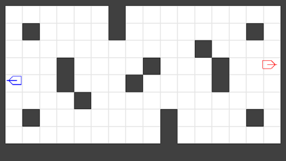
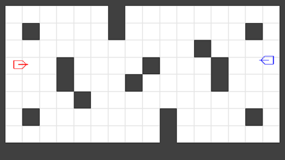

# Tank Twin Stick Shooter

A 2021 Unity 2D twin-stick tank game **reinforcement-learning research environment** revived in 2026. Unity 6.5 is the simulator; a Python driver (`pop_trainer`) drives it over a TCP-JSON socket, with agents observing the **real rendered pixel frame**.

<p align="center">
  <br>
  <em>A map-aware coverage agent (blue) vs. a random opponent (red) — real captured gameplay frames.</em>
</p>

## What this is

The game runs as a **Python-clocked simulator**: Unity renders and steps the physics, while Python supplies both players' actions each frame and reads back a pixel frame (resolution is config-driven — 640×360 by default; the current experiments train on 64×64) plus a 52-float game state. That makes it a clean RL gym — train a policy on pixels (CnnPolicy), with the state vector as a supervised-decode objective.

The training stack (`src/pop_trainer/`) is rebuilt component-by-component, each independently gated:

| component | what it does |
|---|---|
| `core` | the contract: the 52-float state, the wire protocol, configs, maps, the Agent interface |
| `env` | `TankEnv` — a Gymnasium wrapper over the socket (the simulator swap point) |
| `agents` | map-aware coverage policies (+ a random baseline) that drive data collection |
| `models` | composable, ablation-ready vision encoders (ONNX / Unity-Sentis-clean) |
| `data` | a multi-worker collection runner — parallel builds, **map + pairing rotation**, echo-tagged shards |
| `pretraining` | **supervised encoder pretraining** — decode the 52-float state from single real frames (heatmap + soft-argmax heads); per-epoch checkpoints; the trained encoder feeds `rl` |
| `rl` | **end-to-end PPO on pixels** — pretrained-encoder load (frozen or warm-start), map rotation in training, a **win-rate (opponent × map) curriculum fed from evaluation**, per-map eval win rates in TensorBoard, self-play opponent seam, ELO, multi-env (`SubprocVecEnv`), checkpoint/resume |
| `play` | launch the live build and play one episode — any pairing of human, rule-based, or a trained `rl:<ckpt>` agent |

### Multi-map data collection

The collector rotates arenas *and* policy pairings between episodes — one long-lived build, a `switch_arena` message at each reset — tagging every shard with the map Unity actually loaded:

<p align="center">
  <br>
  <em>One collector worker rotating through three arenas via <code>switch_arena</code>.</em>
</p>

## Quickstart

```bash
uv sync                                          # Python 3.12 env (managed by uv)
# build the Unity game -> unity/build/TankTwinStickShooter.exe  (see docs/runbook.md)
uv run python -m pop_trainer.play                # watch / play one episode (human, rule-based, or rl:<ckpt>)
uv run python -m pop_trainer.data.collect_runner --out-dir runs/demo --maps   # collect a rotating dataset
uv run python -m pop_trainer.pretraining.train \
  --data datasets/<shards> --trunk gn-cnn --resolution 64 --device cuda \
  --out runs/decode                                # pretrain a vision encoder (state decoding)
uv run python -m pop_trainer.rl.train \
  --config unity/Assets/StreamingAssets/train_config_64.json \
  --encoder-checkpoint runs/decode/encoder.pt --trunk gn-cnn \
  --maps --matchup-sampling winrate --run-dir runs/train \
  --total-timesteps 20000000                       # PPO on pixels with the pretrained encoder
```

Full setup, the component map, and the class-to-class architecture live in **[`docs/`](docs/README.md)**.

## How it's built

This revival is developed by a team of AI coding subagents — research, engineering, and a read-only platform gate that documents at GO — under a human CTO. See **[`docs/agent-team.md`](docs/agent-team.md)**.

## Status

**M0** — playable two-human game ✅ · **M1** — single-agent PPO on real pixels: **full stack landed** — pretrained 64×64 gn-cnn encoder, map rotation, an eval-driven (opponent × map) curriculum, per-map evaluation; a frozen-vs-warm-start encoder A/B is training to 20M steps now · **M2** — population-based self-play (next). Target training cluster: GCP.
