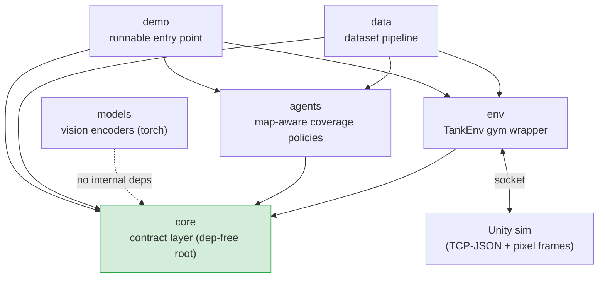

# pop_trainer — documentation hub

`pop_trainer` is the Python reinforcement-learning driver for the Tank Twin Stick Shooter
revival. Unity 6.5 is the 2D twin-stick **simulator**; `pop_trainer` is the **trainer** that
drives it over a strict TCP-JSON socket (plus a binary pixel-frame channel). Agents observe
the **real rendered pixel frame** Unity emits each step (CnnPolicy), while the 52-float wire
state rides alongside in `info` as the supervised-decode objective.

This site is onboarding-grade: skim the map, drill into one component (each page lists what it
**pulls from** and **pushes to**, linked so the dependency graph is clickable), then run things
end to end via the [runbook](runbook.md).

## What's here today

The built + GO'd slice of the target architecture. The dependency direction is
**`core ← {models, env, data, agents} ← demo`** — `core` is the dependency-free root and every
component points inward toward it. (`pretraining` / `rl` / `eval` / `population` / `deployment`
/ `imitation` are namespace placeholders, not yet built — not documented here.)

## Component map at a glance

Solid arrows are import-time dependencies (A → B means "A imports B"). `models` imports nothing
internal — it only shares `core`'s place as a leaf the future `pretraining` / `rl` consume.

## Navigation index

| Component | Responsibility |
|-----------|----------------|
| [core](components/core.md) | The dependency-free contract: state schema, wire protocol, configs, maps, Agent Protocol. |
| [models](components/models.md) | Composable, ablation-ready vision encoders + Sentis-clean ONNX export (torch). |
| [env](components/env.md) | `TankEnv` — the Gymnasium wrapper over the Unity socket; the simulator swap point. |
| [agents](components/agents.md) | The model-free decision-makers: the map-aware `CoverageAgent` family (+ presets) + the `RandomAgent` baseline + the coverage-measurement harness. |
| [data](components/data.md) | The dataset pipeline: a multi-worker collection CLI (`collect_runner`) → `(frame, state, action)` samples → shards → map-aware splits. |
| [demo](components/demo.md) | `python -m pop_trainer.demo` — launch the live build and watch two agents play. |

- [Architecture](architecture.md) — the cross-component class-to-class interaction map.
- [Runbook](runbook.md) — clone → `uv sync` → build the Unity game → run the demo / collection.

## How this gets built

- [Agent team](agent-team.md) — how the research / engineering / platform teams (and the Director, under the CTO) build, gate, and document this repo.

## Unity side (still relevant)

- [Game architecture](game-architecture.md) — how the Unity build actually runs (Python-clocked simulator, no standalone human mode).
- [Input controls](input-controls.md) — the New Input System wiring for human tanks.
