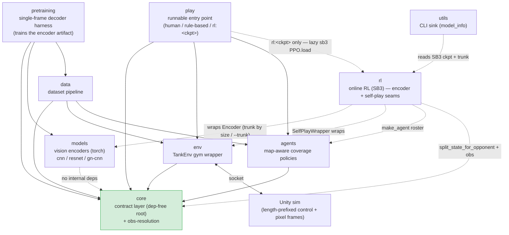

# pop_trainer — documentation hub

`pop_trainer` is the Python reinforcement-learning driver for the Tank Twin Stick Shooter
revival. Unity 6.5 is the 2D twin-stick **simulator**; `pop_trainer` is the **trainer** that
drives it over a strict TCP-JSON socket (plus a binary pixel-frame channel). Agents observe
the **real rendered pixel frame** Unity emits each step (CnnPolicy), while the 52-float wire
state rides alongside in `info` as the supervised-decode objective.

This site is onboarding-grade: skim the map, drill into one component (each page lists what it
**pulls from** and **pushes to**, linked so the dependency graph is clickable), then run things
end to end via the [runbook](runbook.md).

## What's here today

The built + GO'd slice of the target architecture. The dependency direction is
**`core ← {models, env, data, agents} ← {play, rl, pretraining}`** — `core` is the dependency-free
root and every component points inward toward it; [utils](components/utils.md) hangs off the side as
a one-way sink (nothing imports it). The online-RL component [rl](components/rl.md) is the **built**
`train_local` integrator (encoder + self-play + eval/ELO seams, CLI-parameterized PPO). The offline
arm [pretraining](components/pretraining.md) is the **built** single-frame decoder harness (a
supervised inverse-renderer that trains the reusable encoder artifact). `core` now also owns the
**observation-resolution contract** ([`core.obs`](components/core.md#the-observation-resolution-contract-coreobs)):
the env's pixel `frame_shape` is derived from the launched game config, the single source of truth
shared with the Unity build. (`eval` / `population` / `deployment` / `imitation` are namespace
placeholders, not yet built — not documented here.)

## Component map at a glance

Solid arrows are import-time dependencies (A → B means "A imports B"); dashed arrows are lazy /
attribute-only edges. `models` imports nothing internal — it only shares `core`'s place as a leaf;
[rl](components/rl.md)'s `EncoderExtractor` wraps its `Encoder`, auto-selecting the trunk
(`cnn` / `gn-cnn`) by the obs resolution or honoring an explicit `--trunk`. `rl` spans four internal
deps: beyond `models`, its self-play seam wraps `env` (`SelfPlayWrapper`) and reuses `agents`
(`make_agent` roster) + `core` (`split_state_for_opponent` + `obs`); it imports nothing from `data`
or `pretraining`. [pretraining](components/pretraining.md) is the offline arm — it imports `core` /
`models` / `data` (it streams `data`'s shards and trains the `models` encoder), nothing from `env`
or `rl`. [utils](components/utils.md) is a one-way sink — it loads an `rl` checkpoint and names the
active `models` trunk, but nothing imports it, so it can never form a cycle.

## Navigation index

| Component | Responsibility |
|-----------|----------------|
| [core](components/core.md) | The dependency-free contract: state schema, wire protocol, configs, maps, Agent Protocol. |
| [models](components/models.md) | Composable, ablation-ready vision encoders + Sentis-clean ONNX export (torch). |
| [env](components/env.md) | `TankEnv` — the Gymnasium wrapper over the Unity socket; the simulator swap point. |
| [agents](components/agents.md) | The model-free decision-makers: the map-aware `CoverageAgent` family (+ presets) + the `RandomAgent` baseline + the coverage-measurement harness. |
| [data](components/data.md) | The dataset pipeline: a multi-worker collection CLI (`collect_runner`) → `(frame, state, action)` samples → shards → map-aware splits. |
| [play](components/play.md) | `python -m pop_trainer.play` — launch the live build and play one episode with any pairing of human / rule-based / trained `rl:<ckpt>` players. |
| [rl](components/rl.md) | Online RL (SB3 PPO); the `train_local` integrator over the encoder seam (`EncoderExtractor`, trunk auto-selected by obs size or `--trunk`), the self-play opponent seam, and the eval+ELO seam — fully CLI-parameterized PPO. |
| [pretraining](components/pretraining.md) | The single-frame decoder harness: a supervised inverse-renderer that decodes the 52-float state from one pixel frame (`StateDecoder` = encoder + spatial heads + detached embed-probe), training the reusable encoder artifact. |
| [utils](components/utils.md) | A leaf CLI toolbox (a one-way sink). First tool: `python -m pop_trainer.utils.model_info <ckpt>` inspects a trained PPO checkpoint — obs/action spaces, the active encoder trunk, id-deduped param counts. |

- [Architecture](architecture.md) — the cross-component class-to-class interaction map.
- [Runbook](runbook.md) — clone → `uv sync` → build the Unity game → play an episode / collect.

## How this gets built

- [Agent team](agent-team.md) — how the research / engineering / platform teams (and the Director, under the CTO) build, gate, and document this repo.

## Unity side (still relevant)

- [Game architecture](game-architecture.md) — how the Unity build actually runs (Python-clocked simulator, no standalone human mode).
- [Input controls](input-controls.md) — the New Input System wiring for human tanks.
