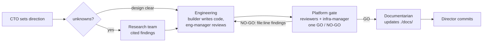

# How the agent team works

This repo is built by a team of AI subagents under a human **CTO** (strategy + RL/DL calls) and
an AI **Director** (orchestration). The authoritative spec is the charter at
[`.claude/agents/README.md`](../.claude/agents/README.md); this page is the onboarding view of
how the pieces fit and how a change actually moves through them.

## The operating model — a matrix

- **Functional teams** (the "rows") each own a discipline and have a **manager**.
- **Components** (the "columns" — `core`, `env`, `agents`, …) are carried as opt-in **skills**,
  not per-directory config: an agent loads the `pop-<component>` skill for the contract it needs.
- **Adversarial chain at every tier:** worker ← manager ← Director ← CTO. Nothing self-certifies;
  "done" means a check passed, not "looks done."

## The teams

| Team | Manager | Workers | Role |
|---|---|---|---|
| **Research** | `research-manager` | `research-docs`, `research-source`, `research-empirical` | Investigate unknowns by method-matched lanes (literature / real OSS / throwaway spikes); return **cited findings**, never edits. |
| **Engineering** | `eng-manager` | `builder` (Python), `unity-builder` (C#/Unity) | The **only** agents that write production code — one component at a time, context via skills. |
| **Platform / infra** | `infra-manager` | `code-reviewer`, `evaluation`, `repo-steward`, `documentarian` | The read-only **GO / NO-GO** gate. The `documentarian` is the lone writer — `./docs/` only, post-GO. |

## How a change moves through the teams

1. **Research (when there are unknowns).** The Director frames a question; the research-manager
   splits it into method-matched lanes and synthesizes one cited, decision-ready report. Findings
   inform the design — they are not code.
2. **Engineering builds.** The eng-manager scopes the work into a component, hands the builder the
   component skill, and adversarially reviews the result against that contract.
3. **The platform team gates.** The infra-manager runs the read-only reviewers (does it work /
   is it correct / is it structurally sound), adversarially vets their verdicts, and emits **one**
   GO / NO-GO. A NO-GO routes back to engineering with `file:line` findings.
4. **The documentarian documents (post-GO).** On GO, before commit, it updates the affected
   `./docs/` pages; the infra-manager accuracy-checks the docs against the code.
5. **The Director commits** the GO'd, documented work — and adversarially reviews every manager's
   verdict along the way.

## Why this shape

The matrix keeps **discipline** (a manager owns the practice and is the adversary for the work)
separate from **component context** (a skill, opt-in, so context doesn't bloat every agent). The
read-only platform team earns its independence by never writing the code it judges. The
[charter](../.claude/agents/README.md) has the full rationale and the leading indicators we watch
to know the model is working.

[← back to index](README.md)
