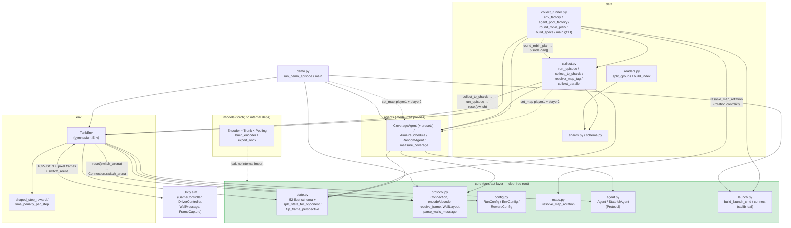

# Architecture

The cross-component class-to-class interaction map for the built + GO'd slice of `pop_trainer`.

## Dependency direction

`core` is the **dependency-free root**; every component points inward toward it, never back out.
`models` imports nothing internal (a leaf alongside `core`). The full direction:

```
core  ←  { models, env, agents, data }  ←  demo
```

- [core](components/core.md) — stdlib + numpy only; imports nothing internal.
- [models](components/models.md) — torch only; imports nothing internal.
- [env](components/env.md) — imports `core` (+ gymnasium, numpy).
- [agents](components/agents.md) — imports `core` (+ numpy).
- [data](components/data.md) — imports `core`, `env`, `agents`.
- [demo](components/demo.md) — imports `core`, `env`, `agents`.

No import cycles: `data` and `demo` sit at the top, `core` at the bottom, `models` off to the
side. (`pretraining` / `rl` / `eval` / `population` / `deployment` / `imitation` are not built
yet and are omitted.)

## Class-to-class interaction map



## Reading the map

- **`TankEnv` is the hub.** It pulls every `core` module it needs (`protocol`, `state`,
  `config`, `agent`, plus its own `rewards`) and is the only thing that talks to Unity over the
  socket. It is a **pure symmetric transport** that owns neither player — `step(a1, a2)` takes both
  actions from the caller. Both `data.collect` and `demo` run their episodes through it.
- **The self-play seam** lives in `core.state` (`split_state_for_opponent` /
  `flip_frame_perspective`) and is owned **driver-side**: `data.collect` / `demo` flip player2's
  perspective to compute its action `a2`, then pass it to `env.step(a1, a2)`. Agents read `PLAYER_1`
  out of whatever (possibly flipped) view they're handed. `TankEnv` exposes `player2_frame()` /
  `player2_state()` helpers but does not call them during `step`.
- **The wall-message seam** flows `WallMessage` (Unity) → `protocol.parse_walls_message` →
  `WallLayout` → `TankEnv.current_map` → `info["map"]`, and from there into a map-aware agent via
  the OPTIONAL `set_map` hook — called **driver-side** on **both** players: `data.collect` /
  `demo` call `set_map` on player1 and player2 (all `getattr`-probed; the env notifies no agent). A
  [`CoverageAgent`](components/agents.md) rebuilds its coverage grid from the layout; `RandomAgent`
  does not implement the hook. See
  [core](components/core.md#the-wall-message--protocol-seam-walllayout--infomap).
- **`core.launch` is the shared live seam.** Both the `demo` and `data.collect_runner` launch the
  build + open the socket through `build_launch_cmd` / `connect`; it is stdlib-only so `core` stays
  the leaf. `collect_runner.env_factory` calls it once per worker (`port = base_port + worker_id`).
- **`data.collect_runner` is the collection CLI** (`python -m pop_trainer.data.collect_runner`):
  the concrete `env_factory` + `agent_pool_factory` (module-level, spawn-safe) + `build_specs` over
  `collect`'s spawn orchestration — multi-worker, single-map **or** a map × pairing rotation.
- **The rotation seam.** `--maps` resolves through `core.maps.resolve_map_rotation` (the shared
  rotation contract) to a set of arenas; `round_robin_plan` slices the (map × pairing) grid per
  worker (cell `(worker_id + i*n_workers) % G`) into `EpisodePlan[]`. Each episode rotates the
  long-lived build's arena via `collect.run_episode → env.reset(options={"switch_arena": ...}) →
  core.Connection.switch_arena` (the additive outbound seam), and `collect.resolve_map_tag` tags
  each sample's `map_id` from the arena Unity **echoed** (the F5 tag-from-echo), decoded through the
  `maps.json` sidecar / `map_index`. See
  [data](components/data.md#the-rotation-scheduler--map-tagging).
- **`models` is detached** from the live loop today — it's the shared vision backbone the
  future `pretraining` / `rl` will consume, and the deployable ONNX artifact.

---
[← back to index](README.md)
