# Architecture

The cross-component class-to-class interaction map for the built + GO'd slice of `pop_trainer`.

## Dependency direction

`core` is the **dependency-free root**; every component points inward toward it, never back out.
`models` imports nothing internal (a leaf alongside `core`). The full direction:

```
core  ←  { models, env, agents, data }  ←  play
```

- [core](components/core.md) — stdlib + numpy only; imports nothing internal (now incl. the
  `obs` observation-resolution contract).
- [models](components/models.md) — torch only; imports nothing internal.
- [env](components/env.md) — imports `core` (+ gymnasium, numpy).
- [agents](components/agents.md) — imports `core` (+ numpy).
- [data](components/data.md) — imports `core`, `env`, `agents`.
- [play](components/play.md) — imports `core`, `env`, `agents`; and `rl` **lazily** (a
  composition-root app — the only relaxation; sb3/torch import only inside its RL-player factory).
- [rl](components/rl.md) — imports `core`, `env`, `models`, `agents` (+ torch / gymnasium / numpy /
  stable-baselines3).
- [utils](components/utils.md) — a **leaf SINK**: it MAY import `core` / `models` / `rl` (+ sb3 /
  torch), but **nothing in `pop_trainer` imports it**, so it can never create a cycle.

No import cycles: `data` and `play` sit at the top, `core` at the bottom, `models` off to the
side, `utils` off to the side as a one-way sink. `play` is a LEAF (imported by nothing), so its lazy
`play → rl` edge adds no cycle. (`pretraining` / `eval` / `population` / `deployment` / `imitation`
are not built yet and are omitted.)

## Class-to-class interaction map

```mermaid
graph TD
    subgraph core["core (contract layer — dep-free root)"]
        State["state.py<br/>52-float schema +<br/>split_state_for_opponent /<br/>flip_frame_perspective"]
        Protocol["protocol.py<br/>Connection (send=length-prefixed),<br/>encode/decode, receive_frame,<br/>WallLayout, parse_walls_message"]
        Config["config.py<br/>RunConfig / EnvConfig /<br/>RewardConfig"]
        Obs["obs.py<br/>frame_shape_from_config /<br/>validate_frame_shape"]
        Maps["maps.py<br/>resolve_map_rotation"]
        AgentProto["agent.py<br/>Agent / StatefulAgent<br/>(Protocol)"]
        Launch["launch.py<br/>build_launch_cmd / connect<br/>(stdlib leaf)"]
    end

    subgraph models["models (torch; no internal deps)"]
        Encoder["Encoder = Trunk × Pooling<br/>TRUNKS: cnn / resnet / gn-cnn<br/>build_encoder / export_onnx"]
    end

    subgraph utils["utils (leaf CLI sink)"]
        ModelInfo["model_info.py<br/>inspect SB3 ckpt:<br/>spaces / trunk / param counts"]
    end

    subgraph rl["rl (online RL; SB3)"]
        EncoderExtractor["EncoderExtractor<br/>(SB3 BaseFeaturesExtractor)"]
        SelfPlay["SelfPlayWrapper (gym.Wrapper) /<br/>OpponentProvider / ScriptedOpponent"]
    end

    subgraph agents["agents (model-free policies)"]
        AgentImpls["CoverageAgent (+ presets) /<br/>AimFireSchedule / RandomAgent /<br/>measure_coverage"]
    end

    subgraph env["env"]
        TankEnv["TankEnv<br/>(gymnasium.Env)"]
        Rewards["shaped_step_reward /<br/>time_penalty_per_step"]
    end

    subgraph data["data"]
        Runner["collect_runner.py<br/>env_factory / agent_pool_factory /<br/>round_robin_plan / build_specs / main (CLI)"]
        Collect["collect.py<br/>run_episode / collect_to_shards /<br/>resolve_map_tag / collect_parallel"]
        Shards["shards.py / schema.py"]
        Readers["readers.py<br/>split_groups / build_index"]
    end

    Play["play.py<br/>run_play_episode / main<br/>(human / rule-based / rl:&lt;ckpt&gt;)"]

    Unity["Unity sim<br/>(GameController, DriverController,<br/>WallMessage, FrameCapture)"]

    %% env wiring
    TankEnv --> Protocol
    TankEnv -->|"reset(switch_arena)<br/>→ Connection.switch_arena"| Protocol
    TankEnv --> State
    TankEnv --> Config
    TankEnv --> AgentProto
    TankEnv --> Rewards
    TankEnv <-->|TCP-JSON + pixel frames + switch_arena| Unity

    %% agents wiring
    AgentImpls --> AgentProto
    AgentImpls --> State
    AgentImpls --> Protocol

    %% map hook: WallLayout reaches a map-aware agent via the optional set_map hook (driver-side)
    Collect -.->|set_map player1 + player2| AgentImpls
    Play -.->|set_map player1 + player2| AgentImpls

    %% models wiring
    Encoder -.->|leaf, no internal import| core

    %% rl wiring: the encoder seam wraps models; the self-play seam wraps env + reuses core/agents
    EncoderExtractor -.->|"wraps build_encoder(trunk by size or --trunk, flatten)"| Encoder
    SelfPlay -.->|"wraps env; step(a1,a2)"| TankEnv
    SelfPlay -.->|"from_roster → make_agent"| AgentImpls
    SelfPlay -.->|split_state_for_opponent| State

    %% data wiring
    Runner --> Collect
    Runner --> Launch
    Runner -->|"resolve_map_rotation<br/>(rotation contract)"| Maps
    Runner --> TankEnv
    Runner --> AgentImpls
    Runner -.->|"round_robin_plan →<br/>EpisodePlan[]"| Collect
    Collect -->|"collect_to_shards →<br/>run_episode → reset(switch)"| TankEnv
    Collect --> AgentImpls
    Collect --> State
    Collect --> Shards
    Readers --> Shards

    %% play wiring
    Play --> TankEnv
    Play --> AgentImpls
    Play --> Protocol
    Play --> Launch
    Play -.->|"rl:&lt;ckpt&gt; only — lazy sb3 PPO.load(ckpt)"| rl

    %% obs-resolution wiring: every live entry derives frame_shape from its launched config
    %% (the derived resolution also drives the rl extractor's trunk auto-selection)
    Play -.->|frame_shape_from_config| Obs
    Runner -.->|frame_shape_from_config| Obs
    rl -.->|"frame_shape_from_config + validate_frame_shape"| Obs

    %% utils: a one-way sink — loads an SB3 ckpt + reads the models trunk by attribute
    ModelInfo -.->|"PPO.load + .encoder.trunk (by attr)"| rl
    ModelInfo -.->|names the active trunk class| Encoder

    classDef root fill:#d4edda,stroke:#28a745;
    class core root;
```



## Reading the map

- **`TankEnv` is the hub.** It pulls every `core` module it needs (`protocol`, `state`,
  `config`, `agent`, plus its own `rewards`) and is the only thing that talks to Unity over the
  socket. It is a **pure symmetric transport** that owns neither player — `step(a1, a2)` takes both
  actions from the caller. Both `data.collect` and `play` run their episodes through it.
- **The self-play seam** lives in `core.state` (`split_state_for_opponent` /
  `flip_frame_perspective`) and is owned **driver-side**: `data.collect` / `play` flip player2's
  perspective to compute its action `a2`, then pass it to `env.step(a1, a2)`. Agents read `PLAYER_1`
  out of whatever (possibly flipped) view they're handed. `TankEnv` exposes `player2_frame()` /
  `player2_state()` helpers but does not call them during `step`. [`rl`](components/rl.md) now
  packages this SAME driver path as a `gymnasium.Wrapper` — `SelfPlayWrapper` samples a scripted
  opponent per episode (via `OpponentProvider` over the `agents` roster), caches player2's flipped
  view from `info["state"]`, and drives `env.step(a1, a2)` so SB3 supplies only `a1`. Self-play stays
  a WRAPPER over the trainer, never woven into the env or PPO core.
- **The wall-message seam** flows `WallMessage` (Unity) → `protocol.parse_walls_message` →
  `WallLayout` → `TankEnv.current_map` → `info["map"]`, and from there into a map-aware agent via
  the OPTIONAL `set_map` hook — called **driver-side** on **both** players: `data.collect` /
  `play` call `set_map` on player1 and player2 (all `getattr`-probed; the env notifies no agent). A
  [`CoverageAgent`](components/agents.md) rebuilds its coverage grid from the layout; `RandomAgent`
  does not implement the hook. See
  [core](components/core.md#the-wall-message--protocol-seam-walllayout--infomap).
- **`core.launch` is the shared live seam.** Both `play` and `data.collect_runner` launch the
  build + open the socket through `build_launch_cmd` / `connect`; it is stdlib-only so `core` stays
  the leaf. `collect_runner.env_factory` calls it once per worker (`port = base_port + worker_id`).
- **`data.collect_runner` is the collection CLI** (`python -m pop_trainer.data.collect_runner`):
  the concrete `env_factory` + `agent_pool_factory` (module-level, spawn-safe) + `build_specs` over
  `collect`'s spawn orchestration — multi-worker, single-map **or** a map × pairing rotation.
- **The rotation seam.** `--maps` resolves through `core.maps.resolve_map_rotation` (the shared
  rotation contract) to a set of arenas; `round_robin_plan` slices the (map × pairing) grid per
  worker (cell `(worker_id + i*n_workers) % G`) into `EpisodePlan[]`. Each episode rotates the
  long-lived build's arena via `collect.run_episode → env.reset(options={"switch_arena": ...}) →
  core.Connection.switch_arena` (the additive outbound seam), and `collect.resolve_map_tag` tags
  each sample's `map_id` from the arena Unity **echoed** (the F5 tag-from-echo), decoded through the
  `maps.json` sidecar / `map_index`. See
  [data](components/data.md#the-rotation-scheduler--map-tagging).
- **`models` is detached** from the live loop today — it's the shared vision backbone, and the
  deployable ONNX artifact. Its trunks are named by architecture (`cnn` / `resnet` / `gn-cnn`); the
  small-frame `gn-cnn` (DreamerV3-style GroupNorm CNN) survives ≤128px frames where the `cnn`
  stride-4 stem collapses. The seam to consume it now exists: [`rl`](components/rl.md)'s
  `EncoderExtractor` wraps the `Encoder` and reads its `embed` flat embedding as the SB3 policy /
  value feature extractor, **auto-selecting the trunk by obs resolution** (or honoring an explicit
  `--trunk` override). The future `pretraining` (which reads `Encoder.features`) is still unbuilt.
- **The observation-resolution seam (`core.obs`).** The env's pixel `frame_shape` is the ONE
  source of truth derived from the launched config's `obs_pixels_width/height` via
  `core.obs.frame_shape_from_config` — every live entry (`play` / `rl.train` / the collection
  runner) derives it, so the env byte-read always matches the build's rendered W/H, and the derived
  resolution is what drives the `models` trunk auto-selection above. `rl.train` also
  `validate_frame_shape`s its configured shape against the launched config before any build starts.
  See [core](components/core.md#the-observation-resolution-contract-coreobs).
- **The transport handshake (Python-driven round boundary + length-prefix framing).** The episode
  boundary is now driven off **Unity's own clock** — Unity ends the round (winner OR timer), freezes
  it (`roundOver`), delivers the `done` step+frame once, and KEEPS servicing the socket while waiting;
  Python's `done → terminated → reset()` sends `restart` into the clean waiting state (never
  mid-round). Python → Unity control/step writes are now **length-prefixed** (4-byte big-endian +
  JSON, the new `DriverProtocol.cs` read-exactly side); inbound JSON + the pixel-frame header are
  unchanged. The wire DATA contract is byte-identical. See
  [Unity/protocol](game-architecture.md#the-python-driven-round-boundary--length-prefix-framing).
- **`utils` is a one-way sink** off the graph: `utils.model_info` (`python -m
  pop_trainer.utils.model_info <ckpt>`) loads an SB3 checkpoint on CPU and reports its obs/action
  spaces, the active [`models`](components/models.md) trunk, and id-deduped per-section param counts.
  Nothing imports it, so it can reach across components without a cycle. See
  [utils](components/utils.md).
- **`rl` now spans four internal deps**, not just `models`: the self-play seam adds `env` (the
  `TankEnv` `SelfPlayWrapper` wraps), `agents` (`make_agent` for the opponent roster), and `core`
  (`split_state_for_opponent` for the perspective flip, plus `core.launch` for the re-derived live
  build launch). It still imports NOTHING from `data` / `pretraining` — the opponent-driving
  primitives are reused directly, not the `data` module. The M1 PPO trainer is **built**:
  `train_local` composes the vec-env stack + `CnnPolicy`/`EncoderExtractor` policy, the
  `EvalWinRateCallback` (a same-width `M == N` eval instance set on a disjoint port block,
  time-multiplexed with training so the two sets never coexist), checkpoint + resumable `state.json`
  sidecar, and the light from-eval ELO wiring — plus the `n_envs > 1` `SubprocVecEnv` fan-out (one
  Unity build per training port `game_port + i`, `start_method="spawn"`), now implemented + unit-tested
  (live multi-instance launch pending). The Unity-instance lifecycle is `TankEnv`-owned (lazy launch /
  `release` / kill-old-first reconnect) so a lost connection is survivable. Still future: the
  population / M2 frozen-self ELO ladder and the distributed/GCP cluster.

---
[← back to index](README.md)
