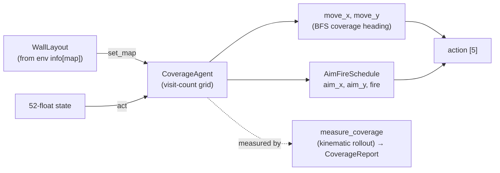
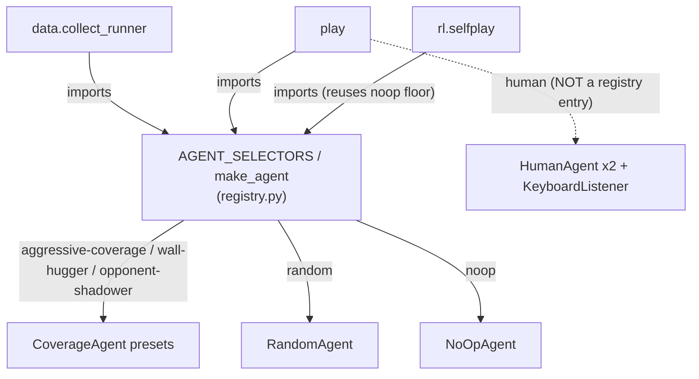

# agents

The model-free **decision-makers** that fill the `player1` / `player2` slots — each producing a
5-float action `[move_x, move_y, aim_x, aim_y, fire]` from an observation. After the 2026 coverage
redesign the data-collection surface is **ONE map-aware policy family** (occupancy-biased coverage)
parameterized by presets, plus the map-agnostic random baseline and the stationary no-op floor. Five
ideas hold the whole component together:

1. **Everything is a [`core.agent.Agent`](core.md)** — `act(obs) → action`; stateful/seeded ones add
   `reset(*, seed=)`, map-aware ones the OPTIONAL `set_map(layout)` hook. No NN, no `load`/`save`.
2. **One coverage family, three presets** — a visit-count walk that sweeps a map's free floor;
   `aggressive` / `wall-hugger` / `opponent-shadower` are parameterizations, not separate classes.
3. **An orthogonal aim/fire layer** rides the position-only movement so the aim + bullet channels are
   exercised too — the cadence is modest because bullets don't bounce.
4. **The selector registry is the SINGLE `string → agent` source** imported by data / play / rl —
   no consumer keeps its own copy.
5. **`HumanAgent` is a separate live-play family** — keyboard-driven, `pynput`-lazy, the one
   exception to the import boundary; it touches none of the coverage harness.

**Boundary:** `agents` imports [`core`](core.md) only (the `Agent` Protocol + `set_map` hook, the
`state` schema, `protocol.WallLayout`) plus numpy + stdlib — and `pynput` **LAZILY**, listener-only.
No torch; nothing from `env` / `data` / `models` / `rl` / `pretraining`; nothing from `tank_twin`.
`agents` is a **leaf** the consumers build on ([data](data.md) / [play](play.md) / [rl](rl.md) import
DOWN into it, never the reverse). The `human`-extra `pynput` import is the ONE exception and it is
lazy — `import pop_trainer.agents` succeeds core-only, without `pynput`
([`coverage.py:36-38`](../../src/pop_trainer/agents/coverage.py),
[`human_agent.py:31-33,275-278`](../../src/pop_trainer/agents/human_agent.py)). No cycles.

## Architecture at a glance

How one coverage decision is composed (movement + the orthogonal aim/fire layer):

The registry is the one selector source all consumers build from:

## Key classes / entry points

### `CoverageAgent` — the one occupancy-biased coverage family
[`coverage.py`](../../src/pop_trainer/agents/coverage.py). Drives the tank to sweep the free floor: a
visit-count grid over the reachable free cells; each re-pick it chooses the **nearest least-visited**
cell as a waypoint (BFS distance field from the current cell), descends a plain-BFS gradient toward
it, nudged away from adjacent walls, with `eps` decorrelation noise. It exists to make trajectories
broadly *cover* a map for the supervised-decode corpus, not to play to win
([`CoverageAgent`, `coverage.py:199`](../../src/pop_trainer/agents/coverage.py)). Presets are built
via classmethods:

- **`CoverageAgent.aggressive`** — max-coverage baseline (tuned `K=4` / `eps=0.02`)
  ([`coverage.py:263`](../../src/pop_trainer/agents/coverage.py)).
- **`CoverageAgent.wall_hugger`** — same walk, but `border_bias=True` biases the least-visited
  tiebreak toward wall-adjacent cells so the walk hugs the boundary and samples the position extremes
  a centre-biased walk misses ([`coverage.py:268`](../../src/pop_trainer/agents/coverage.py)).
- **`CoverageAgent.opponent_shadower`** — same movement, but the aim layer aims at the opponent (read
  from the 52-float state) and fires — subsuming the old `aim-at-player2` rule
  ([`coverage.py:278`](../../src/pop_trainer/agents/coverage.py)).

### `AimFireSchedule` — the orthogonal aim/fire layer
[`coverage.py`](../../src/pop_trainer/agents/coverage.py). The movement family is **position-only**;
this layers a cheap aim sweep + periodic fire on top so the aim + bullet pos/dir channels also get
exercised. The cadence is deliberately modest: bullets do not bounce (they die on wall/tank contact),
so firing every step would make new bullets immediately self-block. `opponent-shadower` overrides the
sweep by passing an explicit aim direction
([`AimFireSchedule`, `coverage.py:152`](../../src/pop_trainer/agents/coverage.py); cadence rationale
[`coverage.py:157-159`](../../src/pop_trainer/agents/coverage.py)).

### `RandomAgent` / `NoOpAgent` — the baseline + the curriculum floor
- **[`RandomAgent`](../../src/pop_trainer/agents/random_agent.py)** — the seeded, **map-agnostic
  baseline**: `act` ignores `obs` and draws a fresh uniform-random action each step (move/aim uniform
  in `[-1, 1]`, Bernoulli `fire`). It does NOT implement `set_map` — random coverage is the broadest
  unstructured control the coverage family is measured against
  ([`RandomAgent`, `random_agent.py:28`](../../src/pop_trainer/agents/random_agent.py);
  [`act`, `random_agent.py:42-48`](../../src/pop_trainer/agents/random_agent.py)).
- **[`NoOpAgent`](../../src/pop_trainer/agents/noop_agent.py)** — the **stationary curriculum floor**:
  an obs-agnostic zero-action policy returning the validated `[0,0,0,0,0]`. Stateless (no `reset` /
  `set_map`) — `act` alone satisfies the [`Agent`](core.md) Protocol. It is the easiest TRAINING
  opponent, which is WHY it lives here and [rl](rl.md) reuses it via the registry rather than
  redefining it ([`NoOpAgent.act`, `noop_agent.py:24-25`](../../src/pop_trainer/agents/noop_agent.py)).
  [rl](rl.md#the-self-play-opponent-seam) wraps it as a `ScriptedOpponent`.

### `measure_coverage` — the validation harness
[`coverage_metrics.py`](../../src/pop_trainer/agents/coverage_metrics.py). A deterministic **kinematic
rollout**: it builds the free/reachable grid from a `WallLayout`, hands the agent the map via
`set_map`, drives `decisions` decisions (each calls `agent.act(state)` and integrates the tank over
the confirmed mechanics — speed 3 u/s, accel 6/s, axis-separable slide collision), and returns a
[`CoverageReport`](../../src/pop_trainer/agents/coverage_metrics.py). This is how the family is
validated against `RandomAgent` in-tree without a live Unity
([`measure_coverage`, `coverage_metrics.py:177`](../../src/pop_trainer/agents/coverage_metrics.py);
mechanics [`coverage_metrics.py:24-28`](../../src/pop_trainer/agents/coverage_metrics.py)).

> **Objectives vs guardrail.** [`CoverageReport`](../../src/pop_trainer/agents/coverage_metrics.py)
> carries three numbers that are NOT equal: **coverage-fraction** and **normalized
> occupancy-entropy** are the DESIGN objectives, but **ESS ratio** is a **GUARDRAIL ONLY** — it
> measures trajectory decorrelation (jitter), NOT coverage, and rewards jitter, so it must NEVER be
> presented as a coverage reward
> ([`coverage_metrics.py:68-84,245-264`](../../src/pop_trainer/agents/coverage_metrics.py)).

### `HumanAgent` — keyboard-driven live play
[`human_agent.py`](../../src/pop_trainer/agents/human_agent.py). A SEPARATE family from the coverage
surface — a live-play input agent for human-vs-human (or human-vs-bot) testing, consumed only by
[play](play.md). Its `act` **IGNORES the observation** (the action comes from the keyboard) and emits
the env 5-float action: `move_x = right − left`, `move_y = up − down` (same for aim), `fire = 1.0` iff
the fire key is down; diagonals are left un-normalized
([`HumanAgent.act`, `human_agent.py:228-243`](../../src/pop_trainer/agents/human_agent.py)). The
load-bearing facts:

- **Two players, one keyboard.** A SINGLE [`KeyboardListener`](../../src/pop_trainer/agents/human_agent.py)
  tracks the pressed-key set into a shared [`KeyboardState`](../../src/pop_trainer/agents/human_agent.py),
  and TWO `HumanAgent`s — one per [`KeyMapping`](../../src/pop_trainer/agents/human_agent.py) — read
  that SAME state ([`human_agent.py:215-247,249-305`](../../src/pop_trainer/agents/human_agent.py)).
- **The mapping** (matches the CTO spec): **P1** move WASD, aim TFGH, fire LEFT SHIFT
  ([`human_agent.py:129-146`](../../src/pop_trainer/agents/human_agent.py)); **P2** move IJKL, aim
  NUMPAD 8/4/5/6, fire ENTER ([`human_agent.py:149-170`](../../src/pop_trainer/agents/human_agent.py)).
- **Numpad-by-vk (load-bearing).** The P2 aim keys are detected by VIRTUAL-KEY CODE (8=104, 4=100,
  5=101, 6=102) so they work regardless of Num Lock; with Num Lock OFF the keys arrive as arrows (or
  numpad-5 as `VK_CLEAR`), so each numpad token is a SET accepting EITHER encoding
  ([`human_agent.py:149-170,319-348`](../../src/pop_trainer/agents/human_agent.py)).
- **`pynput` is OPTIONAL + LAZY** (the `human` extra). The ONLY import is inside
  `KeyboardListener._require_pynput` — never at module top — so `import pop_trainer.agents` works
  core-only; building/starting a listener without it raises a clear `RuntimeError` naming the extra
  ([`PYNPUT_MISSING_MSG`, `human_agent.py:69-72`](../../src/pop_trainer/agents/human_agent.py);
  [`human_agent.py:263-279`](../../src/pop_trainer/agents/human_agent.py)). The pure layer
  (`KeyMapping` / `KeyboardState` / `HumanAgent`) never touches `pynput` and is unit-tested with no
  hardware.

### The map hook (`set_map`) — the one interface change
The static wall layout is sent once per episode and reaches a map-aware agent through the OPTIONAL
`StatefulAgent.set_map` hook: `Unity walls → core.protocol.WallLayout → env info["map"] →
agent.set_map(layout)`. [`CoverageAgent.set_map`](../../src/pop_trainer/agents/coverage.py) (re)builds
the free grid and clears the per-episode visit state. The free-cell derivation is **production-only**
(`free = {dims bounding box} − layout.occupied` — the wire carries `Walls` + `dims`, never the arena
`Floor`), so the family restricts the visit grid to the **BFS-reachable component** from the spawn so
unreachable border cells never poison the least-visited pick, and degrades to a **safe map-blind
random heading** when `set_map` is never called rather than crash. `RandomAgent` does not implement
the hook; callers always probe via `getattr`
([`set_map`, `coverage.py:290`](../../src/pop_trainer/agents/coverage.py);
[`free_cells_from_layout`, `coverage.py:89`](../../src/pop_trainer/agents/coverage.py);
[`reachable_from`, `coverage.py:105`](../../src/pop_trainer/agents/coverage.py); fallback
[`coverage.py:352-353`](../../src/pop_trainer/agents/coverage.py)).

### Operational note — coverage is step-budget-dependent on the real engine
The `measure_coverage` harness is kinematic and OPTIMISTIC relative to live Unity — a spot-check found
the family fully covers a map only by **~800 decisions**. For [data collection](data.md): run episodes
long enough to sweep, and treat the harness numbers as a *relative* ranking (family vs `RandomAgent`),
not an absolute "covered in N steps" budget for the real engine.

### The selector registry (`string → agent`)
[`registry.py`](../../src/pop_trainer/agents/registry.py) is the **SINGLE source of truth** for
mapping a selector name to a built agent — `agents` is its natural home.
[`AGENT_SELECTORS`](../../src/pop_trainer/agents/registry.py) is a dict of selector → seed-taking
factory (uniform even for the stateless `noop`, which accepts and ignores the seed), and
[`make_agent`](../../src/pop_trainer/agents/registry.py)`(selector, *, seed=None)` looks up + builds,
raising `ValueError` (listing valid names) on an unknown selector. The roster is the coverage family's
three presets, `random`, and `noop`
([`registry.py:33-39,42-51`](../../src/pop_trainer/agents/registry.py)). Both are imported by BOTH
[`data.collect_runner`](../../src/pop_trainer/data/collect_runner.py)
([`collect_runner.py:66`](../../src/pop_trainer/data/collect_runner.py)) and
[`play`](../../src/pop_trainer/play.py) ([`play.py:73`](../../src/pop_trainer/play.py)). The
**`"human"`** form is **NOT** a registry entry — it needs a shared `KeyboardListener` / `KeyboardState`
a per-agent seed factory cannot express, so play wires it outside `AGENT_SELECTORS`
([`HUMAN_SELECTOR`, `play.py:117,164-166`](../../src/pop_trainer/play.py)).

## Pulls from (upstream)

- **[core](core.md)** — `agent.Agent` Protocol + the OPTIONAL `set_map` hook; `core.state` (the
  52-float schema accessors `position` / `PLAYER_1` / `PLAYER_2` / `STATE_LEN` the coverage walk and
  opponent-shadow read); `core.protocol.WallLayout` (the map geometry `set_map` consumes)
  ([`coverage.py:58-61`](../../src/pop_trainer/agents/coverage.py),
  [`coverage_metrics.py:49-52`](../../src/pop_trainer/agents/coverage_metrics.py)).
- **numpy + stdlib** — `collections.deque` for the BFS floods, `math`, `numpy` RNG; and `pynput`
  LAZILY (listener-only) ([`coverage.py:43-47`](../../src/pop_trainer/agents/coverage.py)).

## Pushes to (downstream)

The `registry` is the shared selector source all consumers build from:

- **[data](data.md)** — `collect_runner` imports `AGENT_SELECTORS` / `make_agent` from here
  ([`collect_runner.py:66`](../../src/pop_trainer/data/collect_runner.py)); collection pairs a
  `player1` + `player2` agent to drive episodes (both driver-side; the env owns neither) and calls
  `set_map` on both via `getattr`.
- **[play](play.md)** — imports the SAME registry; the rule-based `--player1` / `--player2` selectors
  build agents through `make_agent`, and the `human` form (NOT a registry selector) wires a
  `HumanAgent` per player over ONE shared `KeyboardListener` / `KeyboardState`
  ([`play.py:73`](../../src/pop_trainer/play.py)).
- **[rl](rl.md)** — reuses the SAME selectors (e.g. `noop`, the curriculum floor) via the registry,
  without reaching into `data` (a forbidden import).

## Where it sits in the run

The opponents and data-collection drivers. Agents are what actually *play* — the driver
([data](data.md) / [play](play.md)) advances **both** player1 and player2 (the env is a pure
transport that owns neither), so a recorded trajectory (or a play episode) is the product of whichever
pair of agents was chosen. The coverage family's job is to make those trajectories sweep the map
broadly, so the supervised-decode corpus sees the whole state space; [rl](rl.md) drives the same
scripted agents as self-play opponents.

---
[← back to index](../README.md)
