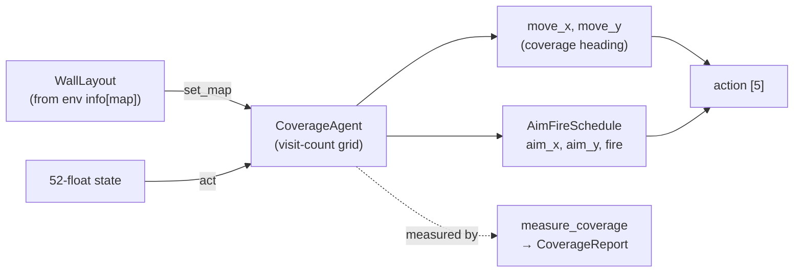

# agents

The model-free **decision-makers** that fill the `player1` / `player2` slots. Every agent
implements the [`core.agent.Agent`](core.md) Protocol — `act(obs) → action`, returning the env's
5-float `[move_x, move_y, aim_x, aim_y, fire]` (move/aim in `[-1, 1]`, fire 0/1); stateful /
seeded ones also implement `reset(*, seed=None)`, and map-aware ones the OPTIONAL
`set_map(layout)` hook. No neural nets — this package is model-free only (no `load` / `save` /
`train`).

After the 2026 coverage redesign the data-collection surface is **ONE map-aware policy family**
([`CoverageAgent`](../../src/pop_trainer/agents/coverage.py), occupancy-biased coverage)
parameterized by presets, plus the map-agnostic [`RandomAgent`](../../src/pop_trainer/agents/random_agent.py)
baseline. The old explorer / aim-sweep / spray / perimeter / rules variants are **deleted** —
subsumed by the one family, its aim/fire layer, and the `opponent-shadower` preset.

**Boundary:** imports [`core`](core.md) only (the `Agent` Protocol, the `state` schema, the
`protocol.WallLayout` type) plus numpy + stdlib. No torch; nothing from `env` / `data` /
`models` / `rl` / `pretraining`; nothing from `tank_twin`.

## Key classes / entry points

- [`CoverageAgent`](../../src/pop_trainer/agents/coverage.py) — the one **occupancy-biased map
  coverage** family. It drives the tank to sweep the free floor of a map: a **visit-count grid**
  over the reachable free cells; each re-pick it chooses the **nearest least-visited** cell as a
  waypoint (BFS distance field from the current cell), descends a plain-BFS gradient toward it,
  nudged away from adjacent walls, with `eps` decorrelation noise (`coverage.py:199`). It exists
  to generate trajectories that broadly *cover* a map's state space for the supervised-decode
  corpus, rather than play to win. Presets are built via classmethods (`coverage.py:263`):
  - **`CoverageAgent.aggressive`** — max-coverage baseline (tuned `K=4` / `eps=0.02`), aim sweep
    + periodic fire (`coverage.py:263`).
  - **`CoverageAgent.wall_hugger`** — same walk, but `border_bias=True` biases the least-visited
    tiebreak toward wall-adjacent cells, so the walk hugs the boundary and samples the position
    extremes a centre-biased walk misses (`coverage.py:268`).
  - **`CoverageAgent.opponent_shadower`** — same coverage movement, but the aim layer aims at the
    opponent (read from the 52-float state) and fires — subsuming the old `aim-at-player2` rule
    (`coverage.py:278`).
- [`AimFireSchedule`](../../src/pop_trainer/agents/coverage.py) — the **orthogonal aim/fire
  layer** (`coverage.py:152`). The movement family is **position-only** (it sets `move_x` /
  `move_y`); this layers a cheap aim sweep + periodic fire on top so the aim and bullet
  pos/dir state channels also get exercised. The cadence is deliberately modest: bullets do not
  bounce (they die on wall/tank contact), so firing every step would make new bullets immediately
  self-block (`coverage.py:157`). `opponent-shadower` overrides the sweep by passing an explicit
  aim direction.
- [`RandomAgent`](../../src/pop_trainer/agents/random_agent.py) — the seeded, **map-agnostic
  baseline**: `act` ignores `obs` and draws a fresh uniform-random action each step (move/aim
  uniform in `[-1, 1]`, Bernoulli `fire`) (`random_agent.py:28`). It does NOT implement
  `set_map` — random coverage is the broadest unstructured exploration, the natural control the
  coverage family is measured against.
- [`measure_coverage`](../../src/pop_trainer/agents/coverage_metrics.py) — the
  **coverage-measurement harness** (`coverage_metrics.py:177`). A deterministic **kinematic
  rollout**: it builds the free/reachable grid from a `WallLayout`, hands the agent the map via
  `set_map`, drives `decisions` decisions (each calls `agent.act(state)` and integrates the tank
  over the confirmed mechanics — speed 3 u/s, accel 6/s, axis-separable slide collision,
  `coverage_metrics.py:24`), and returns a [`CoverageReport`](../../src/pop_trainer/agents/coverage_metrics.py)
  (`coverage_metrics.py:68`). This is how the family is validated against `RandomAgent` in-tree
  without a live Unity.

## Objectives vs guardrail (the metric suite)

The [`CoverageReport`](../../src/pop_trainer/agents/coverage_metrics.py) carries three numbers
(`coverage_metrics.py:68`), and they are NOT equal:

- **coverage-fraction** = visited reachable cells / reachable cells — the **DESIGN objective**
  (`coverage_metrics.py:80`).
- **normalized occupancy-entropy** = entropy of the visit distribution over reachable cells,
  ÷ `log(n_reachable)` — the **DESIGN objective** (a flat visit distribution → 1.0)
  (`coverage_metrics.py:245`).
- **ESS ratio** = a **GUARDRAIL ONLY**. It measures trajectory decorrelation (jitter), NOT
  coverage; it exists solely to detect a degenerate still / stuck agent. **Never** present it as
  a coverage reward — it rewards jitter (`coverage_metrics.py:255`).

## The map hook (`set_map`) — the one interface change

The static wall layout is sent once per episode and reaches a map-aware agent through the OPTIONAL
[`StatefulAgent.set_map`](core.md) hook:

```
Unity walls  →  core.protocol.WallLayout  →  env info["map"]  →  agent.set_map(layout)
```

[`CoverageAgent.set_map`](../../src/pop_trainer/agents/coverage.py) (re)builds the free grid from
the layout and clears the per-episode visit state (`coverage.py:290`). The free-cell derivation is
**production-only**: `free = {all cells in the WallLayout.dims bounding box} − layout.occupied`
([`free_cells_from_layout`](../../src/pop_trainer/agents/coverage.py), `coverage.py:89`) — the wire
carries `Walls` + `dims`, never the arena `Floor` block. The family is robust to the resulting
border-ring mismatch: it restricts the visit grid to the **BFS-reachable component** from the spawn
([`reachable_from`](../../src/pop_trainer/agents/coverage.py), `coverage.py:105`) so unreachable
border cells never poison the least-visited pick, and snaps an off-grid tank to the nearest free
cell. When `set_map` is never called (no arena), the family **degrades to a safe map-blind random
heading** rather than crash (`coverage.py:352`). `RandomAgent` does not implement the hook and is
simply never called with it. Callers always probe via `getattr` — the hook is never required.

## Operational note — coverage is step-budget-dependent on the real engine

The `measure_coverage` harness is a *kinematic* sim, and its coverage-per-step is **optimistic**
relative to the live Unity engine. A live-game coverage spot-check found the family fully covers
the map only by **~800 decisions** (the kinematic rollout reaches high coverage sooner). The
practical consequence for [data collection](data.md): **run episodes long enough to sweep** —
short episodes will record only a partial map traversal. Treat the harness numbers as a *relative*
ranking (family vs `RandomAgent`), not an absolute "covered in N steps" budget for the real
engine.

## Pulls from (upstream)

- [core](core.md) — `agent.Agent` Protocol + the new `StatefulAgent.set_map` hook; `core.state`
  (the 52-float schema accessors `position` / `PLAYER_1` / `PLAYER_2` the coverage walk and the
  opponent-shadow read); `core.protocol.WallLayout` (the map geometry `set_map` consumes).
- Plus numpy + stdlib (`collections.deque` for the BFS floods, `math`).

## Pushes to (downstream)

- [env](env.md) — a `CoverageAgent` (or `RandomAgent`) is injected as `player2`; the env calls
  `player2.set_map` at reset when a map is tracked.
- [data](data.md) — collection pairs a `player1` + `player2` agent to drive episodes, and calls
  `set_map` on `player1` via `_maybe_set_map`.
- [demo](demo.md) — the `--player1` / `--player2` selectors (`aggressive-coverage` /
  `wall-hugger` / `opponent-shadower` / `random`) build agents from here.

## Where it sits in the run

The opponents and data-collection drivers. Agents are what actually *play* — injected into the
env as player2 and driven directly as player1 — so a recorded trajectory (or a demo episode) is
the product of whichever pair of agents was chosen. The coverage family's job is to make those
trajectories sweep the map broadly, so the supervised-decode corpus sees the whole state space.



---
[← back to index](../README.md)
