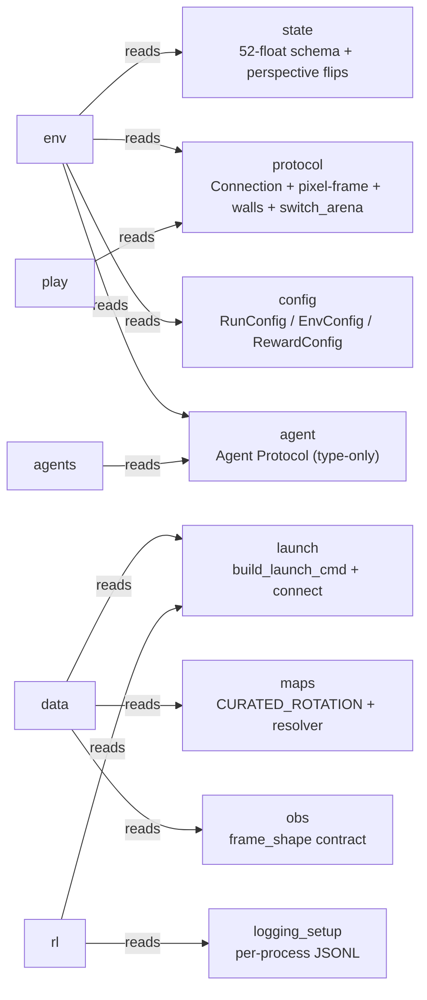
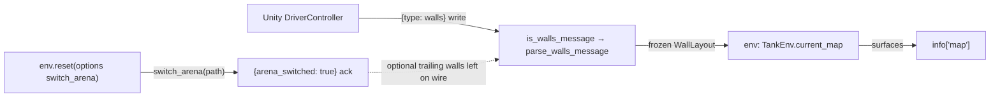

# core

The dependency-free **contract layer** — the root of the `pop_trainer` dependency graph. It
imports nothing internal (no `models` / `env` / `data` / `agents`) and uses **stdlib + numpy
only** (no torch / gymnasium / sb3), so it stays the leaf every other component reads its shared
definitions from. Six ideas hold the whole component together:

1. **The 52-float state schema** is the single source of truth for the wire state Unity emits —
   the supervised-decode *objective*, NOT the policy observation (the observation is the pixel
   frame).
2. **The wire client** is strict-JSON, frame-aware, and length-prefixes ONLY outbound writes;
   the real RGB pixel frame rides the same socket on its own binary header.
3. **The observation-resolution contract** makes the game config the ONE source of truth for the
   env's pixel `frame_shape`, so the two sides can never silently desync.
4. **The map-rotation contract** is a curated 10-arena tuple + a pure `--maps`→arena-targets
   resolver shared by the trainer and the collector.
5. **The launch + logging seams** are stdlib-only side-effect helpers (windowed `Popen` arg-list,
   bounded socket connect, per-process structured-JSONL routing) every live consumer shares.
6. **The Agent Protocol** is type-only (`act(obs) → action`), so `env` can be typed against an
   agent without importing `agents` or torch.

The package re-exports the leaf symbols at top level — the modules (`state` / `protocol` /
`config` / `obs` / `maps` / `agent` / `launch` / `logging_setup`), plus `Agent` / `StatefulAgent`
and the obs trio `DEFAULT_FRAME_SHAPE` / `frame_shape_from_config` / `validate_frame_shape`
([`__init__.py:33-55`](../../src/pop_trainer/core/__init__.py)).

**Boundary:** `core` imports **nothing internal** and uses stdlib + numpy only (numpy lives only on
the state perspective transforms + the protocol frame path; the config / obs / maps / launch /
logging modules are numpy-free). It is the dependency-free root — every other component points
inward to it, and it points at nothing ([`__init__.py:1-6`](../../src/pop_trainer/core/__init__.py)).
No cycles.

## Architecture at a glance

The shared seams `core` defines and who reads each (every arrow is an inward dependency):

The reset-time map-state path (`switch_arena` → `WallLayout` → `info["map"]`):

## Key classes / entry points

### `core.state` — the 52-float schema + perspective transforms
[`state.py`](../../src/pop_trainer/core/state.py). Defines what the wire-state floats mean (the
frozen `GameController.UpdateState` seam) and the self-play perspective ops.

- **Layout constants + pure accessors.** `STATE_LEN = 52`; P1 occupies indices 0..25, P2 26..51;
  `position` / `velocity` / `aim` / `iter_bullets` read named offsets, never magic indices, off any
  indexable sequence — numpy is not required to read the schema. An absent bullet is the `pos_x ==
  -100` sentinel ([`state.py:37-73,101-154`](../../src/pop_trainer/core/state.py)).
- **The two perspective transforms (the RL self-play contract, numpy).**
  [`split_state_for_opponent`](../../src/pop_trainer/core/state.py) swaps the two 26-float halves
  to build player2's first-person view, and `flip_frame_perspective` swaps the R/B channels of a
  rendered RGB frame; both are involutions. These are applied **driver-side** — the [data](data.md)
  collection and [play](play.md) loops flip before passing player2's action to `env.step`; the env
  is a pure transport and does not flip ([`state.py:160-185`](../../src/pop_trainer/core/state.py)).
- **`validate(state)`** raises unless the length is exactly 52 — the contract that makes the
  accessors meaningful ([`state.py:90-98`](../../src/pop_trainer/core/state.py)).

The state is the supervised-decode **objective**, NOT the policy observation.

### `core.protocol` — the strict TCP-JSON wire client + pixel channel
[`protocol.py`](../../src/pop_trainer/core/protocol.py). The Python side of the Unity wire seam over
an **injected** transport; `encode` / `decode` are pure (no socket).

- **Frame-aware inbound reads.** [`Connection.receive`](../../src/pop_trainer/core/protocol.py)
  reads EXACTLY one top-level JSON object via a string/escape-aware brace-depth scan and buffers any
  trailing bytes (TCP coalesces back-to-back writes), so a runaway object is size-capped and binary
  frame bytes never reach `json.loads` ([`protocol.py:304-334,450-529`](../../src/pop_trainer/core/protocol.py)).
- **Outbound length-prefix framing (Python → Unity).** `Connection.send` (and the pure
  [`encode_framed`](../../src/pop_trainer/core/protocol.py)) prepend a **4-byte big-endian uint32** =
  the UTF-8 JSON byte length, then the JSON — a read-exactly frame that fixed the dormant single-`Read`
  desync. **INBOUND JSON stays UNFRAMED** (the brace-scan tolerates it) and the pixel channel keeps
  its own 10-byte header, so only the outbound control/step direction gains a prefix
  (`SEND_LENGTH_PREFIX_LEN = 4`, [`protocol.py:108,277-302`](../../src/pop_trainer/core/protocol.py)).
- **The pixel-frame channel.** `parse_frame_header` decodes the 10-byte big-endian header and
  [`Connection.receive_frame`](../../src/pop_trainer/core/protocol.py) reads + reshapes the payload
  into a top-left-origin `(H, W, 3)` uint8 array — the real obs input path. numpy lives only here
  ([`protocol.py:187-215,399-446`](../../src/pop_trainer/core/protocol.py)).
- **The wall-layout message seam.** `is_walls_message` discriminates the one-time
  `{"type": "walls", ...}` Unity write by its tag and `parse_walls_message` strict-parses it into a
  frozen [`WallLayout`](../../src/pop_trainer/core/protocol.py) (string column keys → ints, a derived
  `occupied` cell set) — see [below](#the-wall-message-seam-walllayout--infomap)
  ([`protocol.py:545-651`](../../src/pop_trainer/core/protocol.py)).
- **The switch-arena handshake** — the one additive outbound write, reset-time only — see
  [below](#the-switch-arena-handshake-connectionswitch_arena)
  ([`Connection.switch_arena`, `protocol.py:336-365`](../../src/pop_trainer/core/protocol.py)).

### `core.obs` — the observation-resolution contract
[`obs.py`](../../src/pop_trainer/core/obs.py). Makes the game config the ONE source of truth for the
env's pixel `frame_shape` so the build's rendered W/H and the Python byte-read can never silently
desync. stdlib only (`json` + `pathlib`) — see [below](#the-observation-resolution-contract-coreobs).

### `core.maps` — the map-rotation contract
[`maps.py`](../../src/pop_trainer/core/maps.py). [`CURATED_ROTATION`](../../src/pop_trainer/core/maps.py)
is the single source of truth for the training rotation — a hard-coded 10-entry tuple of arena
targets (`Arenas/<name>.json`, alphabetical), there is no on-disk config-wrapper dir.
[`resolve_map_rotation(values)`](../../src/pop_trainer/core/maps.py) turns a `--maps` flag value into
a `list[str]` of arena targets (or `None`): absent → `None` (single-map); empty/sentinel → the
curated rotation; a single directory → its sorted `*.json` configs' `arena_path`s; an explicit list →
verbatim ([`maps.py:41-52,71-86`](../../src/pop_trainer/core/maps.py)).

### `core.launch` — the shared live-launch seam
[`launch.py`](../../src/pop_trainer/core/launch.py). stdlib only (`subprocess` / `socket`), no
internal imports, so `core` stays the leaf.
[`build_launch_cmd`](../../src/pop_trainer/core/launch.py) is the **pure** `Popen` arg-list builder —
launches the build **windowed** (`-screen-fullscreen 0`, `-batchmode` deliberately absent), port
positional + `--config` JSON, with an optional `unity_log_path` appending `-logFile` (byte-identical
to the no-log path when `None`). [`connect`](../../src/pop_trainer/core/launch.py) opens a TCP socket
to `127.0.0.1:port` with a bounded retry/backoff. Shared by both [play](play.md) and the [data](data.md)
collection runner ([`launch.py:94-132,135-166`](../../src/pop_trainer/core/launch.py)).

### `core.logging_setup` — per-process structured-JSONL observability
[`logging_setup.py`](../../src/pop_trainer/core/logging_setup.py). stdlib `logging` only (no new
dependency); lives in `core` so `train` / `env` / `protocol` can route to it without a boundary
violation.

- **Per-process file routing (pure path builders, unit-tested for exact filenames):**
  `system_log_path` → `training-system.log`, `env_log_path` → `env-<role>-<port>.log`, and
  `unity_log_path` → `unity-<role>-<port>.log` (passed to `core.launch`'s `-logFile`; pairs with the
  Python env log by `(role, port)`) ([`logging_setup.py:103-124`](../../src/pop_trainer/core/logging_setup.py)).
- **Strict-JSON line schema.** [`JsonlFormatter`](../../src/pop_trainer/core/logging_setup.py) emits
  one strict-JSON object per record (`ts_wall` is the cross-file merge key) with `role` / `port` /
  `layer` bound at setup ([`logging_setup.py:139-182`](../../src/pop_trainer/core/logging_setup.py)).
- **Eval isolation (load-bearing).** Setup sets `propagate=False` so an eval env's records land ONLY
  in `env-eval-<port>.log` and never leak into `training-system.log`; setup is idempotent (the
  handler it owns is tagged) ([`logging_setup.py:188-264`](../../src/pop_trainer/core/logging_setup.py)).
  `level_from_env` is the pure `--debug` / `POP_LOG_LEVEL` switch
  ([`logging_setup.py:267-282`](../../src/pop_trainer/core/logging_setup.py)).

### `core.config` — the frozen, strict-JSON config dataclasses
[`config.py`](../../src/pop_trainer/core/config.py). Frozen dataclasses
[`RunConfig`](../../src/pop_trainer/core/config.py) /
[`EnvConfig`](../../src/pop_trainer/core/config.py) /
[`RewardConfig`](../../src/pop_trainer/core/config.py) with a shared loader API that **rejects
unknown keys** (`TypeError`) on strict-JSON load ([`config.py:36-162`](../../src/pop_trainer/core/config.py)).

### `core.agent` — the Agent Protocol (type-only)
[`agent.py`](../../src/pop_trainer/core/agent.py). [`Agent`](../../src/pop_trainer/core/agent.py) is
`@runtime_checkable` and declares ONLY `act(obs) → action`;
[`StatefulAgent`](../../src/pop_trainer/core/agent.py) adds the OPTIONAL `reset(*, seed=None)` and the
`set_map(layout)` map hook in a **separate** Protocol — folding either into the runtime-checkable
surface would wrongly reject a valid `act`-only agent, so the optional methods are consumed by
`getattr`/`hasattr` probing, never `isinstance`. Lives here so `env` can be typed against an agent
without importing `agents` or torch ([`agent.py:49-90`](../../src/pop_trainer/core/agent.py)). See
[agents](agents.md) for who implements `set_map`.

## The wall-message seam (`WallLayout` → `info["map"]`)

Unity is the source of truth for the static map geometry. On a map load `DriverController` writes the
handshake confirmation first, then a **separate** strict-JSON `{"type": "walls", ...}` message
([`WallMessage.Build`](../../unity/Assets/Scripts/WallMessage.cs)) — skipped when no arena is
configured. `core.protocol.is_walls_message` discriminates it by its `"type"` tag and
`parse_walls_message` strict-parses it into a frozen `WallLayout` (column-x string keys → ints, a
derived `occupied` frozenset of cells). [`env`](env.md) reads it during the handshake, stores it on
`TankEnv.current_map`, and surfaces it as `info["map"]` — so Python tracks map-state without ever
re-parsing the arena JSON ([`protocol.py:576-651`](../../src/pop_trainer/core/protocol.py)).

## The switch-arena handshake (`Connection.switch_arena`)

The **one additive outbound write** on the otherwise-frozen wire, reset-time only. Between the restart
ack and the `{"start": True}` send (Unity's `!ingame` window) the caller MAY request a map change, so
a long-lived build can rotate arenas without relaunching. The per-step `{1: a1, 2: a2}` wire and the
52-float state are unchanged; a reset that does NOT switch is byte-identical to today.

- [`Connection.switch_arena(arena_path)`](../../src/pop_trainer/core/protocol.py) sends
  `{"switch_arena": <path>}` (key constant `SWITCH_ARENA_KEY`), then reads **exactly one** JSON object
  and validates the `{"arena_switched": true}` ack (key constant `ARENA_SWITCHED_KEY`), raising
  `ValueError` if the ack is missing/falsy. **It reads ONLY the ack** — Unity writes the optional
  trailing walls message (only when the new arena has a "Walls" block) as its own discrete write,
  which `switch_arena` deliberately leaves on the wire for the caller to route with the same
  `receive` + `is_walls_message` logic. Calling it outside the `!ingame` window desyncs the wire
  ([`protocol.py:336-365`](../../src/pop_trainer/core/protocol.py)).

The caller is [`env`](env.md): `TankEnv.reset(options={"switch_arena": <path>})` fires this in the
`!ingame` window then drains the optional walls message — see the
[env reset hook](env.md#map-rotation-resetoptionsswitch_arena-).

## The observation-resolution contract (`core.obs`)

The Unity build sizes its RenderTexture / Texture2D from `obs_pixels_width` / `obs_pixels_height` in
the game config at runtime and ships actual W/H on the wire; the Python env reads exactly
`prod(frame_shape)` bytes per frame, so its `frame_shape` MUST match that config. `core.obs` makes
the config the ONE source of truth for both sides ([`obs.py:1-16`](../../src/pop_trainer/core/obs.py)).

- [`frame_shape_from_config(config_path)`](../../src/pop_trainer/core/obs.py) STRICT-`json`-reads the
  RAW game-config JSON and returns the **channels-last** `(height, width, 3)` (HEIGHT first); a
  missing key falls back to [`DEFAULT_FRAME_SHAPE = (360, 640, 3)`](../../src/pop_trainer/core/obs.py),
  but a present-but-malformed value (non-int / non-positive / bool) is a clear `ValueError` — a silent
  default there would re-introduce the very desync this module prevents
  ([`obs.py:28,51-78`](../../src/pop_trainer/core/obs.py)).
- [`validate_frame_shape(frame_shape, config_path)`](../../src/pop_trainer/core/obs.py) is the
  anti-silent-desync guard: raises a clear `ValueError` naming both shapes on a mismatch, a no-op on a
  match ([`obs.py:81-98`](../../src/pop_trainer/core/obs.py)).

Every live entry point derives its `frame_shape` from the config it launches with — [play](play.md),
[rl.train](rl.md) (which also `validate_frame_shape`s before launch), and the [data](data.md)
collection runner. The derived resolution also drives the [models](models.md) trunk auto-selection
(small vs large frame).

## Pulls from (upstream)

Nothing internal. **`core` is the dependency-free root** — stdlib + numpy only
([`__init__.py:1-6`](../../src/pop_trainer/core/__init__.py)).

## Pushes to (downstream)

Every other component depends on `core`:

- [models](models.md) — shares `core`'s leaf position (imports nothing from it today).
- [env](env.md) — `state` (schema + transforms), `protocol` (`Connection` incl. `switch_arena`,
  `WallLayout`, `is_walls_message` / `parse_walls_message`), `config`, `agent.Agent`, and
  `logging_setup.LAYER_ENV`.
- [agents](agents.md) — `agent.Agent` Protocol + the `state` schema.
- [rl](rl.md) — `launch` (incl. the `unity_log_path` kwarg), `protocol.Connection`, `config`, `obs`
  (`frame_shape_from_config` / `validate_frame_shape` / `DEFAULT_FRAME_SHAPE`), and `logging_setup`
  (the per-process loggers + `level_from_env`).
- [data](data.md) — `state` (`STATE_LEN` + `validate`), `config.EnvConfig`, `protocol.Connection`,
  `agent.Agent`, `launch` (one build per worker), `obs.frame_shape_from_config`, and
  `maps.resolve_map_rotation`.
- [play](play.md) — `protocol.Connection` / `WallLayout`, `config.EnvConfig`, `agent.Agent`,
  `state.split_state_for_opponent` / `flip_frame_perspective`, `obs.frame_shape_from_config`, and
  `launch` (`build_launch_cmd` / `connect`).
- [pretraining](pretraining.md) — `state` (the named accessors / index constants + `bullet_present`)
  to carve the per-group decode targets from the 52-float wire state (`targets.py:36`).
- [utils](utils.md) — no direct `core` import today; a leaf sink reaching the stack's artifacts by
  attribute.

## Where it sits in the run

The bedrock. Before any episode, `core` defines what a state vector means, how bytes move on the wire,
what pixel resolution the frame is, which arena the rotation plays, and what an agent must look like.
Everything else is built on these contracts.

---
[← back to index](../README.md)
