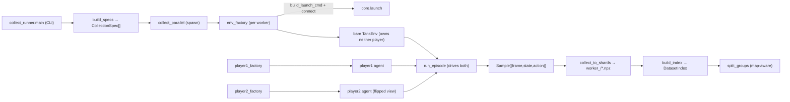

# data

The **datasets pipeline**: collect time-aligned `(frame, state, action)` samples for supervised
pretraining, organize them into on-disk `.npz` shards, and split them map-aware. Collection
routes through [`TankEnv`](env.md) — the **same** Gymnasium observation pipeline RL trains on —
so the captured rows match the RL observations exactly. It communicates downstream only via
dataset artifacts on disk.

**Boundary:** imports [`core`](core.md) (state schema), [`env`](env.md) (`TankEnv`), and
[`agents`](agents.md) (the policies that drive collection), plus numpy / stdlib — following the
`core ← {env, agents} ← data` direction. Nothing from `models` / `pretraining` / `rl`. The
package is named `data` (not `datasets` — that name collides with the git-ignored data dir).

## Key modules / entry points

- [`data.schema`](../../src/pop_trainer/data/schema.py) — the **on-disk record contract**: the
  parallel-array names / dtypes / shapes a shard holds (`frames` uint8 `(N,H,W,3)`, `states`
  float32 `(N,52)`, optional `actions` float32 `(N,2,5)`, `map_ids` / `episode_ids` /
  `step_idxs`). Imports `core.state.STATE_LEN` so the state width is never re-hardcoded.
- [`data.shards`](../../src/pop_trainer/data/shards.py) — pure, round-trip-exact `.npz`
  read/write. [`Shard`](../../src/pop_trainer/data/shards.py) validates shapes on construction;
  [`write_shard`](../../src/pop_trainer/data/shards.py) is **atomic** (write `*.tmp` →
  `Path.replace`); [`read_shard_meta`](../../src/pop_trainer/data/shards.py) reads only `.npy`
  headers (no frame decompression) so a directory can be indexed cheaply.
- [`data.readers`](../../src/pop_trainer/data/readers.py) — **map-aware (group-key)**
  train/val/test splits. [`split_groups`](../../src/pop_trainer/data/readers.py) keeps a whole
  map's samples in exactly one split (the no-leak guard) and is deterministic in its `seed`;
  [`build_index`](../../src/pop_trainer/data/readers.py) /
  [`DatasetIndex`](../../src/pop_trainer/data/readers.py) flatten a shard directory into a
  per-sample group index without loading frames.
- [`data.collect`](../../src/pop_trainer/data/collect.py) — the **collection driver**.
  [`run_episode`](../../src/pop_trainer/data/collect.py) is the pure step loop over an injected
  bare `env` (a pure transport that owns neither player), so it drives **both** `player1` and
  `player2`: each step it computes `a1 = player1.act(vec)` (player1's own unflipped view) and
  `a2 = player2.act(split_state_for_opponent(vec))` (player2's flipped first-person view, computed
  here via [`core.state`](core.md), `collect.py:193-195`), calls `env.step(a1, a2)`, and records the
  current `(frame, state)` paired with both applied actions from `info`. After `env.reset` it hands
  the tracked map to **both** map-aware agents via the `_maybe_set_map` helper —
  `getattr`-probing `agent.set_map(info["map"])`, a no-op when an agent is map-agnostic or the
  layout is `None` (`collect.py:119,174-175`). [`collect_to_shards`](../../src/pop_trainer/data/collect.py)
  wraps episodes into shards. [`CollectionSpec`](../../src/pop_trainer/data/collect.py) /
  [`run_worker`](../../src/pop_trainer/data/collect.py) /
  [`collect_parallel`](../../src/pop_trainer/data/collect.py) are the **spawn-based** (never
  fork — a CLAUDE.md YOU MUST) parallel orchestration; each worker builds its own bare env + socket
  and **both** agents inside the process from the spec's factories, so nothing live crosses the
  spawn boundary.
- [`data.collect_runner`](../../src/pop_trainer/data/collect_runner.py) — the **live collection
  entry point** (`python -m pop_trainer.data.collect_runner`): the concrete factories + CLI riding
  on `collect`'s orchestration. It is **multi-worker, SINGLE-map** (Phase A — `custom1` only;
  rotation is Phase B, not built).
  [`env_factory`](../../src/pop_trainer/data/collect_runner.py) is the module-level (spawn-safe,
  no closures) factory that launches one Unity build per worker via
  [`core.launch.build_launch_cmd`](core.md) + `subprocess.Popen` on `port = base_port + worker_id`,
  connects via [`core.launch.connect`](core.md), and builds the bare
  [`TankEnv`](env.md) (which owns neither player) — wrapping `env.close` so closing the env also
  reaps the launched build.
  [`player1_factory`](../../src/pop_trainer/data/collect_runner.py) and
  [`player2_factory`](../../src/pop_trainer/data/collect_runner.py) are the symmetric driver-side
  hooks that build player1 / player2 from a selector name (`collect_runner.py:202-218`); both are
  wired onto every spec (`collect_runner.py:308-310`) and **required** by `run_worker` (it raises
  `ValueError` if either is `None`, `collect.py:343-348`).
  [`build_specs`](../../src/pop_trainer/data/collect_runner.py) is the pure
  CLI-args→`list[CollectionSpec]` builder (one per worker, `--workers` clamped to `[1, 8]`, each
  worker an own `worker_<id>/` out-dir + a distinct seed `base + w*10000`).
  [`main`](../../src/pop_trainer/data/collect_runner.py) parses the flags, resolves `--map custom1`
  to the obs_pixels-enabled `demo_config.json`, and drives `collect_parallel`. See the
  [runbook](../runbook.md#4-collect-a-dataset-cli) for the flags.

## Pulls from (upstream)

- [core](core.md) — `state` (`STATE_LEN`, `validate`), `config.EnvConfig`,
  `protocol.Connection`, `agent.Agent`, and `launch` (`build_launch_cmd` / `connect` — the shared
  build-launch + socket-connect seam `collect_runner` uses per worker).
- [env](env.md) — `TankEnv` (collection drives episodes through it).
- [agents](agents.md) — the `player1` / `player2` policies (the coverage / random presets), and
  `validate_action`.
- Plus numpy + stdlib (`multiprocessing` spawn context, `subprocess`).

## Pushes to (downstream)

On-disk `.npz` shard artifacts + a dataset index — **not** via imports:

- (Future `pretraining` streams shards via the schema for the inverse-render / supervised-decode
  training.)

## Where it sits in the run

The data-generation arm. It pairs two [agents](agents.md) inside a [`TankEnv`](env.md), runs
episodes, and writes shards to disk — producing the supervised-pretraining corpus whose
`(frame, state)` rows are byte-for-byte the observations the policy will later see.

> **Episode length matters for coverage.** The coverage family fully sweeps a map only by
> ~800 decisions on the live engine (see the [agents operational note](agents.md#operational-note--coverage-is-step-budget-dependent-on-the-real-engine)),
> so collection episodes must run long enough to cover the map — short episodes record only a
> partial traversal.

---
[← back to index](../README.md)
