# data

The **datasets pipeline**: collect time-aligned `(frame, state, action)` samples for supervised
pretraining, organize them into on-disk `.npz` shards, and split them map-aware. Collection
routes through [`TankEnv`](env.md) — the **same** Gymnasium observation pipeline RL trains on —
so the captured rows match the RL observations exactly. It communicates downstream only via
dataset artifacts on disk.

**Boundary:** imports [`core`](core.md) (state schema), [`env`](env.md) (`TankEnv`), and
[`agents`](agents.md) (the policies that drive collection), plus numpy / stdlib — following the
`core ← {env, agents} ← data` direction. Nothing from `models` / `pretraining` / `rl`. The
package is named `data` (not `datasets` — that name collides with the git-ignored data dir).

## Key modules / entry points

- [`data.schema`](../../src/pop_trainer/data/schema.py) — the **on-disk record contract**: the
  parallel-array names / dtypes / shapes a shard holds (`frames` uint8 `(N,H,W,3)`, `states`
  float32 `(N,52)`, optional `actions` float32 `(N,2,5)`, `map_ids` / `episode_ids` /
  `step_idxs`). Imports `core.state.STATE_LEN` so the state width is never re-hardcoded.
- [`data.shards`](../../src/pop_trainer/data/shards.py) — pure, round-trip-exact `.npz`
  read/write. [`Shard`](../../src/pop_trainer/data/shards.py) validates shapes on construction;
  [`write_shard`](../../src/pop_trainer/data/shards.py) is **atomic** (write `*.tmp` →
  `Path.replace`); [`read_shard_meta`](../../src/pop_trainer/data/shards.py) reads only `.npy`
  headers (no frame decompression) so a directory can be indexed cheaply.
- [`data.readers`](../../src/pop_trainer/data/readers.py) — **map-aware (group-key)**
  train/val/test splits. [`split_groups`](../../src/pop_trainer/data/readers.py) keeps a whole
  map's samples in exactly one split (the no-leak guard) and is deterministic in its `seed`;
  [`build_index`](../../src/pop_trainer/data/readers.py) /
  [`DatasetIndex`](../../src/pop_trainer/data/readers.py) flatten a shard directory into a
  per-sample group index without loading frames.
- [`data.collect`](../../src/pop_trainer/data/collect.py) — the **collection driver**.
  [`run_episode`](../../src/pop_trainer/data/collect.py) is the pure step loop over an injected
  bare `env` (a pure transport that owns neither player), so it drives **both** `player1` and
  `player2`: each step it computes `a1 = player1.act(vec)` (player1's own unflipped view) and
  `a2 = player2.act(split_state_for_opponent(vec))` (player2's flipped first-person view, computed
  here via [`core.state`](core.md), `collect.py:299-300`), calls `env.step(a1, a2)`, and records the
  current `(frame, state)` paired with both applied actions from `info`. When `switch_arena` is set
  it resets via `env.reset(seed=seed, options={"switch_arena": ...})` so Unity rotates to that
  arena first; `switch_arena=None` is the byte-identical no-switch reset (`collect.py:269-272`).
  After reset it hands the tracked map to **both** map-aware agents via `_maybe_set_map`
  (`getattr`-probing `agent.set_map(info["map"])`, a no-op when map-agnostic or the layout is
  `None`, `collect.py:200-211,275-276`).
  [`collect_to_shards`](../../src/pop_trainer/data/collect.py) drives an `episode_plan` (a
  round-robin of (map × pairing) [`EpisodePlan`](../../src/pop_trainer/data/collect.py)s) on ONE
  long-lived env, pairing each episode's two selectors from an `agent_pool`
  (`selector → agent` dict the worker builds once), and flushes samples to shards. Its `shard_size`
  is the **in-RAM BUFFER bound (the OOM surface), NOT a file-size knob**: default now **AUTO**
  (`None` → derived ONCE from the first captured sample's `frame.nbytes` via the byte budget, see
  [Memory safety](#memory-safety-the-pre-flight-guard)), not the old count-based `10000`. A smaller
  bound just yields **more, smaller** shards with **byte-identical** on-disk contents — the
  [`schema`](../../src/pop_trainer/data/schema.py) is unchanged (`collect.py:471-477`).
  [`CollectionSpec`](../../src/pop_trainer/data/collect.py) /
  [`run_worker`](../../src/pop_trainer/data/collect.py) /
  [`collect_parallel`](../../src/pop_trainer/data/collect.py) (`collect.py:574-612`) are the
  **spawn-based** (never fork — a CLAUDE.md YOU MUST) parallel orchestration; each worker builds its
  own bare env + socket and the agent pool inside the process from the spec's `env_factory` /
  `agent_pool_factory`, so only plain data (the `episode_plan`, the `map_index`, `extra`) crosses the
  spawn boundary. `collect_parallel` also drives a **single aggregate live progress bar**
  ([`_Progress`](../../src/pop_trainer/data/collect.py), tqdm) owned by the **parent** — never
  one-bar-per-worker. It is **per-episode** granularity (one tick per completed episode); its `total`
  is `sum(len(spec.episode_plan) for spec in specs)`, the episode count across ALL workers known
  upfront (`collect.py:604`), `unit="ep"`, with a running `samples=…` postfix and tqdm's default
  ETA/remaining field. It is **auto-silent off-TTY** (`disable=not sys.stderr.isatty()`,
  `collect.py:559`) — a redirected / captured / piped run emits zero progress bytes. **Spawn-safe:**
  each completed episode pushes a plain `(worker_id, n_samples)` message onto a `Manager().Queue()`
  handed to children via the Pool `initializer` ([`_init_worker`](../../src/pop_trainer/data/collect.py),
  `collect.py:473`) — never pickled onto `CollectionSpec`; the parent drains the queue, advancing the
  one bar, until every `AsyncResult` is `.ready()` and the queue is empty (the single-spec in-process
  path drives the SAME bar via a `_DirectBarQueue` shim). It is a **pure observability side-channel** —
  workers report only an int count, so collecting with vs without it yields byte-identical shards
  (`collect.py:379-384,418-419`).
- [`data.manifest`](../../src/pop_trainer/data/manifest.py) — the **pure dataset-manifest
  assembler** (stdlib-only). [`build_manifest`](../../src/pop_trainer/data/manifest.py) shapes +
  validates the run-root `manifest.json` from injected provenance/machine/collection values (no
  I/O, no clock); the live gathering is `collect_runner.main`'s glue. It also carries a
  `descriptions` list of human/agent annotations seeded by
  [`add_description`](../../src/pop_trainer/data/manifest.py). See
  [the run-root manifest](#the-run-root-manifestjson-dataset-fingerprint) and
  [Descriptions](#descriptions-human--agent-annotations).
- [`data.describe`](../../src/pop_trainer/data/describe.py) — the **annotate-a-manifest CLI**
  (`python -m pop_trainer.data.describe <dataset-dir> --text … [--author …]` to add, or `--list`
  to print): stdlib-only glue that appends one free-form description to a run's `manifest.json` and
  rewrites it atomically. See [Descriptions](#descriptions-human--agent-annotations).
- [`data.collect_runner`](../../src/pop_trainer/data/collect_runner.py) — the **live collection
  entry point** (`python -m pop_trainer.data.collect_runner`): the concrete factories + CLI riding
  on `collect`'s orchestration. It is **multi-worker** and runs either a single map or a
  **map × pairing rotation** (the `--maps` / `--map-rotation` flag).
  [`env_factory`](../../src/pop_trainer/data/collect_runner.py) is the module-level (spawn-safe,
  no closures) factory that launches one Unity build per worker via
  [`core.launch.build_launch_cmd`](core.md) + `subprocess.Popen` on `port = base_port + worker_id`,
  connects via [`core.launch.connect`](core.md), and builds the bare
  [`TankEnv`](env.md) (which owns neither player) — wrapping `env.close` so closing the env also
  reaps the launched build. The build is launched **once** per worker on the boot config and rotates
  arenas at runtime via `switch_arena`.
  [`agent_pool_factory`](../../src/pop_trainer/data/collect_runner.py) is the module-level (spawn-safe)
  factory that builds the worker's `{selector → agent}` pool once up front — covering every selector
  its plan pairs — so each selector's RNG stream is continuous across the episodes it plays
  (`collect_runner.py:384-394`); both factories are wired onto every spec and **required** by
  `run_worker` (it raises `ValueError` if either is `None`).
  [`build_specs`](../../src/pop_trainer/data/collect_runner.py) is the pure
  CLI-args→`list[CollectionSpec]` builder (one per worker, `--workers` clamped to `[1, MAX_WORKERS=8]`,
  each worker an own `worker_<id>/` out-dir + a distinct seed `base + w*10000`, and either a
  single-map no-switch plan or its slice of the round-robin via `round_robin_plan`).
  [`main`](../../src/pop_trainer/data/collect_runner.py) parses the flags, resolves the boot
  `--map` config to the obs_pixels-enabled `demo_config.json`, runs the **pre-flight memory guard**
  (the new `--shard-size` / `--allow-oversized` flags, see [Memory safety](#memory-safety-the-pre-flight-guard)),
  writes the `maps.json` sidecar, drives `collect_parallel`, and prints a **concise end-of-run
  summary** (an aggregate line, a terse shard+sample count per worker, and a per-map sample-count
  table — counts only, no filename dumps). See the
  [runbook](../runbook.md#4-collect-a-dataset-cli) for the flags + the printout.
- [`summarize_collection(worker_map_ids, maps, *, total_shards)`](../../src/pop_trainer/data/collect_runner.py)
  (`collect_runner.py:576-611`) / [`CollectionSummary`](../../src/pop_trainer/data/collect_runner.py)
  (`collect_runner.py:559-573`) — the **pure** (no disk I/O) end-of-run counter: it rolls up
  per-worker + per-map sample counts from each worker's per-sample `map_ids`, returning a frozen
  `CollectionSummary` (`total_shards` / `total_samples` / `worker_samples` / `map_samples`, with ONE
  `map_samples` row per arena in the `maps` sidecar — arenas with zero samples shown as `0`). `main`
  feeds it the per-worker `map_ids` read back by `_read_worker_map_ids`, which globs each worker dir's
  `shard_*.npz` in sorted filename order and lazily reads ONLY each shard's tiny `map_ids` member (the
  big `frames` array is never inflated — NOT via `build_index`, `collect_runner.py:614-629`), and
  renders it with a format-only helper (`collect_runner.py:632-652`).

## The rotation scheduler + map tagging

A run is a deterministic **round-robin over the (map × pairing) grid**. The rotation set comes from
`--maps` (resolved by [`core.maps.resolve_map_rotation`](core.md) directly into arena targets);
the pairing set is `--pairing` (default `DEFAULT_PAIRINGS`, the coverage family vs each other + vs
random).

- [`round_robin_plan(rotation, pairings, *, episodes, worker_id, n_workers, map_index)`](../../src/pop_trainer/data/collect_runner.py)
  (`collect_runner.py:227-273`) — the **pure** per-worker scheduler (unit-tested, no live build).
  The grid is `rotation × pairings` enumerated **map-major**: cell `g` decodes to
  `(map = rotation[g // P], pairing = pairings[g % P])` for `P = len(pairings)`, giving
  `G = M * P` cells. Worker `w` episode `i` picks cell **`(worker_id + i*n_workers) % G`**. Across
  all `n_workers` the chosen global indices `w + i*n_workers` form a **bijection** onto
  `[0, n_workers*episodes)`, so the union of every worker's episodes covers the grid evenly (each
  cell `floor`/`ceil` of `n_workers*episodes / G` times) and no two workers run identical episodes
  at the same step `i`.
- [`EpisodePlan`](../../src/pop_trainer/data/collect.py) (`switch_arena` / `player1` / `player2` /
  `intended_map_id`, `collect.py:133-153`) — one scheduled episode as **plain, spawn-safe data**
  (selector names + an arena-path string + an int). A whole plan crosses the spawn boundary inside
  `CollectionSpec.episode_plan` with no live agent / env. `switch_arena=None` is a no-switch reset
  (single-map mode); `intended_map_id` is the int used only when the echo is missing / unknown.
- [`resolve_map_tag(layout, *, intended_map_id, map_index)`](../../src/pop_trainer/data/collect.py)
  (`collect.py:156-185`) — the **F5 echo-wins** tagging. The on-disk `map_id` int must reflect the
  arena Unity **actually loaded**, not the runner's intent. The echoed arena path is
  `info["map"].map_id`; looked up in `map_index` (the `arena-path → int` index over the rotation
  set), it wins. `tag_source` is one of:
  - `"echo"` — the echo's path was in the index (the authoritative case);
  - `"fallback_unknown_echo"` — an echo arrived but its path was NOT in the index (a runner↔Unity
    desync) → the intended int, **flagged** (treat the run as suspect);
  - `"fallback_no_echo"` — no echo (`info["map"]` was `None`, e.g. a walls-absent arena) → the
    intended int;
  - `"intended"` — `map_index is None` (single-map / no-rotation), always the intended int.

  Both `tag_source` and `echoed_map_id` are recorded on
  [`EpisodeResult`](../../src/pop_trainer/data/collect.py) so a fallback is **never silently
  mis-tagged**. The arena is static within an episode, so the tag is resolved **once** after reset
  and stamped on every sample (`collect.py:277-281`).

## Memory safety (the pre-flight guard)

The per-worker **in-RAM buffer** — each buffered sample holds an UNCOMPRESSED `(H, W, 3)` uint8
frame — is the OOM surface, **not** the (≈140× compressed) on-disk shard. Three **pure**,
unit-tested functions in [`data.collect`](../../src/pop_trainer/data/collect.py) bound it
(`collect.py:86-170`):

- [`default_shard_size(frame_nbytes)`](../../src/pop_trainer/data/collect.py)
  (`collect.py:110-122`) — the frame-size-aware default: `SHARD_BYTES_BUDGET // frame_nbytes`
  (floored, ≥ 1). For the 360×640×3 = 691200-byte (~0.69 MB) pixel frame → **~582 frames/shard**
  (vs the old count-based `10000` ≈ 6.9 GB/worker that OOMed).
- [`estimate_peak_buffer_bytes(frame_nbytes, shard_size, workers)`](../../src/pop_trainer/data/collect.py)
  (`collect.py:125-133`) — the peak estimate:
  `peak buffer ~= frame_bytes × shard_size × workers × spike`.
- [`check_memory_budget(..., available_bytes, allow_oversized)`](../../src/pop_trainer/data/collect.py)
  (`collect.py:136-170`) — raises `MemoryError` when `estimate > available_bytes × MARGIN and not
  allow_oversized`; otherwise returns the human-readable estimate line (the CLI ALWAYS prints it at
  startup).

Constants (`collect.py:97-107`): `SHARD_BYTES_BUDGET ≈ 384 MB` (per-worker buffer ceiling),
`SPIKE_FACTOR = 2` (the `savez_compressed` flush transient), `MARGIN = 0.6` (the guard only lets the
estimate consume 60% of available RAM, leaving headroom for the unmodeled ~1 GB/worker Unity
instances + the OS). These functions take `available_bytes` as an **injected argument** — `psutil`
is read ONLY in [`collect_runner.main`](../../src/pop_trainer/data/collect_runner.py)
(`collect_runner.py:786-815`, the CLI glue), which resolves the effective `shard_size`, reads
`psutil.virtual_memory().available`, calls `check_memory_budget`, and on `MemoryError` aborts with
exit code `2` BEFORE launching any build (unless `--allow-oversized`).

## The run-root `manifest.json` (dataset fingerprint)

Each run writes a single **`manifest.json`** at the run root (next to the root `maps.json`) that
**identifies** the dataset and makes cross-machine discrepancies explicable. Datasets are **NOT
byte-reproducible** run-to-run (Unity physics + GPU rendering vary across machines), so the
manifest is not a reproduce-this recipe — it records WHAT was collected, WHICH commit/build
produced it, and on WHAT machine.

The shape is the dict returned by [`build_manifest`](../../src/pop_trainer/data/manifest.py)
(`manifest.py:70-139`). Top-level keys (constants `MANIFEST_NAME = "manifest.json"`,
`MANIFEST_SCHEMA_VERSION = 2`, `manifest.py:31-32`):

- `schema_version` (int) + `created_utc` (ISO-8601 UTC string) + `dataset` (the run name).
- `descriptions` — a list of free-form human/agent annotations (see
  [Descriptions](#descriptions-human--agent-annotations)). Each entry is exactly
  `{"author": str, "text": str, "added_utc": str}` (`added_utc` ISO-8601 UTC). Empty list when no
  description was seeded.
- `collection` — the run params: `seed`, `command` (the `sys.argv` list), `workers`, `episodes`,
  `max_steps`, `maps` (the arena list, aligned to `maps.json`), `pairings` (each a 2-element
  `[player1, player2]` list), `total_shards`, `total_samples`, `per_map_samples` (an
  `arena-path → count` map). The three counts + `per_map_samples` are reused from the same
  [`CollectionSummary`](../../src/pop_trainer/data/collect_runner.py) the end-of-run printout uses.
- `provenance` — `git_commit`, `git_dirty` (a bool, or `None` when git is absent / not a repo), and
  `build` = `{path, mtime_utc, size_bytes}` (the build-binary fingerprint).
- `machine` — `hostname`, `platform`, `system`, `release`, `arch`, `processor`, `cpu_count`,
  `ram_total_gb`, `python`.

**Pure builder / injected glue split** — the same shape as the rest of `data`:

- [`build_manifest(*, dataset, collection, provenance, machine, created_utc, descriptions=None)`](../../src/pop_trainer/data/manifest.py)
  (`manifest.py:70-139`) is **pure + unit-tested**: it assembles AND validates the manifest dict
  from values the caller **injects** — no I/O, no env reads, no clock read (`created_utc` is passed
  in). It normalizes the JSON-unrepresentable pieces (pairing tuples → 2-element lists,
  `per_map_samples` keys → strings, `manifest.py:99-100`) and seeds `descriptions` (`None` → `[]`,
  copied to a fresh list, `manifest.py:106`) so the result round-trips through strict JSON, and
  fails **loudly** (`ValueError`) if a required sub-key is missing / mistyped (`_require_keys`,
  `manifest.py:61-67`). `manifest.py` is **stdlib-only**.
- The **live gathering** of provenance + machine values is **untested CLI glue** in
  [`collect_runner.main`](../../src/pop_trainer/data/collect_runner.py) (`collect_runner.py:893-955`):
  `git_commit` via `git rev-parse HEAD` and `git_dirty` via `git status --porcelain` (both arg-list
  `subprocess`, `None` if git is absent / errors); `build` from `args.exe.stat()`; `machine` from
  `socket` / `platform` / `os` / `psutil`; `created_utc` from `datetime.now(UTC).isoformat()`. It is
  written **atomically** — `json.dump` to `manifest.json.tmp`, then `Path.replace` onto
  `manifest.json` (`collect_runner.py:952-955`) — the same tmp→replace discipline as the shards and
  the sidecar.

## Descriptions (human / agent annotations)

The manifest carries a `descriptions` list of free-form annotations so a human or an agent can
record WHAT a dataset is / why it was collected. Each entry is exactly
`{"author": str, "text": str, "added_utc": str}` (`added_utc` ISO-8601 UTC). `author` is **content
provenance** — who WROTE the note (`"human"`, `"claude"`, any string) — NOT git/PR attribution.

`MANIFEST_SCHEMA_VERSION` bumped **1 → 2** (`manifest.py:32`); the only v1→v2 difference is this
added `descriptions` list. A v1 manifest lacking the key is treated as having an **empty list**, so
older datasets stay readable AND annotatable (backward-compatible).

There are two ways to add a description:

- **At collection time** — `collect_runner`'s `--description "TEXT" [--description-author NAME]`
  flags seed exactly ONE entry into the manifest as it is written (`--description-author` defaults
  to `"human"`). The seed entry's `added_utc` shares the manifest's `created_utc` (one clock read,
  `collect_runner.py:915-921,950`). See the
  [runbook](../runbook.md#descriptions-annotating-a-dataset).
- **Post-hoc** — [`python -m pop_trainer.data.describe`](../../src/pop_trainer/data/describe.py)
  loads a run's `manifest.json`, appends one annotation, and writes it back. See below.

[`data.describe`](../../src/pop_trainer/data/describe.py) — the **annotate-a-manifest CLI**
(stdlib-only glue):

- `python -m pop_trainer.data.describe <dataset-dir> --text "TEXT" [--author NAME]` appends one
  annotation (`--author` defaults to `"human"`) via the pure
  [`add_description`](../../src/pop_trainer/data/manifest.py) (`manifest.py:142-153`, which never
  mutates its input and treats a v1 manifest with no `descriptions` key as empty) and rewrites the
  manifest **atomically** (sibling `*.tmp` → `Path.replace`, `describe.py:36-47`). `added_utc` is
  the CLI's own `datetime.now(UTC)` clock read (`describe.py:117-122`).
- `python -m pop_trainer.data.describe <dataset-dir> --list` prints the existing descriptions
  instead of adding one.
- Returns rc **0** on success, rc **2** on a missing `manifest.json` OR a missing `--text` (when
  not `--list`) (`describe.py:103-115`).

## Pulls from (upstream)

- [core](core.md) — `state` (`STATE_LEN`, `validate`), `config.EnvConfig`,
  `protocol.Connection`, `agent.Agent`, `launch` (`build_launch_cmd` / `connect` — the shared
  build-launch + socket-connect seam `collect_runner` uses per worker), and
  `maps.resolve_map_rotation` (the shared `--maps` rotation-resolution contract).
- [env](env.md) — `TankEnv` (collection drives episodes through it).
- [agents](agents.md) — the `player1` / `player2` policies (the coverage / random presets), and
  `validate_action`.
- Plus numpy + stdlib (`multiprocessing` spawn context, `subprocess`).

## Pushes to (downstream)

On-disk `.npz` shard artifacts + a dataset index + the run-root `maps.json` / `manifest.json`
fingerprint — **not** via imports:

- (Future `pretraining` streams shards via the schema for the inverse-render / supervised-decode
  training.)
- The [`manifest.json`](#the-run-root-manifestjson-dataset-fingerprint) is the dataset's identity
  card for whoever later consumes / compares the corpus.

## Where it sits in the run

The data-generation arm. It pairs two [agents](agents.md) inside a [`TankEnv`](env.md), runs
episodes, and writes shards to disk — producing the supervised-pretraining corpus whose
`(frame, state)` rows are byte-for-byte the observations the policy will later see.

> **Episode length matters for coverage.** The coverage family fully sweeps a map only by
> ~800 decisions on the live engine (see the [agents operational note](agents.md#operational-note--coverage-is-step-budget-dependent-on-the-real-engine)),
> so collection episodes must run long enough to cover the map — short episodes record only a
> partial traversal.

```mermaid
graph LR
    cli["collect_runner.main (CLI)"] --> rr["round_robin_plan → EpisodePlan[]"]
    cli --> sidecar["write_maps_sidecar → maps.json"]
    rr --> specs["build_specs → CollectionSpec[]"]
    specs --> par["collect_parallel (spawn)"]
    par --> ef["env_factory (per worker)"]
    ef -->|build_launch_cmd + connect| launch["core.launch"]
    ef --> env["bare TankEnv (owns neither player)"]
    apf["agent_pool_factory"] --> pool["{selector → agent} pool"]
    par --> apf
    pool --> cts["collect_to_shards (episode_plan)"]
    env --> cts
    cts --> ep["run_episode (switch_arena + tag-from-echo)"]
    ep -->|reset switch_arena| env
    ep --> samples["Sample[(frame,state,action), map_id]"]
    samples --> shards["worker_<id>/*.npz + maps.json"]
    shards --> idx["build_index → DatasetIndex"]
    idx --> split["split_groups (map-aware)"]
```

---
[← back to index](../README.md)
