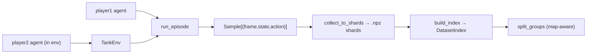

# data

The **datasets pipeline**: collect time-aligned `(frame, state, action)` samples for supervised
pretraining, organize them into on-disk `.npz` shards, and split them map-aware. Collection
routes through [`TankEnv`](env.md) — the **same** Gymnasium observation pipeline RL trains on —
so the captured rows match the RL observations exactly. It communicates downstream only via
dataset artifacts on disk.

**Boundary:** imports [`core`](core.md) (state schema), [`env`](env.md) (`TankEnv`), and
[`agents`](agents.md) (the policies that drive collection), plus numpy / stdlib — following the
`core ← {env, agents} ← data` direction. Nothing from `models` / `pretraining` / `rl`. The
package is named `data` (not `datasets` — that name collides with the git-ignored data dir).

## Key modules / entry points

- [`data.schema`](../../src/pop_trainer/data/schema.py) — the **on-disk record contract**: the
  parallel-array names / dtypes / shapes a shard holds (`frames` uint8 `(N,H,W,3)`, `states`
  float32 `(N,52)`, optional `actions` float32 `(N,2,5)`, `map_ids` / `episode_ids` /
  `step_idxs`). Imports `core.state.STATE_LEN` so the state width is never re-hardcoded.
- [`data.shards`](../../src/pop_trainer/data/shards.py) — pure, round-trip-exact `.npz`
  read/write. [`Shard`](../../src/pop_trainer/data/shards.py) validates shapes on construction;
  [`write_shard`](../../src/pop_trainer/data/shards.py) is **atomic** (write `*.tmp` →
  `Path.replace`); [`read_shard_meta`](../../src/pop_trainer/data/shards.py) reads only `.npy`
  headers (no frame decompression) so a directory can be indexed cheaply.
- [`data.readers`](../../src/pop_trainer/data/readers.py) — **map-aware (group-key)**
  train/val/test splits. [`split_groups`](../../src/pop_trainer/data/readers.py) keeps a whole
  map's samples in exactly one split (the no-leak guard) and is deterministic in its `seed`;
  [`build_index`](../../src/pop_trainer/data/readers.py) /
  [`DatasetIndex`](../../src/pop_trainer/data/readers.py) flatten a shard directory into a
  per-sample group index without loading frames.
- [`data.collect`](../../src/pop_trainer/data/collect.py) — the **collection driver**.
  [`run_episode`](../../src/pop_trainer/data/collect.py) is the pure step loop over an injected
  `env` (drives `player1`; the env owns `player2`), capturing the current `(frame, state)`
  paired with both actions from `info`. [`collect_to_shards`](../../src/pop_trainer/data/collect.py)
  wraps episodes into shards. [`CollectionSpec`](../../src/pop_trainer/data/collect.py) /
  [`run_worker`](../../src/pop_trainer/data/collect.py) /
  [`collect_parallel`](../../src/pop_trainer/data/collect.py) are the **spawn-based** (never
  fork — a CLAUDE.md YOU MUST) parallel orchestration; each worker builds its own env + socket
  inside the process, so nothing live crosses the spawn boundary.

## Pulls from (upstream)

- [core](core.md) — `state` (`STATE_LEN`, `validate`).
- [env](env.md) — `TankEnv` (collection drives episodes through it).
- [agents](agents.md) — the `player1` / `player2` policies, and `validate_action`.
- Plus numpy + stdlib (`multiprocessing` spawn context).

## Pushes to (downstream)

On-disk `.npz` shard artifacts + a dataset index — **not** via imports:

- (Future `pretraining` streams shards via the schema for the inverse-render / supervised-decode
  training.)

## Where it sits in the run

The data-generation arm. It pairs two [agents](agents.md) inside a [`TankEnv`](env.md), runs
episodes, and writes shards to disk — producing the supervised-pretraining corpus whose
`(frame, state)` rows are byte-for-byte the observations the policy will later see.

---
[← back to index](../README.md)
