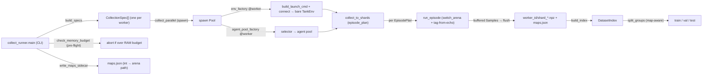
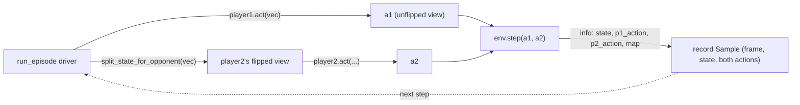

# data

The **datasets pipeline**: collect time-aligned `(frame, state, action)` samples for supervised
pretraining, organize them into on-disk `.npz` shards, and split them map-aware. Collection drives
the game through [`TankEnv`](env.md) — the **same** gymnasium observation pipeline RL trains on — so
the captured rows are byte-for-byte the RL observations, and `data` communicates downstream only via
dataset artifacts on disk. Six ideas hold the whole component together:

1. **The on-disk schema** is the single source of truth for the parallel-array names / dtypes /
   shapes a shard holds (`frames` / `states` / optional `actions` + provenance).
2. **The collection driver** (`run_episode`) is a pure step loop over an injected bare `TankEnv`
   that drives **both** players — flipping player2's view here in the driver, never in the env.
3. **The round-robin scheduler** turns a (map × pairing) grid into a per-worker, spawn-safe plan
   that covers the grid evenly across workers.
4. **Tag-from-echo** stamps each sample's `map_id` from the arena Unity *actually* loaded (the
   echoed `WallLayout`), never the runner's intent — a desync is flagged, never silently mis-tagged.
5. **The memory guard** bounds the per-worker **in-RAM frame buffer** (the OOM surface) by a byte
   budget, not a sample count — and aborts pre-flight if a run would blow the RAM budget.
6. **The split readers** group samples by map so a whole arena's frames never leak across the
   train/val/test boundary.

**Boundary:** `data` imports [`core`](core.md) (state schema, launch, wire, config, map-rotation),
[`env`](env.md) (`TankEnv`), and [`agents`](agents.md) (the policies that drive collection), plus
numpy / stdlib + tqdm / psutil — following the `core ← {env, agents} ← data` direction. It imports
**nothing** from `models` / `pretraining` / `rl`. The package is named `data` (NOT `datasets` — that
collides with the git-ignored data dir) ([`__init__.py:10-14`](../../src/pop_trainer/data/__init__.py)).
No cycles.

## Architecture at a glance

How the CLI fans a (map × pairing) grid out to spawn workers and back to shards:

The per-step driver loop `run_episode` runs (player2's view is flipped HERE):

## Key modules / entry points

### `data.schema` — the on-disk record contract
[`schema.py`](../../src/pop_trainer/data/schema.py). The single source of truth for a shard's
parallel arrays: `frames` uint8 `(N,H,W,3)`, `states` float32 `(N,52)`, **optional** `actions`
float32 `(N,2,5)` (`[p1,p2]×[mx,my,ax,ay,fire]`), plus `map_ids` / `episode_ids` / `step_idxs` int32.
`H` / `W` are NOT fixed here (a reader reads them from the shape). Imports `core.state.STATE_LEN` so
the state width is never re-hardcoded ([`schema.py:37,57-93`](../../src/pop_trainer/data/schema.py)).

### `data.shards` — atomic, round-trip-exact `.npz` I/O
[`shards.py`](../../src/pop_trainer/data/shards.py). The ONLY place that touches the `.npz` byte
layout.

- [`Shard`](../../src/pop_trainer/data/shards.py) casts to the schema dtypes and **validates shapes
  on construction**, so a malformed batch fails loudly at build time
  ([`shards.py:31-109`](../../src/pop_trainer/data/shards.py)).
- [`write_shard`](../../src/pop_trainer/data/shards.py) is **atomic** — write `*.tmp` then
  `Path.replace`, so a crash mid-write never leaves a half-shard
  ([`shards.py:112-125`](../../src/pop_trainer/data/shards.py)).
- [`read_shard_meta`](../../src/pop_trainer/data/shards.py) reads only the `.npy` HEADERS via stdlib
  `zipfile` (never decompresses the frame payload), so a directory can be indexed cheaply
  ([`shards.py:179-200`](../../src/pop_trainer/data/shards.py)).

### `data.readers` — map-aware (group-key) splits + index
[`readers.py`](../../src/pop_trainer/data/readers.py). [`split_groups`](../../src/pop_trainer/data/readers.py)
keeps a whole map's samples in exactly one split (the no-leak guard — a random per-row split would
leak the same arena across train/val) and is deterministic in its `seed`
([`readers.py:67-128`](../../src/pop_trainer/data/readers.py)).
[`build_index`](../../src/pop_trainer/data/readers.py) /
[`DatasetIndex`](../../src/pop_trainer/data/readers.py) flatten a shard directory into a per-sample
group index (concatenating only the small arrays, never the frames) and locate each sample back to
its (shard, row) ([`readers.py:147-223`](../../src/pop_trainer/data/readers.py)).

### `data.collect` — the collection driver
[`collect.py`](../../src/pop_trainer/data/collect.py). The pure, env-injectable heart of collection.

- [`run_episode`](../../src/pop_trainer/data/collect.py) is the pure step loop over an injected **bare**
  env (a pure transport owning neither player), so it drives **both** players: each step it computes
  `a1 = player1.act(vec)` (player1's unflipped view) and `a2 = player2.act(split_state_for_opponent(vec))`
  (player2's flipped first-person view, flipped HERE via [`core.state`](core.md)), calls
  `env.step(a1, a2)`, and records the current `(frame, state)` paired with **both** applied actions
  from `info`. It tags every sample once after reset (see [tag-from-echo](#the-rotation-scheduler--tag-from-echo))
  and reaches the env's boundary or the step cap ([`collect.py:315-406`](../../src/pop_trainer/data/collect.py)).
- [`collect_to_shards`](../../src/pop_trainer/data/collect.py) drives an `episode_plan` (a round-robin
  of (map × pairing) [`EpisodePlan`](../../src/pop_trainer/data/collect.py)s) on ONE long-lived env,
  pairing each episode's two selectors from an `agent_pool` the worker builds once, and flushes
  buffered samples to shards. Its `shard_size` is the **in-RAM BUFFER bound (the OOM surface), NOT a
  file-size knob**: `None` → AUTO-derived once from the first frame's `nbytes`. A smaller bound just
  yields more, smaller shards with byte-identical contents
  ([`collect.py:445-534`](../../src/pop_trainer/data/collect.py)).
- [`CollectionSpec`](../../src/pop_trainer/data/collect.py) /
  [`run_worker`](../../src/pop_trainer/data/collect.py) /
  [`collect_parallel`](../../src/pop_trainer/data/collect.py) are the **spawn-based** (never fork — a
  CLAUDE.md YOU MUST) orchestration: each worker builds its own bare env + socket + agent pool inside
  the process from the spec's factories, so only plain data crosses the spawn boundary. A **single
  aggregate** tqdm progress bar is owned by the **parent** (per-episode granularity, auto-silent
  off-TTY); workers report a plain `(worker_id, n_samples)` count onto a `Manager().Queue()`, so it is
  a pure observability side-channel — collecting with vs without it yields byte-identical shards
  ([`collect.py:540-571,596-723`](../../src/pop_trainer/data/collect.py)).

### `data.collect_runner` — the live collection entry point
[`collect_runner.py`](../../src/pop_trainer/data/collect_runner.py)
(`python -m pop_trainer.data.collect_runner`): the concrete factories + CLI riding on `collect`'s
orchestration. Multi-worker; runs a single map OR a map × pairing rotation (`--maps`).

- [`env_factory`](../../src/pop_trainer/data/collect_runner.py) is the module-level (spawn-safe, no
  closures) factory that launches one Unity build per worker via
  [`core.launch.build_launch_cmd`](core.md) + `Popen` on `port = base_port + worker_id`, connects via
  [`core.launch.connect`](core.md), and builds the bare [`TankEnv`](env.md) — wrapping `env.close` so
  closing the env also reaps the build. The build is launched ONCE per worker on the boot config and
  rotates arenas at runtime via `switch_arena`. The env's `frame_shape` is **derived from the boot
  config's `obs_pixels_*`** via [`core.obs.frame_shape_from_config`](core.md#the-observation-resolution-contract-coreobs),
  so the env byte-read matches the build's rendered frame
  ([`collect_runner.py:346-388,500-501,563`](../../src/pop_trainer/data/collect_runner.py)).
- [`agent_pool_factory`](../../src/pop_trainer/data/collect_runner.py) is the module-level (spawn-safe)
  factory that builds the worker's `{selector → agent}` pool once up front, so each selector's RNG
  stream is continuous across the episodes it plays; both factories are wired onto every spec and
  required by `run_worker` ([`collect_runner.py:391-401`](../../src/pop_trainer/data/collect_runner.py)).
- [`build_specs`](../../src/pop_trainer/data/collect_runner.py) is the pure CLI-args→`list[CollectionSpec]`
  builder (one per worker, `--workers` clamped to `[1, MAX_WORKERS=8]`, each an own `worker_<id>/`
  out-dir + a distinct seed, and either a single-map no-switch plan or its slice of the round-robin)
  ([`collect_runner.py:443-570`](../../src/pop_trainer/data/collect_runner.py)).
- [`main`](../../src/pop_trainer/data/collect_runner.py) parses the flags, resolves the boot config
  (the obs_pixels-enabled `demo_config.json`), runs the **pre-flight memory guard**, writes the
  `maps.json` sidecar, drives `collect_parallel`, and prints a concise end-of-run summary
  (`--max-steps` defaults to `DEFAULT_MAX_STEPS = 800` — the live coverage finding)
  ([`collect_runner.py:144,760-857`](../../src/pop_trainer/data/collect_runner.py)). The pure
  end-of-run counter is [`summarize_collection`](../../src/pop_trainer/data/collect_runner.py) /
  [`CollectionSummary`](../../src/pop_trainer/data/collect_runner.py), fed each worker's per-sample
  `map_ids` read back by `_read_worker_map_ids` (which globs `shard_*.npz` in sorted order and reads
  ONLY the tiny `map_ids` member — never inflating the big `frames` array)
  ([`collect_runner.py:576-628,631-646`](../../src/pop_trainer/data/collect_runner.py)). See the
  [runbook §4](../runbook.md#4-collect-a-dataset) for the flags + printout.

## The rotation scheduler + tag-from-echo

A run is a deterministic **round-robin over the (map × pairing) grid**. The rotation set comes from
`--maps` (resolved by [`core.maps.resolve_map_rotation`](core.md) into arena targets); the pairing set
is `--pairing` (default `DEFAULT_PAIRINGS`, the coverage family vs each other + vs random).

- [`round_robin_plan`](../../src/pop_trainer/data/collect_runner.py) is the **pure** per-worker
  scheduler (unit-tested, no live build). The grid is `rotation × pairings` enumerated **map-major**;
  worker `w` episode `i` picks cell `(worker_id + i*n_workers) % G`. Across all workers the chosen
  indices form a **bijection** onto `[0, n_workers*episodes)`, so the union covers the grid evenly and
  no two workers run identical episodes at the same step
  ([`collect_runner.py:234-280`](../../src/pop_trainer/data/collect_runner.py)).
- [`EpisodePlan`](../../src/pop_trainer/data/collect.py) is one scheduled episode as **plain,
  spawn-safe data** (`switch_arena` arena-path string / `player1` / `player2` selector names /
  `intended_map_id` int); `switch_arena=None` is a no-switch reset (single-map mode)
  ([`collect.py:229-249`](../../src/pop_trainer/data/collect.py)).
- [`resolve_map_tag`](../../src/pop_trainer/data/collect.py) is the **echo-wins** tagging: the on-disk
  `map_id` int must reflect the arena Unity **actually loaded**. The echoed `info["map"].map_id` looked
  up in `map_index` wins (`tag_source = "echo"`); a missing echo → `"fallback_no_echo"`; an echo whose
  path is NOT in the index → `"fallback_unknown_echo"` (a runner↔Unity desync, **flagged**); no index
  at all → `"intended"`. Both `tag_source` and `echoed_map_id` are recorded on
  [`EpisodeResult`](../../src/pop_trainer/data/collect.py) so a fallback is never silently mis-tagged.
  The arena is static within an episode, so the tag is resolved **once** after reset and stamped on
  every sample ([`collect.py:252-281,375-377`](../../src/pop_trainer/data/collect.py)).

## Memory safety (the pre-flight guard)

The per-worker **in-RAM buffer** — each buffered sample holds an UNCOMPRESSED `(H,W,3)` uint8 frame —
is the OOM surface, **not** the (≈140× compressed) on-disk shard. Three **pure**, unit-tested
functions in [`data.collect`](../../src/pop_trainer/data/collect.py) bound it:

- [`default_shard_size`](../../src/pop_trainer/data/collect.py) — the frame-size-aware default
  `SHARD_BYTES_BUDGET // frame_nbytes` (≥ 1): for the 360×640×3 (~0.69 MB) frame → ~582 frames/shard
  (vs the old count-based `10000` that OOMed) ([`collect.py:110-122`](../../src/pop_trainer/data/collect.py)).
- [`estimate_peak_buffer_bytes`](../../src/pop_trainer/data/collect.py) — `frame_bytes × shard_size ×
  workers × SPIKE_FACTOR` ([`collect.py:125-133`](../../src/pop_trainer/data/collect.py)).
- [`check_memory_budget`](../../src/pop_trainer/data/collect.py) — raises `MemoryError` when the
  estimate exceeds `available_bytes × MARGIN` and not `--allow-oversized`; otherwise returns the
  human-readable estimate line (always printed) ([`collect.py:136-170`](../../src/pop_trainer/data/collect.py)).

Constants: `SHARD_BYTES_BUDGET ≈ 384 MB`, `SPIKE_FACTOR = 2` (the flush transient), `MARGIN = 0.6`
(leave headroom for the ~1 GB/worker Unity instances + the OS)
([`collect.py:97-107`](../../src/pop_trainer/data/collect.py)). These take `available_bytes` as an
**injected** argument — `psutil` is read ONLY in [`collect_runner.main`](../../src/pop_trainer/data/collect_runner.py),
which resolves the effective `shard_size`, reads `psutil.virtual_memory().available`, and on
`MemoryError` aborts with exit code `2` BEFORE launching any build
([`collect_runner.py:803-825`](../../src/pop_trainer/data/collect_runner.py)).

## Pulls from (upstream)

- [core](core.md) — `state` (`STATE_LEN` + `validate` + `split_state_for_opponent`),
  `config.EnvConfig`, `protocol.Connection`, `agent.Agent`, `launch` (`build_launch_cmd` / `connect` —
  one build per worker), `obs.frame_shape_from_config` (derive the boot config's pixel `frame_shape`),
  and `maps.resolve_map_rotation` (the shared `--maps` rotation contract).
- [env](env.md) — `TankEnv` (collection drives episodes through the bare pure-transport env).
- [agents](agents.md) — `make_agent` + `AGENT_SELECTORS` (the coverage / random policies it pairs),
  and `validate_action`.
- Plus numpy + tqdm + psutil + stdlib (`multiprocessing` spawn context, `subprocess`).

## Pushes to (downstream)

On-disk `.npz` shard artifacts + the `maps.json` sidecar — **not** via imports. Nothing in
`src/pop_trainer` imports `data` today; the future `pretraining` streams the shards via the
[`schema`](#dataschema--the-on-disk-record-contract) for the supervised-decode training.

## Where it sits in the run

The data-generation arm. It pairs two [agents](agents.md) inside a [`TankEnv`](env.md), runs episodes,
and writes shards to disk — producing the supervised-pretraining corpus whose `(frame, state)` rows
are byte-for-byte the observations the policy will later see in [rl](rl.md).

> **Episode length matters for coverage.** The coverage family fully sweeps a map only by ~800
> decisions on the live engine (see the
> [agents coverage harness](agents.md#measure_coverage--the-validation-harness)), so collection
> episodes must run long enough — `--max-steps` defaults to 800.

---
[← back to index](../README.md)
