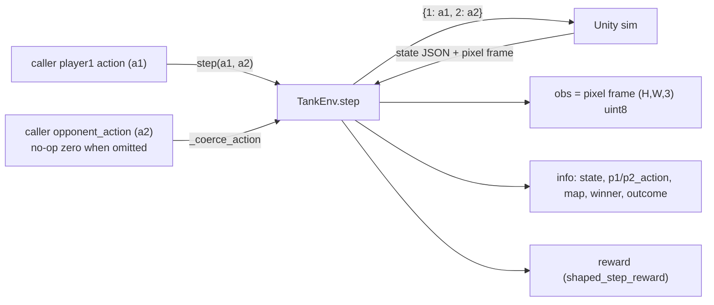
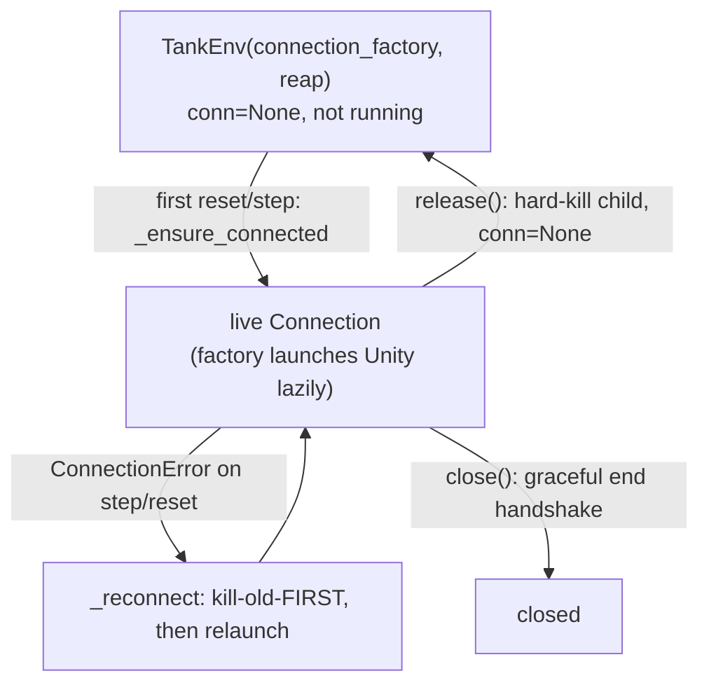

# env

The **simulator interface** — the Gymnasium environment wrapping the Unity sim over the socket,
plus the budget-based shaped reward. This is the trainer's **swap point**: everything downstream
speaks the Gymnasium API, so a different simulator could implement the same interface unchanged.
Five ideas hold the whole component together:

1. **Observation = the real rendered pixel frame**, not the state — the 52-float wire state rides
   in `info["state"]` as the supervised-decode objective, never in `observation_space`.
2. **Pure symmetric transport** — the env owns NEITHER player; `step(a1, a2)` takes BOTH actions
   from the caller and sends the byte-identical `{1: a1, 2: a2}` wire message.
3. **Injected transport + reap hook** keep the env `core`-only and unit-testable against a fake
   socket — and enable lazy launch, kill-old-first reconnect, and hard-kill `release`.
4. **Unity's clock is the episode boundary** — `terminated` is Unity's own `done`/`winner`;
   `max_steps` is a generous SAFETY cap above the round length, never the normal boundary.
5. **Map geometry is tracked, not owned** — the env routes the optional one-time walls message into
   `info["map"]` but never notifies an agent; the driver hands the layout to a map-aware agent.

**Boundary:** `env` imports [`core`](core.md) only (plus `gymnasium` + `numpy`) — `state`,
`protocol`, `config`, `logging_setup` ([`tank_env.py:139-149`](../../src/pop_trainer/env/tank_env.py))
and the local pure [`rewards`](../../src/pop_trainer/env/rewards.py). No torch, no sb3, **nothing**
from `models` / `data` / `agents` / `rl` / the Unity-side C#. The reward module imports nothing
internal at all — it re-declares `PLAYER_1` locally so it stays a pure boundary translation
([`rewards.py:41-43`](../../src/pop_trainer/env/rewards.py)). No cycles.

## Architecture at a glance

The per-step wire exchange SB3 / the driver sees (the env owns neither player):

The instance lifecycle the injected factory + reap hook drive:

## Key classes / entry points

### `TankEnv` — the gym env over the Unity socket
[`tank_env.py`](../../src/pop_trainer/env/tank_env.py). The single-agent, pixel-observation
`gymnasium.Env`. `reset(*, seed=None, options=None)` runs the restart/(switch)/start/first-state
handshake and `step(action, opponent_action=None)` returns the 5-tuple
`(obs, reward, terminated, truncated, info)`
([`TankEnv`, `tank_env.py:194`](../../src/pop_trainer/env/tank_env.py)). The load-bearing facts:

- **Observation is the real rendered frame** (`(H, W, 3)` uint8) read via
  `Connection.receive_state_and_frame`; the 52-float state is surfaced in `info["state"]`, NOT in
  `observation_space` ([`tank_env.py:290-292,531,573-574`](../../src/pop_trainer/env/tank_env.py)).
- **`frame_shape` is config-derived (one source of truth).** The env reads exactly
  `prod(frame_shape)` bytes per frame, so its shape MUST match the build's `obs_pixels_width/height`.
  The constructor default `DEFAULT_FRAME_SHAPE` is the tiny unit-test value; every **live** caller
  ([play](play.md) / [rl](rl.md) / [data](data.md)) passes the shape derived from the launched
  config via [`core.obs.frame_shape_from_config`](core.md#the-observation-resolution-contract-coreobs)
  ([`tank_env.py:160,253,290-292`](../../src/pop_trainer/env/tank_env.py)).
- **`ACTION_DIM = 5`** — the action is `[move_x, move_y, aim_x, aim_y, fire]` in `[-1, 1]`
  ([`tank_env.py:152,293-295`](../../src/pop_trainer/env/tank_env.py)).
- **Injected transport + reap, exactly one of `connection` / `connection_factory`.** A bare
  `connection` is "running" from construction; a `connection_factory` launches NOTHING at
  construction and is invoked lazily — see [Instance lifecycle](#instance-lifecycle-lazy-launch--release--kill-old-first-reconnect). `reap=` is the
  injected `Callable[[object], None]` that hard-kills a `Popen`-like build read off
  `getattr(self.conn, "_launch_proc", None)`; `reap=None` (the pure-test default) only closes the
  transport ([`tank_env.py:261-265,704-707`](../../src/pop_trainer/env/tank_env.py)).
- **Optional observability** (`logger=` / `role=`), both default off: `logger=None` is the
  behaviour-identical, allocation-free hot path (the `_log` helper early-returns with no logger). It
  does **not** touch the wire, the 52-float state, message ordering, or control flow — wired by the
  [rl](rl.md#the-train_local-integrator) integrator
  ([`_log`, `tank_env.py:313-322`](../../src/pop_trainer/env/tank_env.py)).

### Pure symmetric transport (the self-play seam)
`step(action, opponent_action)` takes **two** actions, BOTH from the caller, and sends
`{1: a1, 2: a2}`: `a1` is the unchanged player1 path (`np.asarray(action, np.float32).tolist()`),
`a2` is the caller's `opponent_action` coerced to the `[-1, 1]` length-5 `float64` wire shape via
`_coerce_action` (a no-op zero `[0.0]*5` when omitted). Both wire actions are captured on the env and
surfaced in `info["p1_action"]` / `info["p2_action"]`
([`step`, `tank_env.py:482,517-525,552-553,573-578`](../../src/pop_trainer/env/tank_env.py);
[`_coerce_action`, `tank_env.py:178-191`](../../src/pop_trainer/env/tank_env.py)).

- **The driver owns the perspective flip.** The env exposes player2 self-play **helpers** the driver
  MAY use — `player2_frame()` (R/B channel swap) and `player2_state()`
  (`split_state_for_opponent` on the latest raw state) — but the env does NOT call them itself during
  `step` ([`tank_env.py:657-674`](../../src/pop_trainer/env/tank_env.py)).
- **Seam unchanged.** The wire shape is byte-identical to the frozen RL seam — only the *source* of
  `a2` moved from env-internal to the caller (integer keys `1`/`2`, length-5 `[-1, 1]` actions,
  unchanged player1 path).

### Instance lifecycle (lazy launch / `release` / kill-old-first reconnect)
The env owns the live Unity instance's lifecycle through the **injected** factory + reap hook, so it
stays `core`-only and launches nothing on its own:

- **Lazy launch.** With a `connection_factory` the env launches NO Unity at construction
  (`self.conn is None`, `is_running` is `False`); the factory is invoked lazily on the first `reset`
  (guarded again in `step`) via `_ensure_connected` — so a caller can construct many envs cheaply
  ([`_ensure_connected`, `tank_env.py:678-689`](../../src/pop_trainer/env/tank_env.py);
  [`is_running`, `tank_env.py:326-330`](../../src/pop_trainer/env/tank_env.py)).
- **`release()` — hard-kill + reclaim.** Hard-kills the live Unity child via the reap hook, closes
  the transport, and sets `self.conn = None`. Unlike `close()` it does **NOT** do the graceful end
  handshake — the point is to reclaim a possibly-**stalled** instance. It is idempotent, never
  touches the `-logFile`, and the env OBJECT stays alive: the next `reset` lazily re-launches. This
  is the primitive [rl](rl.md#the-no-coexist-eval-cycle--multi-env-lifecycle)'s eval cycle uses to
  tear instances down ([`release`, `tank_env.py:634-653`](../../src/pop_trainer/env/tank_env.py);
  [`_free_connection`, `tank_env.py:691-713`](../../src/pop_trainer/env/tank_env.py)).
- **Kill-old-first reconnect.** On a dropped connection `_reconnect` kills/reaps the OLD instance to
  free its port **BEFORE** launching the new one. The order is load-bearing: a dropped socket may
  leave the old Unity alive-but-stalled still bound to its port, so relaunching first would collide
  on bind. This makes the intermittent multi-env training stall **survivable** — it recovers, it
  does NOT fix the underlying C# reset-region root cause
  ([`_reconnect`, `tank_env.py:715-736`](../../src/pop_trainer/env/tank_env.py)).

> **Logfile safety.** `release` / `_reconnect` only kill the process and close the socket — they
> NEVER write, truncate, or re-point any Unity `-logFile` (that arg lives entirely in the caller's
> launch command), so the prior instance's C# log is left intact for post-mortem
> ([`tank_env.py:118-120,644-645,729`](../../src/pop_trainer/env/tank_env.py)).

### Map tracking (`info["map"]`)
During the handshake the env reads the optional one-time `{"type": "walls", ...}` message, parses it
via `core.protocol.parse_walls_message`, and stores the [`WallLayout`](core.md) on
`self.current_map` — surfaced in both reset and step `info` as `info["map"]` (`None` when no arena is
configured) ([`tank_env.py:306,445,577`](../../src/pop_trainer/env/tank_env.py)). The routing lives
in `_drain_optional_walls`: it reads JSON objects one at a time, parses + stores any **walls**
message (LAST wins) and continues, but **returns the first non-walls object** (the next handshake
message — a `starting` ack or first `state` — is never mis-read as walls), so it is correct across
all four switch/no-switch × walls present/absent cases
([`_drain_optional_walls`, `tank_env.py:447-459`](../../src/pop_trainer/env/tank_env.py); called
twice at [`tank_env.py:429,437`](../../src/pop_trainer/env/tank_env.py)). The env surfaces the layout
but does **not** notify any agent — both players are driver-side, so [data](data.md) / [play](play.md)
hand it to a map-aware [agent](agents.md) via the OPTIONAL `set_map` hook. The env stays `agents`-free.

### Map rotation (`reset(options={"switch_arena": ...})`)
Map rotation is additive, reset-time only: `reset(options={"switch_arena": <path>})` fires the change
in Unity's `!ingame` window — after the restart ack, before the `{"start": True}` send — via
[`Connection.switch_arena`](core.md#the-switch-arena-handshake-connectionswitch_arena). A reset
**without** the option is byte-identical to the no-switch handshake; the same `"type"`-tag routing
drains the walls message Unity emits after either ack
([`_handshake_and_first_state`, `tank_env.py:379-445`](../../src/pop_trainer/env/tank_env.py)).

### `shaped_step_reward` — the pure budget reward
[`rewards.py`](../../src/pop_trainer/env/rewards.py). The pure (no socket, no gym, no numpy)
budget-based reward + episode-boundary logic: a per-step time penalty accrues every
non-lost-connection step, plus the win/loss terminal **ADDED** (not overwriting) on the decided step,
so a late loss is worse than `loss_reward` alone; survivor mode flips the terminal component off
winner-key **presence** ([`shaped_step_reward`, `rewards.py:59-112`](../../src/pop_trainer/env/rewards.py);
[`time_penalty_per_step`, `rewards.py:46-56`](../../src/pop_trainer/env/rewards.py)).

### Episode boundaries
- `terminated` = Unity decided the round (a winner, or a bare `done`) — the NORMAL boundary;
  `truncated` = the `max_steps` SAFETY cap on an undecided step **OR** a lost connection. A dropped
  connection becomes a `truncated`, reward-`0.0` step with `info["lost_connection"] = True`, then the
  env kill-old-first reconnects
  ([`step`, `tank_env.py:529-547,556-571`](../../src/pop_trainer/env/tank_env.py);
  [`rewards.py:84-110`](../../src/pop_trainer/env/rewards.py)).
- **`info["outcome"]` is the eval source of truth.** On a DECIDED terminal the env tags
  `"win"`/`"loss"`/`"draw"` (a truncation gets none), which [rl](rl.md#the-eval--elo-seam)'s win-rate
  eval reads instead of the reward sign
  ([`tank_env.py:585-591`](../../src/pop_trainer/env/tank_env.py)).

## Pulls from (upstream)

- **[core](core.md)** — `state` (the 52-float schema + `split_state_for_opponent` /
  `flip_frame_perspective` the perspective helpers compose), `protocol` (`Connection` incl.
  `switch_arena` / `receive_state_and_frame`, `WallLayout`, `is_walls_message`,
  `parse_walls_message`, `state_message_is_valid`), `config` (`EnvConfig` / `RewardConfig`),
  `logging_setup` (`LAYER_ENV`) ([`tank_env.py:139-148`](../../src/pop_trainer/env/tank_env.py)).
- **gymnasium / numpy** — the `gymnasium.Env` base + `spaces.Box` and the array handling
  ([`tank_env.py:135-137`](../../src/pop_trainer/env/tank_env.py)).

## Pushes to (downstream)

- **[data](data.md)** — collection drives `TankEnv` (the same observation pipeline RL trains on) and
  rotates the arena per episode via `reset(options={"switch_arena": ...})`.
- **[play](play.md)** — constructs a `TankEnv` over a live socket and runs one episode (human,
  rule-based, or a trained `rl:` agent acting on the pixel frame).
- **[rl](rl.md)** — consumes `TankEnv` as both its training set and a **same-width**
  (`M_eval == N_train`) eval set, each over its own live socket on a **disjoint** port block:
  `SelfPlayWrapper` wraps each for PPO training, and `evaluate_winrate` re-wraps the eval envs for
  periodic **parallel** win-rate eval (reading `info["outcome"]`). The eval cycle uses `release()` to
  time-multiplex the two sets so they **never coexist**, and the factory's lazy launch is what makes
  that cheap.

## Where it sits in the run

The hinge. The env IS the boundary between the trainer and the Unity simulator: it owns the socket
handshake, the per-step wire exchange, and the reward — but **neither player**. The driver
([data](data.md) / [play](play.md)) supplies both `a1` and `a2`; [rl](rl.md) wraps it for self-play
PPO. Swap the env for another simulator behind the same gym interface and everything downstream is
unchanged.

---
[← back to index](../README.md)
