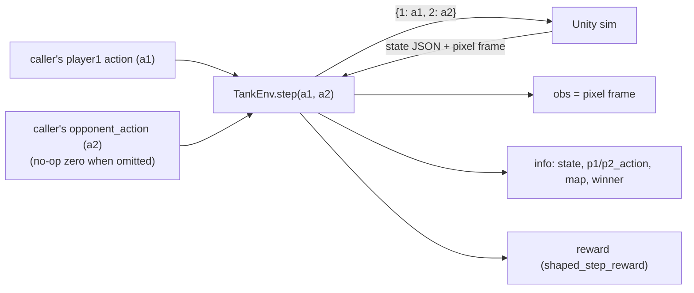

# env

The **simulator interface** — the Gymnasium environment wrapping the Unity sim over the socket,
plus the budget-based shaped reward. This is the trainer's **swap point**: everything downstream
speaks the Gymnasium API, so a different simulator could implement the same interface unchanged.

**Boundary:** imports [`core`](core.md) only (plus `gymnasium` + `numpy`). No torch, no sb3,
nothing from `models` / `data` / `agents` / the Unity-side code.

## Key classes / entry points

- [`TankEnv`](../../src/pop_trainer/env/tank_env.py) — the single-agent, pixel-observation
  `gymnasium.Env` over the Unity socket. `reset(*, seed=None, options=None)` runs the
  restart/(switch)/start/first-state handshake (`options={"switch_arena": <path>}` rotates the
  arena — see [Map rotation](#map-rotation-resetoptionsswitch_arena));
  `step(action, opponent_action=None)` returns the Gymnasium 5-tuple
  `(obs, reward, terminated, truncated, info)`.
  - **Observation = the real rendered pixel frame** (`(H, W, 3)` uint8) read via
    `core.protocol.Connection.receive_state_and_frame`. The 52-float wire state is NOT in
    `observation_space` — it rides in `info["state"]` as the supervised-decode objective.
  - `ACTION_DIM = 5`: the action is `[move_x, move_y, aim_x, aim_y, fire]` in `[-1, 1]`.
  - **Injected transport** (`connection` or `connection_factory`), exactly like
    `core.protocol.Connection` — so the env is unit-testable against an in-process fake socket
    with no live Unity. `connection_factory` also enables reconnect after a dropped connection.
  - **Optional observability** (`logger=` / `role=`). Both default off: `logger=None` is the
    behavior-identical, allocation-free hot path (the `_log` helper early-returns when no logger
    is attached — `tank_env.py:186-187,210-211,235-246`). When a `logging.Logger` is passed the
    env emits env-layer `reset`/`step`/`episode` milestone records (tagged `layer="env"`); the
    SAME logger is meant to be threaded into the `Connection` (by the caller's
    `connection_factory`) so protocol + env records for one socket share the
    `env-<role>-<port>.log` file. `role` (`"train"`/`"eval"`, default `"train"`) is the
    purely-observational role tag surfaced in those records. This is wired by the
    [rl](rl.md#observability-logging) integrator; it does **not** touch the wire, the 52-float
    state, message ordering, or control flow.
- [`shaped_step_reward` / `time_penalty_per_step`](../../src/pop_trainer/env/rewards.py) — the
  **pure** budget-based reward (no socket, no gym, no numpy): a per-step time penalty that
  accrues every step, plus the win/loss terminal *added* on the decided step. Survivor mode
  flips the terminal component.

## Pure symmetric transport (the self-play seam)

The env owns **neither** player — it is a pure symmetric transport. `step(action, opponent_action)`
takes **two** actions, BOTH from the **caller**: it sends the wire message `{1: a1, 2: a2}` where
`a1` is the player1 `action` (sent as `np.asarray(action, np.float32).tolist()`, the unchanged
player1 path) and `a2` is the caller's `opponent_action` coerced to the `[-1, 1]` length-5 wire
shape via `_coerce_action` (`tank_env.py:112-125`). When `opponent_action` is `None` the env sends
a **no-op zero action** `[0.0, 0.0, 0.0, 0.0, 0.0]`. Both wire actions are captured on the env
(`self.last_p1_action` / `self.last_p2_action`) and surfaced in `info["p1_action"]` /
`info["p2_action"]` (`tank_env.py:344-387`).

The **driver** ([data](data.md) collection / [demo](demo.md)) owns each agent and the player2
**perspective flip** — it computes player2's first-person view via
`core.state.split_state_for_opponent` and passes the resulting `a2` into `env.step(a1, a2)`. The
env exposes self-play perspective **helpers** the driver MAY use — `player2_frame()` (R/B channel
swap) and `player2_state()` (`split_state_for_opponent` on the latest raw state,
`tank_env.py:433-450`) — but the env does NOT call them itself during `step`.

> **Seam unchanged.** The wire shape is **byte-identical** to the frozen RL seam — only the
> *source* of `a2` moved from env-internal to the caller. Integer keys `1` / `2`, length-5 `[-1, 1]`
> actions, unchanged player1 path.

## Map tracking (`info["map"]`)

During the handshake the env reads the optional one-time `{"type": "walls", ...}` message
(routed by its `"type"` tag), parses it via `core.protocol.parse_walls_message`, and stores the
[`WallLayout`](core.md) on `self.current_map` — surfaced in both reset and step `info` as
`info["map"]` (`tank_env.py:292,386`). It stays `None` when no arena is configured; the env never
re-parses arena JSON. See the [core](core.md) seam writeup for the full Unity → Python path.

The routing itself lives in **`_drain_optional_walls()`** (`tank_env.py:294-306`): it reads JSON
objects one at a time, and for each, routes by its `"type"` tag — a **walls** message is parsed +
stored on `self.current_map` (**LAST wins**, via `parse_walls_message`) and the loop continues; the
**first non-walls** object is **returned** (the next handshake message — a `starting` ack or the
first `state` — is never mis-read as walls). Because an absent walls message never consumes a
state, this is correct across **all four cases** (switch / no-switch × walls present / absent). It
is called **twice** in the handshake: once after the start send to reach the `starting` ack, then
again to reach the first `state` (`tank_env.py:279,285`).

The env surfaces the `WallLayout` in `info["map"]` but does **not** itself notify any agent — both
players are driver-side, so the [data](data.md) collection and [demo](demo.md) loops hand the
layout to a map-aware [agent](agents.md) (e.g. a `CoverageAgent`) via the OPTIONAL `set_map` hook.
The env stays `agents`-free.

## Map rotation (`reset(options={"switch_arena": ...})`)

Additive, **reset-time only**. `reset(options={"switch_arena": <arena_path>})` fires a map change
in Unity's `!ingame` window — **after the restart ack and before the `{"start": True}` send** — via
[`core.protocol.Connection.switch_arena`](core.md#the-switch-arena-handshake-seam-connectionswitch_arena)
(`tank_env.py:273-274`). The env reads the `{"arena_switched": true}` ack (inside `switch_arena`),
then the optional walls message Unity emits after it (present only for a walls arena) is drained by
the **same** `"type"`-tag routing (`_drain_optional_walls`) used after the start ack. The
`WallLayout` last received — after the switch ack or the start ack — is stored on
`self.current_map`, so `info["map"]` (a `WallLayout` or `None`) reflects the **switched** arena.

A reset **without** this option is **byte-identical** to the no-switch handshake: the switch is
purely additive and never touches the per-step wire. The deterministic Unity wire ordering for a
switch-to-walls reset is `arena_switched`, `walls` (switch), `starting`, `walls` (start), `state`,
`frame` — with the start ack interleaved between the two walls messages; `_drain_optional_walls`
routes every inbound object by tag regardless of read order (`tank_env.py:239-306`).

## Episode boundaries

- `terminated` — the game decided the round (a winner, or a bare `done`).
- `truncated` — `max_steps` reached on an undecided step, **OR** a lost connection. A dropped
  connection (`core.protocol` raises `ConnectionError`) becomes a `truncated` step with reward
  `0.0` and `info["lost_connection"] = True`, then the env reconnects via the factory.

## Pulls from (upstream)

- [core](core.md) — `state` (schema + `split_state_for_opponent` / `flip_frame_perspective`),
  `protocol` (`Connection` incl. `switch_arena`, `WallLayout`, `is_walls_message`,
  `parse_walls_message`), `config` (`EnvConfig` / `RewardConfig`), `agent.Agent`. Plus
  `gymnasium` + `numpy`.

## Pushes to (downstream)

- [data](data.md) — collection drives `TankEnv` (the same observation pipeline RL trains on), and
  rotates the arena per episode via `reset(options={"switch_arena": ...})`.
- [demo](demo.md) — constructs a `TankEnv` over a live socket and runs one episode.
- [rl](rl.md) — consumes `TankEnv` as both its training env and a dedicated eval env (each over its
  own live socket): `SelfPlayWrapper` wraps it for PPO training, and `evaluate_winrate` re-wraps a
  second `TankEnv` for periodic win-rate eval. (Built — the M1 `train_local` trainer.)

## Where it sits in the run

The hinge. The env IS the boundary between the trainer and the Unity simulator: it owns the
socket handshake, the per-step wire exchange, and the reward — but **neither player**. The driver
([data](data.md) / [demo](demo.md)) supplies both `a1` and `a2`; both `data` collection and the
`demo` run their episodes through it.

---
[← back to index](../README.md)
