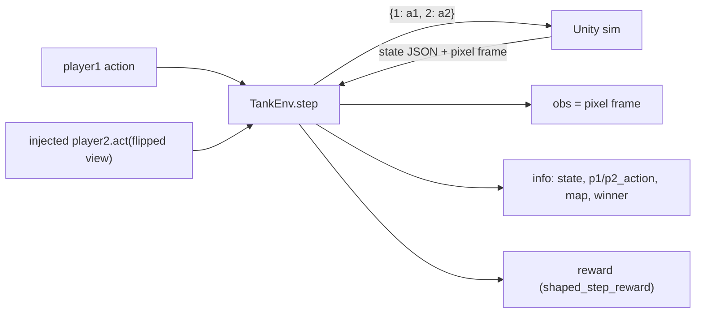

# env

The **simulator interface** — the Gymnasium environment wrapping the Unity sim over the socket,
plus the budget-based shaped reward. This is the trainer's **swap point**: everything downstream
speaks the Gymnasium API, so a different simulator could implement the same interface unchanged.

**Boundary:** imports [`core`](core.md) only (plus `gymnasium` + `numpy`). No torch, no sb3,
nothing from `models` / `data` / `agents` / the Unity-side code.

## Key classes / entry points

- [`TankEnv`](../../src/pop_trainer/env/tank_env.py) — the single-agent, pixel-observation
  `gymnasium.Env` over the Unity socket. `reset()` runs the restart/start/first-state handshake;
  `step(action)` returns the Gymnasium 5-tuple `(obs, reward, terminated, truncated, info)`.
  - **Observation = the real rendered pixel frame** (`(H, W, 3)` uint8) read via
    `core.protocol.Connection.receive_state_and_frame`. The 52-float wire state is NOT in
    `observation_space` — it rides in `info["state"]` as the supervised-decode objective.
  - `ACTION_DIM = 5`: the action is `[move_x, move_y, aim_x, aim_y, fire]` in `[-1, 1]`.
  - **Injected transport** (`connection` or `connection_factory`), exactly like
    `core.protocol.Connection` — so the env is unit-testable against an in-process fake socket
    with no live Unity. `connection_factory` also enables reconnect after a dropped connection.
- [`shaped_step_reward` / `time_penalty_per_step`](../../src/pop_trainer/env/rewards.py) — the
  **pure** budget-based reward (no socket, no gym, no numpy): a per-step time penalty that
  accrues every step, plus the win/loss terminal *added* on the decided step. Survivor mode
  flips the terminal component.

## Player2 injection (the self-play seam)

`player2` is an injected [`core.agent.Agent`](core.md). The env **never imports `agents`** —
when no `player2` is supplied it falls back to a trivial built-in `_RandomPlayer2` seeded off
the env's own `np_random`. Each step the env computes player2's **own first-person view** (the
perspective-flipped 52-float state via `core.state.split_state_for_opponent`), calls
`player2.act(view)`, and captures **both** players' actions into `info["p1_action"]` /
`info["p2_action"]`. `player2_frame()` / `player2_state()` expose the perspective transforms for
the self-play path.

## Map tracking (`info["map"]`)

During the handshake the env reads the optional one-time `{"type": "walls", ...}` message
(routed by its `"type"` tag), parses it via `core.protocol.parse_walls_message`, and stores the
[`WallLayout`](core.md) on `self.current_map` — surfaced in both reset and step `info` as
`info["map"]`. It stays `None` when no arena is configured; the env never re-parses arena JSON.
See the [core](core.md) seam writeup for the full Unity → Python path.

## Episode boundaries

- `terminated` — the game decided the round (a winner, or a bare `done`).
- `truncated` — `max_steps` reached on an undecided step, **OR** a lost connection. A dropped
  connection (`core.protocol` raises `ConnectionError`) becomes a `truncated` step with reward
  `0.0` and `info["lost_connection"] = True`, then the env reconnects via the factory.

## Pulls from (upstream)

- [core](core.md) — `state` (schema + `split_state_for_opponent` / `flip_frame_perspective`),
  `protocol` (`Connection`, `WallLayout`, `is_walls_message`, `parse_walls_message`), `config`
  (`EnvConfig` / `RewardConfig`), `agent.Agent`. Plus `gymnasium` + `numpy`.

## Pushes to (downstream)

- [data](data.md) — collection drives `TankEnv` (the same observation pipeline RL trains on).
- [demo](demo.md) — constructs a `TankEnv` over a live socket and runs one episode.
- (Future `rl` consumes `TankEnv` as its training env — not yet built.)

## Where it sits in the run

The hinge. The env IS the boundary between the trainer and the Unity simulator: it owns the
socket handshake, the per-step wire exchange, the reward, and the player2 opponent. Both
`data` collection and the `demo` run their episodes through it.

---
[← back to index](../README.md)
