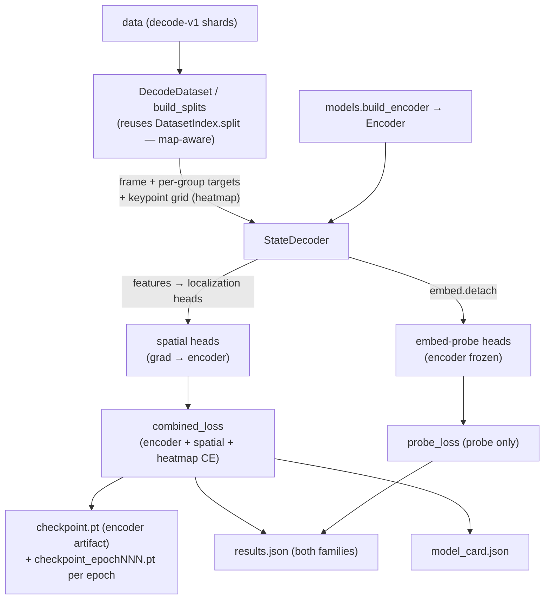

# pretraining

The **single-frame decoder harness** — a supervised **inverse-renderer**. It wraps a
config-built [`Encoder`](models.md) and attaches disposable heads that decode the 52-float wire
state from ONE pixel frame, so the encoder learns to "see" game state. The **encoder is the
reusable artifact** (it flows downstream to RL / the ablation sweep); every head is throwaway
scaffolding. This is Phase 1, tracks #6.

**Boundary:** imports [`core`](core.md) (state-schema accessors), [`models`](models.md)
(`build_encoder` / `Encoder.features` + `Encoder.embed`), and [`data`](data.md)
(`readers.DatasetIndex` / split, `schema`, `shards`) + torch / numpy / stdlib. Imports **nothing
from `env` / `rl`** — it is decoupled from the live engine by the on-disk dataset (offline
training), per [`__init__.py:19`](../../src/pop_trainer/pretraining/__init__.py).

## Key modules / entry points

- [`pretraining.decoder`](../../src/pop_trainer/pretraining/decoder.py) — the
  [`StateDecoder`](../../src/pop_trainer/pretraining/decoder.py): an [`Encoder`](models.md) +
  TWO head families that both decode the per-group state. See
  [the decoder](#the-decoder--localization-spatial-heads--detached-probe).
- [`pretraining.targets`](../../src/pop_trainer/pretraining/targets.py) — **pure numpy,
  torch-free** per-group target extraction + TRAIN-fit normalization. Reads via the
  [`core.state`](core.md) named accessors / index constants (`PLAYER_STRIDE`, `POS_X` / `POS_Y`,
  `bullet_field_indices`, …), **never magic indices** ([`targets.py:71-123`](../../src/pop_trainer/pretraining/targets.py)).
  The bullet-presence rule is **not duplicated here**: `bullet_targets` delegates to
  [`core.state.bullet_present`](core.md) (single source of truth — a slot is present iff
  `pos_x > -50`, the `-100`-sentinel midpoint, NOT `pos_x >= 0`;
  [`targets.py:121`](../../src/pop_trainer/pretraining/targets.py)).
  [`fit_norm_stats`](../../src/pop_trainer/pretraining/targets.py) fits per-field
  [`NormStats`](../../src/pop_trainer/pretraining/targets.py) on the **TRAIN split ONLY** (no
  val/test leak): position / velocity standardized over every row, bullet position over **present
  slots only** (the sentinel masked out so it never skews mean/std), aim left **raw** (it is a
  cosine target, [`targets.py:250-270`](../../src/pop_trainer/pretraining/targets.py)).
  [`fit_grid_extent`](../../src/pop_trainer/pretraining/targets.py) fits the per-axis world→grid
  bounds (the heatmap-target placement map) on TRAIN only too
  ([`targets.py:290-317`](../../src/pop_trainer/pretraining/targets.py)).
  [`presence_pos_weight`](../../src/pop_trainer/pretraining/targets.py) computes
  `(#absent)/(#present)` for the imbalanced presence BCE
  ([`targets.py:340-352`](../../src/pop_trainer/pretraining/targets.py)).
- [`pretraining.losses`](../../src/pop_trainer/pretraining/losses.py) — **torch** per-group
  losses + the auxiliary `heatmap_ce_loss`, plus the `combined_loss` (encoder + spatial) and
  `probe_loss` (same math, disjoint params). See [the five field groups](#the-five-field-groups)
  and [the heatmap auxiliary](#the-heatmap-cross-entropy-auxiliary) below.
- [`pretraining.metrics`](../../src/pop_trainer/pretraining/metrics.py) — **pure numpy**
  interpretable metrics in **world units** (de-normalized via `NormStats`), reported identically
  for BOTH head families ([`metrics.py:178-209`](../../src/pop_trainer/pretraining/metrics.py)).
  Also `select_presence_threshold` — pick the F1-maximizing presence logit threshold on VAL, apply
  to TEST, no leak ([`metrics.py:119-151`](../../src/pop_trainer/pretraining/metrics.py)).
- [`pretraining.dataset`](../../src/pop_trainer/pretraining/dataset.py) — the
  [`DecodeDataset`](../../src/pop_trainer/pretraining/dataset.py), a shard-streaming torch
  `Dataset` over a decode-v1 dir. See [the dataset loader](#the-dataset-loader--map-aware-split).
- [`pretraining.sampler`](../../src/pop_trainer/pretraining/sampler.py) — the
  [`ShardWindowBatchSampler`](../../src/pop_trainer/pretraining/sampler.py), a numpy-only
  per-epoch batch sampler that gives the TRAIN loader cross-shard (cross-map / episode) batch
  diversity while keeping shard reads cache-friendly. See
  [the dataset loader](#the-dataset-loader--map-aware-split).
- [`pretraining.device`](../../src/pop_trainer/pretraining/device.py) —
  [`resolve_device`](../../src/pop_trainer/pretraining/device.py): `--device auto` picks
  cuda > mps > cpu, so the same command runs on a 4090 unchanged with **no hardcoded device**.
- [`pretraining.card`](../../src/pop_trainer/pretraining/card.py) — the **pure** model-card
  assembler (`build_card` / `add_description`) that shapes the strict-JSON `model_card.json`
  written next to a checkpoint. See [the artifacts](#the-artifacts).
- [`pretraining.train`](../../src/pop_trainer/pretraining/train.py) — the **device-agnostic
  training CLI**. See [the CLIs](#the-clis).
- [`pretraining.profile`](../../src/pop_trainer/pretraining/profile.py) — the **compute-profile
  CLI** (parameter counts + forward-pass latency). See [the CLIs](#the-clis).

## The decoder — localization spatial heads + detached probe

[`StateDecoder`](../../src/pop_trainer/pretraining/decoder.py) wraps an [`Encoder`](models.md) and
attaches two head families that both decode the per-group state, so a pooling choice can be
compared head-to-head ([`decoder.py:192-247`](../../src/pop_trainer/pretraining/decoder.py)).

- **Spatial heads** read `Encoder.features(x)` → `(B, C, h, w)` and **localize on the feature
  map** — they are NOT a simple GAP-then-FC bank
  ([`_SpatialHeads`, `decoder.py:104-165`](../../src/pop_trainer/pretraining/decoder.py)):
  - Locatable groups (player / bullet **position**) go through a heatmap + soft-argmax head: a
    spatial-context conv (`3×3 → ReLU → 1×1`) emits one score map per keypoint (12 = 2 players +
    10 bullet slots), a spatial softmax over the grid turns each into a distribution, and
    [`soft_argmax`](../../src/pop_trainer/pretraining/decoder.py) reads the expected grid
    coordinate ([`decoder.py:59-78,121-150`](../../src/pop_trainer/pretraining/decoder.py)). A
    learnable per-keypoint affine ([`_CoordAffine`](../../src/pop_trainer/pretraining/decoder.py))
    maps grid coords into the normalized target space the MSE loss runs in
    ([`decoder.py:81-101`](../../src/pop_trainer/pretraining/decoder.py)).
  - **Presence** is a confidence read-out off the SAME score maps: each bullet keypoint's
    `logsumexp` over the grid through a learnable per-bullet affine → a presence logit
    ([`decoder.py:152-155`](../../src/pop_trainer/pretraining/decoder.py)).
  - **Aim / velocity** are directions / derivatives (not locations), so they use a
    position-preserving flatten-then-FC head
    ([`decoder.py:131-141,157-161`](../../src/pop_trainer/pretraining/decoder.py)).

  The whole family's gradient **flows into the encoder** — these are what train the reusable
  artifact.
- The **detached embed-probe** reads `Encoder.embed(x).detach()` → `(B, D)`, then its own bank of
  per-group FC heads ([`_ProbeHeads`, `decoder.py:168-189,245-246`](../../src/pop_trainer/pretraining/decoder.py)).
  The `.detach()` is mandatory: the probe **never** backprops into the encoder. It measures how
  much state survives pooling (`GAP` vs `Flatten`) and is reported **side-by-side** with the
  spatial heads — this is how a pooling choice "earns its place" in the ablation sweep (a real
  accuracy delta between the two families on the same encoder).
- `forward` returns `{"spatial": per_group, "probe": per_group, "spatial_score_logits": (B,12,h,w)}`
  ([`decoder.py:234-247`](../../src/pop_trainer/pretraining/decoder.py)). The raw score logits sit
  at **top level** (not inside `"spatial"`) so the val-split eval concat never accumulates them —
  eval memory stays flat while the heatmap loss can still read them.
  `spatial_parameters()` = encoder + spatial heads; `probe_parameters()` = probe heads ONLY (the
  two optimizer steps train disjoint params,
  [`decoder.py:249-255`](../../src/pop_trainer/pretraining/decoder.py)). Head input widths are
  **discovered at build time** by a single zero-frame probe at `input_hw`
  ([`_discover_dims`, `decoder.py:212-232`](../../src/pop_trainer/pretraining/decoder.py)), so any
  trunk / pooling / resolution composes.

## The five field groups

Each group has its own target extraction, loss, and metric. The same per-group functions run on
the spatial heads AND the detached probe, so both families are reported with one code path.

| Group | Target ([`targets`](../../src/pop_trainer/pretraining/targets.py)) | Loss ([`losses`](../../src/pop_trainer/pretraining/losses.py)) | Metric ([`metrics`](../../src/pop_trainer/pretraining/metrics.py)) |
|-------|--------|------|--------|
| `player_position` `(N,4)` | standardized over all rows | **MSE** in normalized space | mean **L2 error in WORLD units** (de-normalized) |
| `player_velocity` `(N,4)` | standardized over all rows | **MSE** in normalized space | mean **L2 error in WORLD units** |
| `player_aim` `(N,4)` | left **raw** (unit direction) | per-player **COSINE distance** `1-cos` (NOT MSE — MSE collapses a unit target toward 0) | mean per-player **angular error in DEGREES** |
| `bullet_presence` `(N,10)` | {0,1}, slot present iff `core.state.bullet_present(pos_x)` (`pos_x > -50`) | pos-weighted **BCE-with-logits** (`pos_weight = absent/present`, fit on TRAIN) | accuracy / precision / recall / **F1** |
| `bullet_position` `(N,20)` | standardized over **present slots only**; absent slots zeroed | **MASKED MSE** (absent slots excluded from numerator AND denominator) | **L2 error in WORLD units** over present slots |

The masked bullet-position loss
([`bullet_position_masked_mse`, `losses.py:105-117`](../../src/pop_trainer/pretraining/losses.py))
divides the summed squared error by the present-float count, so an absent slot contributes neither
error nor denominator; it returns a grad-connected zero when no slot is present in the batch.
`combined_loss` (encoder + spatial heads) and `probe_loss` (the same weighted group-loss sum on
the detached probe outputs) are deliberately named separately because they train disjoint parameter
sets ([`losses.py:209-255`](../../src/pop_trainer/pretraining/losses.py)). Per-group weights default
to unit ([`DEFAULT_GROUP_WEIGHTS`, `losses.py:57-63`](../../src/pop_trainer/pretraining/losses.py))
and can be tuned per group via `--group-weights`.

## The heatmap cross-entropy auxiliary

The soft-argmax position heads alone tend to get stuck predicting the grid center on a coarse
feature grid. So `combined_loss` adds an **auxiliary heatmap cross-entropy** ON TOP of the coord
MSE — but ONLY for the encoder + spatial family (the probe never gets it,
[`train.py:189-205`](../../src/pop_trainer/pretraining/train.py)).

- [`heatmap_ce_loss`](../../src/pop_trainer/pretraining/losses.py) is the CE between each
  keypoint's score map and a Gaussian target centered on its TRUE grid location (rendered with the
  same cell-center convention as `soft_argmax`), masked to PRESENT keypoints only
  ([`losses.py:120-162`](../../src/pop_trainer/pretraining/losses.py)). The true grid locations
  come from [`targets.keypoint_targets`](../../src/pop_trainer/pretraining/targets.py) via the
  TRAIN-fit [`GridExtent`](../../src/pop_trainer/pretraining/targets.py)
  (`world_to_grid`, [`targets.py:320-337`](../../src/pop_trainer/pretraining/targets.py)).
- It rides through `combined_loss` only when `score_logits` + the `keypoint_grid` / `keypoint_present`
  targets are present, weighted by its OWN scalar (`heatmap_weight`, NOT the per-group weights); with
  `score_logits=None` the objective is byte-identical to coord-only
  ([`combined_loss`, `losses.py:209-239`](../../src/pop_trainer/pretraining/losses.py)). On a coarse
  grid the weight must be STRONG (default `DEFAULT_HEATMAP_WEIGHT = 6.0`); weak weights (≤1) backfire
  ([`losses.py:49-53`](../../src/pop_trainer/pretraining/losses.py)).

## The dataset loader + map-aware split

[`DecodeDataset`](../../src/pop_trainer/pretraining/dataset.py) is a shard-streaming torch
`Dataset` over a decode-v1 directory. It **does not reimplement split logic** — it builds a
[`DatasetIndex`](data.md) and **reuses `DatasetIndex.split`** (the map-aware grouped split,
group key = `map_id`, so no map leaks across train/val/test,
[`dataset.py:247`](../../src/pop_trainer/pretraining/dataset.py) →
[`readers.py:174`](../../src/pop_trainer/data/readers.py)).

- **Recursive glob** `**/shard_*.npz` covers decode-v1's `worker_*/` subdir layout; a flat dir
  works too ([`dataset.py:223,239`](../../src/pop_trainer/pretraining/dataset.py)). Index basenames
  are mapped back to full subdir paths by `_resolve_shard_paths`
  ([`dataset.py:70-81`](../../src/pop_trainer/pretraining/dataset.py)).
- **Load-time downsample:** `resolution` is the target **HEIGHT** (one of `360 / 180 / 90 / 64`, or
  `0` = native); the width scales by the **same integer factor**, so the training shape **follows the
  dataset's native `frame_hw`** — NOT a hardcoded 16:9. A 360×640 native @ `180` → factor 2 →
  (180, 320); a 64×64 native @ `64` (or `0`) → factor 1 → (64, 64). The single source of truth is
  [`downsampled_hw(native_hw, resolution)`](../../src/pop_trainer/pretraining/dataset.py)
  ([`dataset.py:82`](../../src/pop_trainer/pretraining/dataset.py)), applied to BOTH dims; resize is
  deterministic **area** interpolation. Frames are `uint8 (H,W,3)` → float32 `[0,1]` NCHW. See
  [resolution 64 / 0](#resolution-64-and-0-native-the-shape-follows-the-dataset).
- [`build_splits`](../../src/pop_trainer/pretraining/dataset.py) wires the index + split +
  **TRAIN-only** `NormStats` AND `GridExtent` consistently across the three views
  ([`dataset.py:215-256`](../../src/pop_trainer/pretraining/dataset.py)); `limit` caps the total
  indexed samples for smoke runs. It **defaults to a 60/20/20 map-aware split**
  (`val_frac=0.2`, `test_frac=0.2`). The split allocates by map COUNT (`round(frac * G)`), so with
  only ~10 maps the old 0.1/0.1 seated a **single** arena per val/test split (high-variance, one
  geometry); 0.2 seats **≥2 maps** each at G=10. `build_splits` logs the realized per-split map
  count + sample fraction at **INFO** and **WARNs** when a split seats `<2` maps
  ([`_log_split_visibility`, `dataset.py:262-291`](../../src/pop_trainer/pretraining/dataset.py)).
  This logging lives **only in the dataset.py wrapper** — the underlying
  [`DatasetIndex.split`](data.md) / `data.readers.split_groups` stay **PURE** (grouped map-aware
  split, no logging). The subset is **shard-local**: `_subset_index` spreads the budget evenly
  across shards and keeps a **contiguous per-shard prefix** of rows (not a global stride), so a
  smoke still touches each shard once per pass and preserves map coverage
  ([`dataset.py:297-326`](../../src/pop_trainer/pretraining/dataset.py)).
- A **bounded LRU shard cache** (`_LruShardCache`,
  [`dataset.py:84-110`](../../src/pop_trainer/pretraining/dataset.py)) holds up to `capacity`
  decompressed shards resident; frames are never bulk-loaded into RAM. `set_cache_capacity` resizes
  it ([`dataset.py:139-145`](../../src/pop_trainer/pretraining/dataset.py)) — the windowed train
  loader sizes it to `window + 1` (below); val/test keep the capacity-1 default (sequential
  streaming).

### Resolution 64 and 0 (native): the shape follows the dataset

`--resolution` accepts `360 / 180 / 90` (the 16:9 render) **plus `64` and `0`**
(`RESOLUTIONS = (NATIVE_RESOLUTION, 360, 180, 90, 64)`,
[`dataset.py:60-61`](../../src/pop_trainer/pretraining/dataset.py)):

- **`64`** targets a **64×64-native square** dataset → factor 1 → a (64, 64) cell. The constraint is
  **divisibility**, not 16:9: `64` raises a `ValueError` on a non-64-divisible native height
  ([`_downsample_factor`, `dataset.py:64-79`](../../src/pop_trainer/pretraining/dataset.py)), so a
  640×360 16:9 set **cannot** go square — it would still downsample to 16:9, not a square.
- **`0` is the "native / no-downsample" sentinel** (`NATIVE_RESOLUTION`): factor 1, whatever
  `frame_hw` the dataset carries. It adapts to ANY native shape — 64×64 → (64, 64), 360×640 → (360, 640).

So the training shape is **derived from the dataset's native `frame_hw`** via `downsampled_hw`, never a
fixed aspect: a 16:9 dataset still downsamples to 16:9, a square dataset stays square. Pair the
[64×64 collect](../runbook.md#collecting-a-6464-square-dataset) with the `gn-cnn @ 64` pretrain cell:

```bash
uv run python -m pop_trainer.pretraining.train \
  --data datasets/collect-64 --trunk gn-cnn --resolution 64 --device cuda
```

(`cnn` cannot take a 64-row frame — its stride-4 stem underflows; see
[the sweep-planning note](#sweep-planning-note--cnn--resolution-90-is-infeasible). `gn-cnn` is the
small-frame trunk.)

### Windowed TRAIN sampler (cross-shard diversity, cache-friendly)

The TRAIN loader does **not** use plain `shuffle=True`. It drives the `DataLoader` through a
[`ShardWindowBatchSampler`](../../src/pop_trainer/pretraining/sampler.py) via `batch_sampler=`,
with `set_epoch(epoch)` called before each epoch
([`build_train_loader` / `run`, `train.py:280-304,336-368`](../../src/pop_trainer/pretraining/train.py)).

- **Why** — the heatmap-CE localization decoder only learns from batches that carry cross-shard
  positional diversity: a batch confined to ONE shard (one episode / map) has almost no positional
  spread and starves the heatmap gradient. But a globally shuffled order re-decompresses a whole
  `.npz` PER SAMPLE (the loader perf pathology). decode-v2 has only ~10 maps but ~207 shards
  (~one episode each), and one episode's trajectory is positionally correlated, so a batch needs
  MANY episodes ([`sampler.py:1-37`](../../src/pop_trainer/pretraining/sampler.py)).
- **What it does** — it keeps a sliding **window** of `W` resident shards: each epoch it shuffles
  the shard order (RNG seeded `(seed, epoch)`) and the rows within each shard, admits `W` shards
  into the window, and draws each batch's rows **round-robin across the window**, so a full-window
  batch mixes ~`W` distinct shards (hence ~`W` episodes / maps). When a shard drains it is dropped
  and the next is admitted, so at most `W` shards are open at once
  ([`sampler.py:72-161`](../../src/pop_trainer/pretraining/sampler.py)). One epoch is a full
  **permutation** of the train split's local indices (every sample exactly once, no drops/dups
  unless `drop_last`).
- **The window/cache coupling** — `build_train_loader` sizes the dataset cache to
  `cache_capacity_for_window(window) = window + 1` and guards `C >= window`, so every shard the
  sampler keeps in flight stays resident: each shard is decompressed **exactly once per epoch**
  ([`sampler.py:57-69`](../../src/pop_trainer/pretraining/sampler.py),
  [`train.py:296-303`](../../src/pop_trainer/pretraining/train.py)). RAM cost is `~(W+1) × ~0.4 GB`;
  the default `DEFAULT_SHARD_WINDOW = 32` (~13 GB) is what empirically escapes the
  predict-center basin (W=8 stays flat at the single-shard baseline,
  [`sampler.py:28-54`](../../src/pop_trainer/pretraining/sampler.py)).
- **Where the grouping comes from** — the sampler is built over the int64 shard-id-per-local-index
  array returned by
  [`DecodeDataset.sample_shards()`](../../src/pop_trainer/pretraining/dataset.py)
  ([`dataset.py:157-164`](../../src/pop_trainer/pretraining/dataset.py)), so it reasons over the
  dataset's own shard layout without reaching into the view's private split positions.
- **Val/test are unchanged** — they stay sequential (`shuffle=False`,
  [`train.py:343-348`](../../src/pop_trainer/pretraining/train.py)): already shard-local,
  deterministic, and their metrics are order-independent.

## The CLIs

### train — `python -m pop_trainer.pretraining.train`

Trains the **encoder + spatial heads** (combined loss + the heatmap auxiliary) AND the **detached
probe** (probe loss, no heatmap term) in **two disjoint optimizer steps per batch**
([`train_one_epoch`, `train.py:154-217`](../../src/pop_trainer/pretraining/train.py)); the probe
reads `embed.detach()`, so its step can never move the encoder. It runs periodic **val** evals into
a `val_trajectory` (every `--eval-every` epochs), then a final **val + test** per-group eval for
**both families** ([`evaluate` / `run`, `train.py:251-263,395-409`](../../src/pop_trainer/pretraining/train.py)),
calibrates the presence threshold on val and applies it to test
([`train.py:411`](../../src/pop_trainer/pretraining/train.py)), and writes the
[artifacts](#the-artifacts). Device-agnostic via `--device` (auto → cuda > mps > cpu).

Key flags ([`train.py:670-762`](../../src/pop_trainer/pretraining/train.py)):
`--trunk {cnn,resnet,gn-cnn}`, `--pooling {gap,flatten}`,
`--resolution {0,360,180,90,64}` (target HEIGHT; the shape follows the dataset's native `frame_hw`,
so `64` → a 64×64 square cell and `0` = native/no-downsample — see
[resolution 64 / 0](#resolution-64-and-0-native-the-shape-follows-the-dataset)), `--epochs`,
`--batch-size`, `--lr`, `--subset` / `--limit` (alias, caps total indexed samples), `--val-frac` /
`--test-frac` (map-aware split fractions **by map COUNT**, both default **0.2** for a 60/20/20 split
that seats ≥2 maps at G=10), `--seed`, `--device`, `--num-workers`, `--shard-window` (the windowed
sampler's `W`, default 32), `--heatmap-weight` / `--heatmap-sigma` (the heatmap auxiliary),
`--group-weights GROUP=W …`, `--presence-pos-weight` (override the auto-fit), `--eval-every`,
`--progress` / `--no-progress`. Defaults: `--data datasets/decode-v1`, `--out runs/decode-smoke`.

### profile — `python -m pop_trainer.pretraining.profile`

Reports the Phase-3 compute numbers for one `(EncoderConfig, resolution, device)` cell:
**parameter counts** (total + encoder-only) and **mean forward-pass latency** over a few timed
iterations after warmup ([`profile_forward`, `profile.py:39-86`](../../src/pop_trainer/pretraining/profile.py)).
The profiled input is `downsampled_hw(native_hw, resolution)`, so the cell follows the same
dataset-derived shape as training. Output is a strict-JSON dict (`allow_nan=False`). Same
`--trunk {cnn,resnet,gn-cnn}` / `--pooling` / `--resolution {0,360,180,90,64}` / `--device` knobs,
plus **`--native-hw H W`** (the native frame to downsample from; default `360 640` — pass `64 64` for
the square gn-cnn cell, [`profile.py:106-113`](../../src/pop_trainer/pretraining/profile.py)) and
`--batch-size` / `--warmup` / `--iters` ([`profile.py:95-117`](../../src/pop_trainer/pretraining/profile.py)).

## The artifacts

`run` saves a **checkpoint after every epoch** and writes three end-of-run files into `--out`
([`train.py:350-360,403-408,428-448,602-669`](../../src/pop_trainer/pretraining/train.py)):

- **`checkpoint_epochNNN.pt`** (`checkpoint_epoch000.pt`, `checkpoint_epoch001.pt`, …) — a
  per-epoch checkpoint saved after **EVERY epoch**, BEFORE the end-of-run eval / presence
  calibration, so a long run leaves a usable encoder for each completed epoch even if a later
  step fails or the run is interrupted. **Identical payload to `checkpoint.pt`**: both are
  written by the single `_save_checkpoint` helper
  ([`train.py:350-360`](../../src/pop_trainer/pretraining/train.py)), so the two can never
  drift. The zero-padded epoch number keeps the names unique (and sorted), and cannot collide
  with `checkpoint.pt`; a `[ckpt]` line per epoch goes to stderr
  ([`train.py:403-408`](../../src/pop_trainer/pretraining/train.py)).
- **`checkpoint.pt`** — the FINAL checkpoint (same payload, written after training + calibration
  via the same helper): the encoder `state_dict` + the full decoder state + the TRAIN-fit
  `norm_stats` + `grid_extent` + the run config. The **encoder is the reusable artifact** the
  downstream RL phase and the ablation sweep consume; the heads in the checkpoint are disposable.
- **`results.json`** — strict-JSON (`json.dump(..., allow_nan=False)`, NaN/Inf sanitized): per-group
  val + test metrics for both families, the loss + val trajectories, the presence calibration, and
  the persisted `norm_stats` / `grid_extent` — the per-cell record for the sweep.
- **`model_card.json`** — the provenance + architecture + metrics card assembled by the pure
  [`card.build_card`](../../src/pop_trainer/pretraining/card.py), written **atomically**
  (`*.tmp` → `replace`). It records WHAT architecture / hyperparameters produced the weights, WHICH
  commit + dataset (by recomputed `manifest_id`), on WHAT machine, and HOW it scored — making a
  trained encoder identifiable. The metrics section is the only one that tolerates a non-finite
  float (→ JSON `null`); every other section rejects one loudly
  ([`card.py:1-41`](../../src/pop_trainer/pretraining/card.py)).
  [`pretraining.describe_card`](../../src/pop_trainer/pretraining/describe_card.py) appends a
  free-form annotation to an existing card via the pure `card.add_description`.

## Sweep-planning note — `cnn × resolution 90` is infeasible

This is a **sweep-planning constraint, not a harness bug.** Building a decoder with
`trunk=cnn, resolution=90` raises a clean `RuntimeError` at build time: `StateDecoder.__init__`
probes the trunk with a zero frame
([`_discover_dims`, `decoder.py:212-232`](../../src/pop_trainer/pretraining/decoder.py)), and the
`cnn` trunk's early downsampling stem underflows a 90-row frame — the stem (`4×4` stride-4) crushes
90 rows to 22, then the `8×8/s4 → 4×4/s2 → 3×3/s1` stack collapses the spatial dim below zero
([`CnnTrunk`, `encoders.py:122-154`](../../src/pop_trainer/models/encoders.py)). This is an
**upstream [`models`](models.md) constraint** (the `cnn` lineage is Nature-DQN — the same stride-4
stem), surfaced cleanly by the decoder's build-time probe — not a defect here. `cnn` requires
`resolution ≥ 180`; the gentle-downsampling `gn-cnn` works at all of `{90, 180, 360}`.
**Follow-up for sweep planning:** drop the `cnn@90` cell from the grid (or make the `cnn` stem
90-safe upstream).

## Pulls from (upstream)

- [core](core.md) — `state` schema accessors / index constants (the per-group targets are carved
  via the NAMED accessors, never magic indices,
  [`targets.py:36`](../../src/pop_trainer/pretraining/targets.py)).
- [models](models.md) — `build_encoder` / `EncoderConfig`, and the `Encoder.features` (spatial
  map, for the encoder-training spatial heads) + `Encoder.embed` (flat embedding, detached, for
  the probe) interface.
- [data](data.md) — `readers.DatasetIndex` + its map-aware `split`, `schema` (the on-disk array
  names), and `shards.read_shard` (lazy per-shard reads,
  [`dataset.py:39`](../../src/pop_trainer/pretraining/dataset.py)). It streams the decode-v1 corpus
  `data` produced. The model card also recomputes the dataset's `manifest_id` from
  [`data.manifest`](data.md) ([`train.py:38`](../../src/pop_trainer/pretraining/train.py)).
- Plus torch + numpy + stdlib (+ psutil for the card's machine block).

## Pushes to (downstream)

Not via imports — it produces on-disk artifacts (see [the artifacts](#the-artifacts)):

- A **trained encoder checkpoint** (`checkpoint.pt`) — the **reusable artifact** the downstream
  RL phase and the ablation sweep consume. The heads in the checkpoint are disposable; the
  encoder is the payload. (Per-epoch `checkpoint_epochNNN.pt` snapshots with the SAME payload are
  saved every epoch, so any completed epoch's encoder is also consumable — see
  [the artifacts](#the-artifacts).)
- A strict-JSON **`results.json`** record (per-group metrics for both families, the loss / val
  trajectories, the presence calibration, the norm stats + grid extent) — the per-cell record for
  the sweep.
- A **`model_card.json`** — the trained encoder's identity card (architecture / provenance /
  metrics).

## Where it sits in the run

The **offline pretraining arm**. After [data](data.md) collects the decode-v1 corpus, this
harness streams those `(frame, state)` rows and trains the [models](models.md) encoder to decode
state from a single frame — producing the vision backbone the [rl](rl.md) phase trains on. It
never touches the live Unity engine; the dataset decouples it entirely.



---
[← back to index](../README.md)
