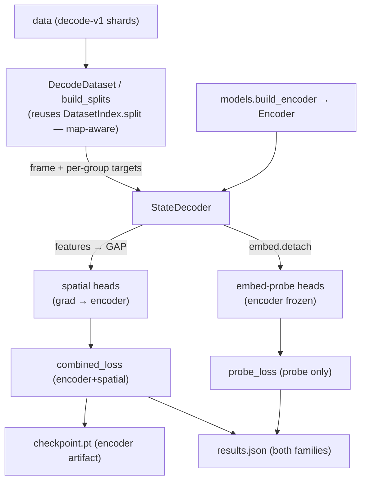

# pretraining

The **single-frame decoder harness** — a supervised **inverse-renderer**. It wraps a
config-built [`Encoder`](models.md) and attaches disposable heads that decode the 52-float wire
state from ONE pixel frame, so the encoder learns to "see" game state. The **encoder is the
reusable artifact** (it flows downstream to RL / the ablation sweep); every head is throwaway
scaffolding. This is Phase 1, tracks #6.

**Boundary:** imports [`core`](core.md) (state-schema accessors), [`models`](models.md)
(`build_encoder` / `Encoder.features` + `Encoder.embed`), and [`data`](data.md)
(`readers.DatasetIndex` / split, `schema`, `shards`) + torch / numpy / stdlib. Imports **nothing
from `env` / `rl`** — it is decoupled from the live engine by the on-disk dataset (offline
training), per `__init__.py:19`.

## Key modules / entry points

- [`pretraining.decoder`](../../src/pop_trainer/pretraining/decoder.py) — the
  [`StateDecoder`](../../src/pop_trainer/pretraining/decoder.py): an [`Encoder`](models.md) +
  TWO head families that both decode the per-group state.
  - **Spatial heads** read `Encoder.features(x)` → `(B, C, h, w)`, **global-average-pool** to
    `(B, C)` (`feat.mean(dim=(2, 3))`, `decoder.py:96-98`), then per-group FC heads. Their
    gradient **flows into the encoder** — these are what train the reusable artifact.
  - The **detached embed-probe** reads `Encoder.embed(x).detach()` → `(B, D)`
    (`decoder.py:100`), then its own per-group FC heads. The `.detach()` is mandatory: the probe
    **never** backprops into the encoder. It measures how much state survives pooling
    (`GAP` vs `Flatten`) and is reported **side-by-side** with the spatial heads — this is how a
    pooling choice "earns its place" in the ablation sweep (a real accuracy delta between the two
    families on the same encoder).
  - `forward` returns `{"spatial": per_group, "probe": per_group}` (`decoder.py:94-102`).
    `spatial_parameters()` = encoder + spatial heads; `probe_parameters()` = probe heads ONLY
    (the two optimizer steps train disjoint params, `decoder.py:104-110`). Head input widths are
    **discovered at build time** by a single zero-frame probe at `input_hw`, so any
    trunk/pooling/resolution composes (`_discover_dims`, `decoder.py:78-92`).
- [`pretraining.targets`](../../src/pop_trainer/pretraining/targets.py) — **pure numpy,
  torch-free** per-group target extraction + TRAIN-fit normalization. Reads via the
  [`core.state`](core.md) named accessors / index constants (`PLAYER_STRIDE`, `POS_X`/`POS_Y`,
  `bullet_field_indices`, …), **never magic indices** (`targets.py:62-119`).
  [`fit_norm_stats`](../../src/pop_trainer/pretraining/targets.py) fits per-field
  [`NormStats`](../../src/pop_trainer/pretraining/targets.py) on the **TRAIN split ONLY** (no
  val/test leak): position/velocity standardized over every row, bullet position over **present
  slots only** (the sentinel masked out so it never skews mean/std), aim left **raw** (it is a
  cosine target, `targets.py:196-216`). [`presence_pos_weight`](../../src/pop_trainer/pretraining/targets.py)
  computes `(#absent)/(#present)` for the imbalanced presence BCE (`targets.py:219-231`).
- [`pretraining.losses`](../../src/pop_trainer/pretraining/losses.py) — **torch** per-group
  losses + the `combined_loss` (encoder+spatial) and `probe_loss` (same math, disjoint params).
  See [the five field groups](#the-five-field-groups) below.
- [`pretraining.metrics`](../../src/pop_trainer/pretraining/metrics.py) — **pure numpy**
  interpretable metrics in **world units** (de-normalized via `NormStats`), reported identically
  for BOTH head families. See [the five field groups](#the-five-field-groups).
- [`pretraining.dataset`](../../src/pop_trainer/pretraining/dataset.py) — the
  [`DecodeDataset`](../../src/pop_trainer/pretraining/dataset.py), a shard-streaming torch
  `Dataset` over a decode-v1 dir. See [the dataset loader](#the-dataset-loader--map-aware-split).
- [`pretraining.device`](../../src/pop_trainer/pretraining/device.py) —
  [`resolve_device`](../../src/pop_trainer/pretraining/device.py): `--device auto` picks
  cuda > mps > cpu, so the same command runs on a 4090 unchanged with **no hardcoded device**
  (`device.py:15-31`).
- [`pretraining.train`](../../src/pop_trainer/pretraining/train.py) — the **device-agnostic
  training CLI**. See [the CLIs](#the-clis).
- [`pretraining.profile`](../../src/pop_trainer/pretraining/profile.py) — the **compute-profile
  CLI** (parameter counts + forward-pass latency). See [the CLIs](#the-clis).

## The five field groups

Each group has its own target extraction, loss, and metric. The same per-group functions run on
the spatial heads AND the detached probe, so both families are reported with one code path.

| Group | Target ([`targets`](../../src/pop_trainer/pretraining/targets.py)) | Loss ([`losses`](../../src/pop_trainer/pretraining/losses.py)) | Metric ([`metrics`](../../src/pop_trainer/pretraining/metrics.py)) |
|-------|--------|------|--------|
| `player_position` `(N,4)` | standardized over all rows | **MSE** in normalized space | mean **L2 error in WORLD units** (de-normalized) |
| `player_velocity` `(N,4)` | standardized over all rows | **MSE** in normalized space | mean **L2 error in WORLD units** |
| `player_aim` `(N,4)` | left **raw** (unit direction) | per-player **COSINE distance** `1-cos` (NOT MSE — MSE collapses a unit target toward 0) | mean per-player **angular error in DEGREES** |
| `bullet_presence` `(N,10)` | {0,1}, slot present iff its `pos_x` is on-board | pos-weighted **BCE-with-logits** (`pos_weight = absent/present`, fit on TRAIN) | accuracy / precision / recall / **F1** |
| `bullet_position` `(N,20)` | standardized over **present slots only**; absent slots zeroed | **MASKED MSE** (absent slots excluded from numerator AND denominator) | **L2 error in WORLD units** over present slots |

The masked bullet-position loss (`bullet_position_masked_mse`, `losses.py:96-108`) divides the
summed squared error by the present-float count, so an absent slot contributes neither error nor
denominator; it returns a grad-connected zero when no slot is present in the batch. `combined_loss`
(encoder + spatial heads) and `probe_loss` (the same weighted group-loss sum on the detached probe
outputs) are deliberately named separately because they train disjoint parameter sets
(`losses.py:155-186`).

## The dataset loader + map-aware split

[`DecodeDataset`](../../src/pop_trainer/pretraining/dataset.py) is a shard-streaming torch
`Dataset` over a decode-v1 directory. It **does not reimplement split logic** — it builds a
[`DatasetIndex`](data.md) and **reuses `DatasetIndex.split`** (the map-aware grouped split,
group key = `map_id`, so no map leaks across train/val/test, `dataset.py:192` →
`readers.py:174-176`).

- **Recursive glob** `**/shard_*.npz` covers decode-v1's `worker_*/` subdir layout; a flat dir
  works too (`dataset.py:173,184`). Index basenames are mapped back to full subdir paths by
  `_resolve_shard_paths` (`dataset.py:64-75`).
- **Load-time downsample:** `resolution` is the target **HEIGHT** (one of `360 / 180 / 90`); the
  width scales by the **same integer factor** so the native 360×640 aspect is preserved, via
  deterministic **area** interpolation (`dataset.py:45-61`). Frames are `uint8 (H,W,3)` →
  float32 `[0,1]` NCHW.
- [`build_splits`](../../src/pop_trainer/pretraining/dataset.py) wires the index + split +
  **TRAIN-only** `NormStats` consistently across the three views (`dataset.py:165-199`); `limit`
  caps the total indexed samples (a deterministic evenly-strided subset) for smoke runs.
  A last-read-shard cache means consecutive same-shard rows reuse one `.npz` read; frames are
  never bulk-loaded into RAM (`dataset.py:78-91`).

## The CLIs

### train — `python -m pop_trainer.pretraining.train`

Trains the **encoder + spatial heads** (combined loss) AND the **detached probe** (probe loss) in
**two disjoint optimizer steps per batch** (`train_one_epoch`, `train.py:76-118`); the probe reads
`embed.detach()`, so its step can never move the encoder. It then evaluates **val + test**
per-group for **both families** (`evaluate`, `train.py:121-150`), writes a **checkpoint**
(`checkpoint.pt` — encoder + full decoder state + norm stats + config) and a **STRICT-JSON**
`results.json` (`json.dump(..., allow_nan=False)`, with NaN/Inf sanitized to `0.0` via `_finite` /
`_sanitize`, `train.py:205-260`). Device-agnostic via `--device` (auto → cuda > mps > cpu).

Key flags (`train.py:265-284`): `--trunk {nature,impala}`, `--pooling {gap,flatten}`,
`--resolution {360,180,90}`, `--epochs`, `--batch-size`, `--lr`, `--subset`/`--limit` (alias,
caps total indexed samples), `--seed`, `--device`, `--num-workers`. Defaults: `--data
datasets/decode-v1`, `--out runs/decode-smoke`.

### profile — `python -m pop_trainer.pretraining.profile`

Reports the Phase-3 compute numbers for one `(EncoderConfig, resolution, device)` cell:
**parameter counts** (total + encoder-only) and **mean forward-pass latency** over a few timed
iterations after warmup (`profile_forward`, `profile.py:39-86`). Output is a strict-JSON dict
(`allow_nan=False`). Same `--trunk` / `--pooling` / `--resolution` / `--device` knobs, plus
`--batch-size` / `--warmup` / `--iters`.

## Sweep-planning note — `nature × resolution 90` is infeasible

This is a **sweep-planning constraint, not a harness bug.** Building a decoder with
`trunk=nature, resolution=90` raises a clean `RuntimeError` at build time: `StateDecoder.__init__`
probes the trunk with a zero frame (`_discover_dims`, `decoder.py:78-92`), and NatureCNN's
early downsampling stem underflows a 90-row frame — the stem (4×4 stride-4) crushes 90 rows to 22,
then the 8×8/s4 → 4×4/s2 → 3×3/s1 stack collapses the spatial dim below zero
([`models.NatureCNN`](models.md), `encoders.py:122-153`). This is an **upstream `models`
constraint**, surfaced cleanly by the decoder's build-time probe — not a defect here. `nature`
requires `resolution ≥ 180`; `impala` works at all of `{90, 180, 360}`. **Follow-up for sweep
planning:** drop the `nature@90` cell from the 12-cell grid (or make NatureCNN's stem 90-safe
upstream).

## Pulls from (upstream)

- [core](core.md) — `state` schema accessors / index constants (the per-group targets are carved
  via the NAMED accessors, never magic indices).
- [models](models.md) — `build_encoder` / `EncoderConfig`, and the `Encoder.features` (spatial
  map, for the encoder-training spatial heads) + `Encoder.embed` (flat embedding, detached, for
  the probe) interface.
- [data](data.md) — `readers.DatasetIndex` + its map-aware `split`, `schema` (the on-disk array
  names), and `shards` (lazy per-row frame reads). It streams the decode-v1 corpus `data`
  produced.
- Plus torch + numpy + stdlib.

## Pushes to (downstream)

Not via imports — it produces on-disk artifacts:

- A **trained encoder checkpoint** (`checkpoint.pt`) — the **reusable artifact** the downstream
  RL phase and the ablation sweep consume. The heads in the checkpoint are disposable; the
  encoder is the payload.
- A strict-JSON **`results.json`** record (per-group metrics for both families, the loss
  trajectory, the norm stats) — the per-cell record for the sweep.

## Where it sits in the run

The **offline pretraining arm**. After [data](data.md) collects the decode-v1 corpus, this
harness streams those `(frame, state)` rows and trains the [models](models.md) encoder to decode
state from a single frame — producing the vision backbone the (not-yet-built) RL phase trains on.
It never touches the live Unity engine; the dataset decouples it entirely.

---
[← back to index](../README.md)
