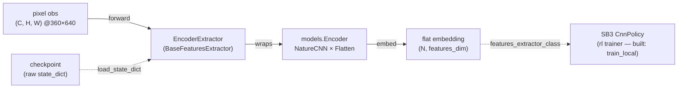
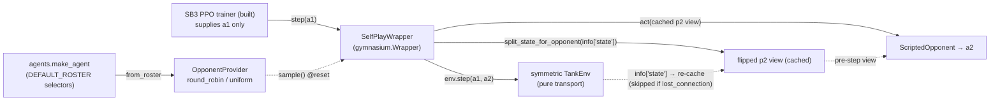
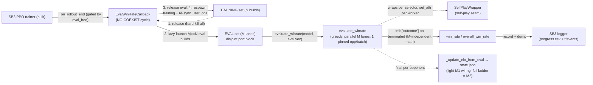

# rl

The **online RL** component — Stable-Baselines3 PPO with a `CnnPolicy` over the env's pixel
observations, plus the self-play machinery (opponent roster, ELO) layered as wrappers. **Three seams
ship today:** the policy↔encoder seam ([`EncoderExtractor`](../../src/pop_trainer/rl/extractor.py))
and the **self-play opponent seam** ([`selfplay.py`](../../src/pop_trainer/rl/selfplay.py) —
`OpponentProvider` + `SelfPlayWrapper` + `ScriptedOpponent`/`Opponent`), and now the **eval + ELO
seam** ([`evaluate.py`](../../src/pop_trainer/rl/evaluate.py) `evaluate_winrate` /
[`callbacks.py`](../../src/pop_trainer/rl/callbacks.py) `EvalWinRateCallback` /
[`elo.py`](../../src/pop_trainer/rl/elo.py) pure ELO math). **And now the integrator seam:**
[`train.py`](../../src/pop_trainer/rl/train.py) (`TrainConfig` + `train_local`) composes those
seams into one runnable SB3 PPO self-play run — vec-env stack, the `CnnPolicy` + `EncoderExtractor`
policy, periodic eval, checkpointing, and a resumable `state.json` sidecar (`train.py:1-37`,
`rl/__init__.py:22-26`). The `n_envs > 1` multi-env
fan-out (`SubprocVecEnv` of one Unity build per training port) is **implemented + unit-tested** —
see [Multi-env (`n_envs > 1`)](#multi-env-n_envs--1). Training and eval Unity instances are now
**mutually-exclusive, time-multiplexed** SETS at the SAME width (`M_eval == N_train`): the eval cycle
tears the training instances down before launching the parallel eval set and respawns training after,
so they **never coexist** — backed by `TankEnv`'s [lazy launch / `release` / kill-old-first
reconnect](env.md#instance-lifecycle-lazy-launch--release--kill-old-first-reconnect), which also
makes the intermittent multi-env stall **survivable** (it does NOT fix the underlying C# reset-region
root cause — it recovers from it). What remains for **later `rl` tasks** is the M2 work: the
population / frozen-self opponent ladder (the `elo` math is the M2 primitive, not yet wired into the
M1 loop). The live Unity training smoke (incl. the multi-instance launch) is the **operator's run**
(the integrator itself ships); see the [runbook](../runbook.md#5-run-rl-training-cli).

**Boundary:** `rl` imports [`core`](core.md) (`core.state.split_state_for_opponent` — the
perspective flip), [`env`](env.md) (the symmetric `TankEnv` the wrapper wraps),
[`models`](models.md) (the encoder factory), and [`agents`](agents.md) (`make_agent` + the canonical
selector registry) — plus torch / gymnasium / numpy / stable-baselines3 / stdlib. It imports
**nothing** from [`data`](data.md) or `pretraining`: the pretrained encoder is consumed as a loaded
`state_dict` artifact (not via a `models.from_pretrained`, `extractor.py:16-17`), and the self-play
seam re-uses the opponent-driving **primitives** (`split_state_for_opponent`, `make_agent`) directly
rather than the `data` module (`selfplay.py:26-28`). The empirical boundary check leaks `[]`. No
cycles.

## Key classes / entry points

### The encoder seam

- [`EncoderExtractor`](../../src/pop_trainer/rl/extractor.py) — a Stable-Baselines3
  [`BaseFeaturesExtractor`](../../src/pop_trainer/rl/extractor.py) (from
  `stable_baselines3.common.torch_layers`, `extractor.py:26`) that **wraps the shared
  [`models.Encoder`](models.md)** so SB3's `CnnPolicy` reads the SAME flat embedding the supervised
  pretraining produces (`extractor.py:34`). It is re-exported from the package alongside the
  self-play symbols, the eval seam, and the integrator — `rl/__init__.py`'s `__all__` is
  `DEFAULT_ROSTER`, `EncoderExtractor`, `EvalWinRateCallback`, `Opponent`, `OpponentProvider`,
  `ScriptedOpponent`, `SelfPlayWrapper`, `TrainConfig`, `evaluate_winrate`, `train_local`, `win_rate`
  (`rl/__init__.py:47-59`). The integrator additions over the prior slice are `DEFAULT_ROSTER`,
  `TrainConfig`, and `train_local` (`rl/__init__.py:45,48,55,57`). Note `elo` is NOT exported — it is
  reached as `from pop_trainer.rl.elo import ...`.
  - **Fixed architecture, no knobs.** The encoder is built `EncoderConfig(trunk="nature",
    pooling="flatten")` — a NatureCNN trunk + Flatten/FC head — at the canonical **360×640** frame
    (`extractor.py:61-63`). The extractor exposes NO architecture knobs; the trunk / pooling /
    resolution ablation lives in the [`models`](models.md) benchmark, NOT here (`extractor.py:5-8`).
    The constructor is `EncoderExtractor(observation_space, *, checkpoint=None, freeze=False)` —
    only those two keyword knobs (`extractor.py:51-57`).
  - **Derived, not hard-coded.** `in_channels` comes from the obs space `(C, H, W)`
    (`extractor.py:59,62`); `features_dim` is the encoder's flat embedding size probed at the obs
    `H × W` via `encoder.embedding_dim(input_hw=(H, W))` (`extractor.py:65`). It is NOT 84×84 — an
    84×84 frame would collapse the NatureCNN stem.
  - **Owns the pretrained-encoder load.** Given a `checkpoint`, it `torch.load`s a raw encoder
    `state_dict` and applies it via `self.encoder.load_state_dict` (`extractor.py:76-78`). There is
    NO `models.from_pretrained` — the extractor owns the load itself.
  - **The freeze contract.** `freeze=True` clears `requires_grad` on every encoder parameter
    (`extractor.py:80-82`). Freezing works through the **grad path** — SB3 builds its optimizer over
    ALL policy params, so a frozen param keeps a `None` grad under that optimizer and is never
    updated — NOT by excluding params from the optimizer. This is load-bearing: the old reference
    trainer got it wrong by excluding params (`extractor.py:11-14`).
  - **`forward` does not re-normalize.** SB3's preprocessing has already cast the uint8 frame to
    float and divided by 255, so observations arrive in `[0, 1]`; `forward` just returns
    `self.encoder(observations)` (`extractor.py:84-90`).

### The self-play opponent seam

The four symbols of [`selfplay.py`](../../src/pop_trainer/rl/selfplay.py) (all re-exported from the
package, `rl/__init__.py:33-38`). Self-play is a **WRAPPER over the trainer** (the ML-Agents
`ghost/` precedent), **never woven into the env or the PPO core** (`selfplay.py:7-8`).

- [`OpponentProvider`](../../src/pop_trainer/rl/selfplay.py) — a roster of opponents plus a
  **per-EPISODE** sampling strategy (`selfplay.py:116`). `sample()` is called once per episode at
  reset to pick that episode's opponent (`selfplay.py:167-174`).
  - **Two strategies.** `"round_robin"` cycles the roster in order with a modulo index
    (`selfplay.py:169-172`); `"uniform"` draws one uniformly from a **SEEDED**
    `np.random.default_rng` (`selfplay.py:146,174`) so a fixed `seed` reproduces the sequence of
    picks.
  - **Validated.** An unknown `strategy` raises `ValueError` listing the valid names
    (`selfplay.py:139-141`); an empty roster raises `ValueError` (`selfplay.py:143-144`). Valid
    strategies are `("round_robin", "uniform")` (`selfplay.py:54`).
  - **`from_roster` builds from `agents` selectors.** `from_roster(roster=DEFAULT_ROSTER, ...)`
    wraps each selector as `ScriptedOpponent(make_agent(sel, seed=seed))` (`selfplay.py:149-165`);
    `seed` threads into BOTH `make_agent` and the provider's sampling RNG. `DEFAULT_ROSTER` is the
    five canonical selectors — `noop`, `random`, `aggressive-coverage`, `wall-hugger`,
    `opponent-shadower` (`selfplay.py:46-52`) — the SAME selectors the collection runner resolves
    through the [`agents`](agents.md) registry.
- [`ScriptedOpponent`](../../src/pop_trainer/rl/selfplay.py) — wraps a scripted
  [`agents`](agents.md) `Agent` (`selfplay.py:74-87`). `obs_kind == "state"` — it consumes the
  52-float wire state (`selfplay.py:84`), and `act` delegates straight to the wrapped agent
  (`selfplay.py:89-91`). `set_map` / `reset` **getattr-PROBE** the wrapped agent and **no-op when
  the hook is absent** (`selfplay.py:93-113`) — mirroring `data.collect`'s `_maybe_set_map` /
  `_maybe_reset` but **re-implemented here**, not re-imported, to keep the `data` boundary.
- [`Opponent`](../../src/pop_trainer/rl/selfplay.py) — the runtime-checkable `Protocol` for the
  player2 side: `obs_kind` (which view the wrapper feeds) + `act` (returns the 5-float env action);
  `set_map` / `reset` are **OPTIONAL** on the protocol, never required (`selfplay.py:57-71`).
- [`SelfPlayWrapper`](../../src/pop_trainer/rl/selfplay.py) — a real `gymnasium.Wrapper` presenting
  the **symmetric pure-transport** `TankEnv` as a **1-action gym env** (`selfplay.py:177`). SB3
  supplies ONLY player1's action; the wrapper drives player2 behind the scenes. The action /
  observation spaces are player1's, inherited **unchanged** from the wrapped env (a
  `gymnasium.Wrapper` forwards both by default — `selfplay.py:180-182`).
  - **The mechanism.** At `reset` it samples ONE opponent for the episode, forwards
    `set_map(info["map"])` then `reset(seed)` to it (both no-ops unless the agent exposes the hook),
    and **CACHES** player2's flipped first-person view = `split_state_for_opponent(info["state"])` —
    the **PRE-step** view a simultaneous-move opponent sees (`selfplay.py:199-215`). At
    `step(action)` the opponent `act`s on that cached pre-step view, then `env.step(action, a2)`
    transports **BOTH** actions (a1 = caller, a2 = opponent), and the p2 view is **RE-cached** from
    the new `info["state"]` (`selfplay.py:219-238`). That re-cache is **GUARDED on `"state" in
    info`** (`selfplay.py:236-237`): on `TankEnv`'s lost-connection/reconnect step
    (`info = {"lost_connection": True}`, no `state` — `tank_env.py:485`) the wrapper **KEEPS** the
    prior cached p2 view and passes the env's 5-tuple through unchanged — a reward-0 truncation, so
    the vec env auto-resets and `reset` re-primes the view. A new opponent is sampled **ONLY at
    reset, never mid-episode** (`selfplay.py:189-190`).
  - **It mirrors the collection driver.** This is exactly `data.collect.run_episode`'s driver loop
    (`a2 = player2.act(split_state_for_opponent(np.asarray(vec)))` → `env.step(a1, a2)`,
    [`collect.py:395-397`](../../src/pop_trainer/data/collect.py)) — but packaged as a `Wrapper`
    instead of a bespoke loop. The perspective flip (`core.state.split_state_for_opponent`, swapping
    the two 26-float halves, [`state.py:178-185`](../../src/pop_trainer/core/state.py)) lives in the
    wrapper, never reaching into env internals — so the flip stays visible and assertable.

### The eval + ELO seam

The M1 evaluation seam — three modules that score a trained policy by **win-rate** and log it during
training. The metric is win-rate (fraction of greedy episodes won), broken out **per opponent** so
the breakdown shows where the policy is strong/weak across the scripted family
(`evaluate.py:1-6`).

- [`evaluate_winrate(model, eval_env, opponents=DEFAULT_ROSTER, n_episodes=100, seed=None)`](../../src/pop_trainer/rl/evaluate.py)
  — the eval driver, **PARALLEL across M eval envs**. It first normalizes `eval_env` (a vec env of M
  `SelfPlayWrapper`s used as-is, or a single / list of raw envs auto-wrapped in a `DummyVecEnv`) via
  `_as_eval_vec` (`evaluate.py:78-109`). Then for EACH selector in `opponents` it **re-pins** every
  env's `SelfPlayWrapper` to a single-entry `OpponentProvider` for that ONE opponent
  (`vec.set_attr("opponents", ..., indices=i)` — fanned per worker), `reset`s the vec, and repeatedly
  `predict(obs, deterministic=True)` + `vec.step(actions)`: the M lanes step **TOGETHER** each
  iteration (a `SubprocVecEnv` runs its workers concurrently across processes → true parallel eval),
  SB3 **auto-resets** finished envs, and the first `n_episodes` outcomes are tallied
  (`_eval_opponent_vec`, `evaluate.py:112-155`). It returns a per-selector `dict[selector, win_rate]`
  whose insertion order matches the `opponents` argument (`evaluate.py:197-201`).
  - **The win-rate MATH is M-independent.** `win_rate` is computed over exactly `n_episodes` outcomes
    regardless of M, so **`M == 1` reproduces the sequential result** for the same scripted outcomes
    — `M > 1` is only faster (`evaluate.py:18-21,122-123,178-181`).
  - **The win signal is `info["outcome"]`, NOT the reward sign.** The per-episode result is read
    from `info["outcome"]` on the done step ONLY, defaulting to `DRAW` (`evaluate.py:152-154`). A
    done-without-outcome episode (time-limit / lost connection) therefore stays a `"draw"` and can
    NEVER inflate the metric (`evaluate.py:125-127`). This is tied to the env source of truth:
    [`TankEnv.step`](../../src/pop_trainer/env/tank_env.py) sets `info["outcome"]="win"` iff
    `winner == S.PLAYER_1`, `"loss"` for a decided non-P1 winner, else `"draw"`, and ONLY on
    `terminated` (a truncation is not a decided game) (`tank_env.py:520-526`).
  - **Pure helpers (stdlib-only, unit-testable).** [`win_rate(outcomes)`](../../src/pop_trainer/rl/evaluate.py)
    is the pure counting helper — `wins / len(outcomes)`, draws/losses in the denominator only,
    `0.0` on empty input, unknown tokens tolerated (`evaluate.py:53-72`).
    [`overall_win_rate`](../../src/pop_trainer/rl/evaluate.py) is the unweighted mean of the
    per-opponent rates (the pooled rate when every opponent gets the same episode count)
    (`evaluate.py:218-230`) — it IS wired, used by the callback (`callbacks.py:122`).
    [`format_per_map_table`](../../src/pop_trainer/rl/evaluate.py) renders a one-line per-opponent
    breakdown (`<opp>: <rate> | ... | OVERALL: <overall> (N opponents x E episodes)`,
    `evaluate.py:233-252`) and **is wired**: the [integrator](#the-train_local-integrator-seam)
    imports it (`train.py:1029`) and prints it as the end-of-run summary line (`train.py:1219`). All
    three helpers avoid torch/env (type-only imports, `evaluate.py:30-38`).
- [`EvalWinRateCallback(BaseCallback)`](../../src/pop_trainer/rl/callbacks.py) — the SB3 callback
  that runs the eval periodically during training and logs it.
  - **THE CRUX — the NO-COEXIST eval cycle (time-multiplexed instances).** <a name="the-no-coexist-eval-cycle"></a>The training builds and
    the eval builds share the SAME RAM budget (`M_eval == N_train`), so they are **time-multiplexed**:
    at any instant the run holds **EITHER** the training set **OR** the eval set, **never both**
    (`callbacks.py:8-25`). At each eval boundary `_run_eval_cycle` runs a **load-bearing** sequence
    (`callbacks.py:125-161`): (1) **tear down ALL training** Unity instances via
    `training_vec.env_method("release")` — `release` hard-kills each child and frees its port, the
    worker PROCESSES stay alive; (2) **parallel eval** — lazy-launch the M eval instances and run
    `evaluate_winrate` across them; (3) **tear down the eval** instances via
    `eval_env.env_method("release")` (in a `finally`); (4) **respawn training** via
    `training_vec.reset()` (lazy re-launch) and **re-sync** the model's rollout sentinels to the
    fresh obs — `model._last_obs = reset_obs` and `model._last_episode_starts[:] = True`. The
    in-flight training episodes are abandoned (truncation) — intended; the next rollout starts clean.
    The callback is handed BOTH vec handles at construction (`eval_env` + `training_vec` =
    `model.env`, SB3's `VecTransposeImage`-wrapped training stack, so the respawn `reset()` returns
    obs in the exact space `_last_obs` expects — `callbacks.py:72-80`).
  - **Rollout-boundary ONLY — never mid-rollout.** `_on_step` is a no-op returning `True`
    (`callbacks.py:104-106`); the cycle fires in `_on_rollout_end`, gated by `eval_freq` AND a
    timestep delta against the last eval (`callbacks.py:108-114`). Batching at the boundary keeps the
    teardown/respawn churn between rollouts rather than mid-rollout. `eval_freq <= 0` disables eval
    (`callbacks.py:110-111`).
  - **Parallel eval via `evaluate_winrate` on the eval vec.** It hands the eval vec env (M
    `TankEnv`s) to `evaluate_winrate`, which peels each to its raw `TankEnv` and re-wraps it in its
    own per-opponent `SelfPlayWrapper` (`callbacks.py:142-148`). It logs `eval/win_rate/<selector>`
    per opponent plus an overall `eval/win_rate` (`overall_win_rate`) into the model's existing SB3
    logger, then `dump`s — so the row lands in BOTH `progress.csv` and TensorBoard `tfevents` at this
    timestep (`callbacks.py:116-123`).
  - **Rotation-desync handling — by omission, not a toggle.** It suppresses map rotation during eval
    NOT via a (nonexistent) `env.set_rotation_enabled` toggle but simply by NEVER passing
    `switch_arena` on any eval reset: `TankEnv` rotates ONLY when the CALLER passes
    `reset(options={"switch_arena": ...})` and `evaluate_winrate` issues plain `reset()`s — so the
    documented mid-eval arena-switch desync cannot occur (`callbacks.py:132-135`).
- [`elo.py`](../../src/pop_trainer/rl/elo.py) — pure ELO rating math, `import math` ONLY (no
  sb3/gym/torch/numpy — unit-testable on its own, `elo.py:1-8`). `elo_prob(elo1, elo2)` is the
  logistic expected-win probability (base 10, `/400`) (`elo.py:11-13`); `elo_change(elo_a, elo_b,
  K, a_win_rate)` returns the per-side ROUNDED deltas, which (being rounded per side) need NOT sum to
  zero (`elo.py:16-28`). It is **NOT exported from `rl/__init__.py`** — reach it as
  `from pop_trainer.rl.elo import elo_prob, elo_change`. **It is now wired into the integrator** as a
  light sidecar update: `train_local` seeds every roster selector at `BASE_ELO` (`train.py:105`,
  `_initial_elo` `train.py:803-805`, called `train.py:1099`) and nudges each opponent's rating from
  the realized per-opponent eval win-rate via
  [`_update_elo_from_eval`](../../src/pop_trainer/rl/train.py) (which calls `elo_change`,
  `train.py:823-844`, called `train.py:1212`), persisting the result in `state.json`. This is a
  deliberately light Phase-1 wiring so the persisted ELO structure is non-trivial; the **full ELO
  ladder over a frozen-self population is M2 work**, not yet built (`train.py:831-832`, `elo.py:2-5`).

### The `train_local` integrator seam

[`train.py`](../../src/pop_trainer/rl/train.py) is the **INTEGRATOR** — it composes the three seams
above into one runnable SB3 PPO self-play run and **re-implements nothing** (it WIRES the already-built
parts, `train.py:1-37`). [`TrainConfig`](../../src/pop_trainer/rl/train.py) is the frozen, validated
run spec (`train.py:130-256`); [`train_local(cfg)`](../../src/pop_trainer/rl/train.py) runs (or resumes)
one local run and returns `cfg.run_dir` (`train.py:992-1245`). The operator-facing CLI is documented in
the [runbook](../runbook.md#5-run-rl-training-cli).

- **TWO env stacks, both built ONCE at startup — same width (`M_eval == N_train`).** `train_local`
  builds a TRAINING vec on the training port block (`monitor=True`) and a **same-width PARALLEL** eval
  vec on the **disjoint** eval port block (`ports=eval_ports(cfg)`, `monitor=False`) — at the top of
  the run, NOT per-eval (`train.py:1089-1093`). Both are built by the SAME `build_vec_env` at the SAME
  `cfg.n_envs`, so there are `M_eval == N_train == n_envs` eval builds, one per eval port.
  - **Port blocks.** The training block is `[game_port, game_port + n_envs - 1]`
    (`training_ports`, `train.py:558-560`). The default eval block sits ENTIRELY after it:
    `effective_eval_port = eval_port` override or **`game_port + n_envs`**, so the eval block is
    `[game_port + n_envs, game_port + 2*n_envs - 1]` (`eval_ports`, `train.py:563-570`,
    `effective_eval_port`, `train.py:257-267`). At `n_envs == 1` that is `game_port + 1` (as before).
    `__post_init__` REJECTS an `eval_port` equal to `game_port` OR an eval BLOCK that overlaps the
    training block (`train.py:238-255`) — no eval build can collide with any training build, even
    across a relaunch. (The eval and training builds never run concurrently anyway — the eval cycle
    tears training down first — but disjoint blocks keep a relaunched-but-not-yet-reaped instance
    from clashing on bind.)

> **NOTE — the `train_local` docstring is stale here.** The docstring at `train.py:996-999` still
> describes the eval env as "**ALWAYS-SINGLE** ... `single=True`". The SHIPPED code at
> `train.py:1091-1093` builds an `M == n_envs` PARALLEL eval vec on `eval_ports`. This page documents
> the **code's** real behaviour.
- **The vec-env composition.** [`build_vec_env`](../../src/pop_trainer/rl/train.py) builds
  `[VecMonitor(]VecFrameStack({Dummy,Subproc}VecEnv([SelfPlayWrapper(TankEnv)]))[)]`
  (`train.py:630-723`): each per-env unit is a bare pure-transport `TankEnv` over its port's connection
  factory, wrapped in a `SelfPlayWrapper` driving player2 from an `OpponentProvider` built from
  `cfg.opponents` / `cfg.opponent_strategy`. At **`n_envs == 1`** (or `single=True`) it is a
  `DummyVecEnv` of ONE env on `port` (provider seeded `cfg.seed`); at **`n_envs > 1`** it is a
  `SubprocVecEnv` of `n_envs` envs, one per port in `ports` (default `training_ports`; the eval vec
  passes the disjoint `eval_ports`), provider seeded `cfg.seed + i`, `start_method="spawn"` — see
  [Multi-env (`n_envs > 1`)](#multi-env-n_envs--1). Then `VecFrameStack` at `n_stack = cfg.frame_stack`
  (`1` = passthrough, still wrapped so the stack is uniform — `train.py:718`), and when `monitor=True`
  it is wrapped OUTERMOST in `VecMonitor` so SB3 logs `rollout/ep_rew_mean` / `rollout/ep_len_mean` —
  **only the TRAINING stack is monitored**; the eval stack is built `monitor=False` (it uses
  `evaluate_winrate`'s own loop, not SB3 episode stats — `train.py:719-722`). The TRAINING and EVAL
  vecs are built the SAME way at the SAME width (`role="train"`/`"eval"` only tags the per-process log
  filenames).
- **The policy.** PPO is built as `"CnnPolicy"` (`train.py:1120-1121`). Its `policy_kwargs` carries
  `features_extractor_class=EncoderExtractor` + `features_extractor_kwargs={checkpoint, freeze}` from
  `cfg.encoder_checkpoint` / `cfg.freeze_encoder` ([`_build_policy_kwargs`](../../src/pop_trainer/rl/train.py),
  `train.py:726-738`) — so the `EncoderExtractor` (which owns the pretrained-encoder load + the freeze
  path) is handed to the policy. The model is built **fresh** on a clean run, or **`PPO.load`-ed** on
  resume (`train.py:1102-1134`).

#### The live-launch seam / boundary (the crux)

`TankEnv` does NOT launch Unity — it takes an injected `connection_factory` (and an injected `reap`
hook). The LIVE launch lives in [`data`](data.md), which `rl` must **NOT** import (boundary). So the
live `connection_factory` is **re-derived HERE from the shared, dependency-free
[`core.launch`](core.md) primitives** — never imported from `data`
([`_live_connection_factory_for_port`](../../src/pop_trainer/rl/train.py), `train.py:430-478`; imports
at `train.py:52-62`). The factory is **parameterized by `port`** so each TRAINING build
(`game_port + i`) and each EVAL build (`eval_ports`) launches its OWN build on its OWN socket. Each
factory call: `build_launch_cmd` + `subprocess.Popen` (windowed, never batchmode) + `connect` + wrap
the socket in a `core.protocol.Connection` (`train.py:461-476`). The live `Popen` is stashed on the
produced `Connection` (`conn._launch_proc`, `train.py:475`). A unit-test **STUB** factory carries no
`_launch_proc`, so the reap is a no-op and **no Unity launches** (`train.py:545-547`). The whole point
of this seam: `rl` imports **nothing** from `data` / `pretraining`.

- **The env owns the reap (injected hook), not a close-wrapper.** `_build_base_env` constructs each
  `TankEnv` with **`reap=_terminate`** (terminate → wait → kill, idempotent — `train.py:398-413`),
  so the env hard-kills its own build off `getattr(self.conn, "_launch_proc", None)` from
  [`TankEnv.release`](env.md#instance-lifecycle-lazy-launch--release--kill-old-first-reconnect) and
  the kill-old-first reconnect (`train.py:509-518`). There is no `env.close`-wrapper / captured-proc
  bookkeeping — the env always reaps the **CURRENT** connection's proc, so a relaunched build is never
  orphaned and a mid-run socket drop is **survivable** (kill-old-first, `tank_env.py:650-671`). It does
  NOT fix the underlying C# reset-region root cause of the multi-env stall — it recovers from it.
- **Per-attempt logfiles — a relaunch never truncates a prior log.** <a name="per-attempt-logfiles"></a>
  Unity's `-logFile` truncates its target on every launch, so the factory captures a per-LAUNCH
  attempt counter in its closure and points each launch at a DISTINCT
  `unity-<role>-<port>-<attempt>.log` (`_attempt_unity_log_path`, `train.py:416-427`; the counter
  increments per call, `train.py:459-463`). So a respawn (lazy relaunch / reconnect) NEVER truncates
  the prior (possibly hung) instance's C# log — prior logs survive for post-mortem. The paired Python
  env log is `env-<role>-<port>.log`; the main-process log is `training-system.log`; all under
  `run_dir/logs` (or `--log-dir`).
- **DUAL REAP — both sets reaped on any exit.** `train_local` uses a **nested `try/finally`**: the
  eval vec is `env_method("release")`-d + closed in an inner `finally`, and the training vec in the
  outer `finally` (`train.py:1229-1243`). `release` HARD-KILLS each live build (the graceful `close()`
  alone would not kill a stalled instance), so BOTH live Unity SETS are reaped even on exception /
  `KeyboardInterrupt`.

#### Checkpoint / resume / sidecar

- **Checkpoints.** SB3's `CheckpointCallback` writes `model_<steps>_steps.zip` on the
  `cfg.checkpoint_freq` cadence (constructed in `train_local`, `train.py:1153-1157`).
- **The sidecar rides the SAME cadence.** [`_make_sidecar_callback`](../../src/pop_trainer/rl/train.py)
  builds a callback that writes `run_dir/state.json` alongside each checkpoint zip, gated on the same
  `checkpoint_freq` (`train.py:862-899`). [`save_sidecar`](../../src/pop_trainer/rl/train.py) (PURE,
  strict JSON) captures the provider position, the per-selector ELO dict, `cfg.to_dict()`, and
  `num_timesteps` (`train.py:763-795`). The provider position is replayable **only for `round_robin`**
  (the `_index`); for `uniform` only `strategy` is recorded — non-replayable by design (the seeded RNG
  continues fresh — `train.py:783-794`).
- **Resume.** `--resume <prior run_dir>` picks the **MAX-step** zip
  ([`_latest_checkpoint`](../../src/pop_trainer/rl/train.py), parses the trailing integer from each
  `model_*.zip`, `train.py:967-986`), does `PPO.load(latest, env=vec_env)` (`train.py:1110`), restores
  the provider position + ELO from the sidecar
  ([`_restore_provider_position`](../../src/pop_trainer/rl/train.py), `train.py:808-821`, called
  `train.py:1114`), and continues with `learn(reset_num_timesteps=False)` (`train.py:1100,1176`).
  Resuming a `run_dir` with no parseable checkpoint raises `FileNotFoundError` (`train.py:1106-1109`).

#### Multi-env (`n_envs > 1`)

The multi-env fan-out is now **IMPLEMENTED** (code path + unit tests ship; the LIVE multi-instance
launch is the operator's smoke, still pending). At `cfg.n_envs == 1` `build_vec_env` builds a
`DummyVecEnv` of one in-process env; at `cfg.n_envs > 1` it builds a **`SubprocVecEnv`** of `n_envs`
Unity builds with **`start_method="spawn"`** (REQUIRED — no fork/forkserver per CLAUDE.md;
Windows-safe), one build **per training port** `game_port + i` (`training_ports`, `train.py:558-560`),
each in its OWN process (`build_vec_env`, `train.py:692-723`).

- **Spawn-safe env factories.** Each env factory `i` is a CLOSURE capturing only `cfg` (a frozen,
  picklable dataclass) + the int `i`; it constructs the provider / base env / live connection INSIDE
  the subprocess, so nothing live crosses the spawn boundary (SB3 ships the `env_fns` via cloudpickle —
  `_training_env_factories`, `train.py:611-627`; `_make_self_play_env`, `train.py:521-555`).
- **Per-subproc opponent provider.** Each subproc builds its OWN `OpponentProvider` seeded
  `cfg.seed + i` (`_make_self_play_env`, `train.py:552-554`), so each training build rotates its
  roster independently. The providers are **NOT reachable** from the main process (`SubprocVecEnv`
  exposes no `.envs`), so `_find_selfplay_wrapper` is used only at `n_envs == 1`.
- **Resume at `n_envs > 1` RESEEDS the rotation.** Because the per-subproc providers are unreachable,
  `train_local` passes `provider=None` at `n_envs > 1`; the sidecar records only `strategy` + `seed`
  and resume RESEEDS the rotation — **approximate phase, like `uniform`** (the `provider is None`
  branch, `train.py:1097`). `round_robin` at `n_envs > 1` therefore degrades to per-subproc rotation
  with reseed-on-resume. **`n_envs == 1` keeps position-exact `round_robin` resume** (the in-process
  provider's `_index` is restored).
- **Eval is PARALLEL at the SAME width.** The eval vec is built by the SAME `build_vec_env` at
  `cfg.n_envs`, so there are `M_eval == N_train == n_envs` eval builds on the disjoint
  `eval_ports` block (`train.py:1091-1093`). `evaluate_winrate` distributes `n_episodes` across the M
  eval lanes and steps them together; the win-rate MATH is M-independent (`M == 1` reproduces the
  sequential result — `evaluate.py:18-21`). (At `n_envs == 1` the eval vec is a one-env `DummyVecEnv`
  — the old single-env path.)
- **Cadence holds at any `n_envs`.** The checkpoint + sidecar callbacks ride the SAME
  `max(checkpoint_freq // n_envs, 1)` per-call `save_freq` (`_checkpoint_save_freq`, `train.py:847-859`),
  so a `model_*.zip` + its `state.json` still land every `checkpoint_freq` NUM_TIMESTEPS in lockstep
  at any `n_envs`.
- **Pre-flight memory guard.** At high `n_envs` the PPO `RolloutBuffer` is the OOM surface; a startup
  guard sizes it (≈ `n_steps × n_envs × frame_bytes × frame_stack`, uint8) plus ~1 GB per live Unity
  instance — and it charges **`n_envs`** instances, NOT `n_envs + 1`, because the eval and training
  instance SETS never coexist (peak concurrent = `max(N_train, M_eval) = n_envs` — the eval cycle
  tears training down before spawning eval). It ABORTS before launch if the total exceeds 60 % of
  available RAM unless `--allow-oversized`; lower `--n-steps` or `--n-envs` to fit
  (`check_rl_memory_budget`, `train.py:344-392`). Operator details + the worked example:
  [runbook §5 → Multi-env training](../runbook.md#multi-env-training-n-envs--1).

#### The training-topology config

`cfg.game_config` defaults to [`train_config.json`](../../unity/Assets/StreamingAssets/train_config.json)
(`DEFAULT_TRAIN_CONFIG`, `train.py:94`) — the single-arena AI-vs-AI pixel config the build launches
under. Load-bearing values (`train_config.json:1-22`): `timeScale: 5` (**MUST stay ≤ 5** — the
collection cap applies; ≥ 10 corrupts), `obs_pixels: true` at `640×360`, both `player1_ai` /
`player2_ai` `true`, `game_maxTime: 60`, `player_maxHealth: 3`, and a single `arena_path`
(`Arenas/custom1.json` — no rotation, unlike the collection rotation set).

#### Observability logging

`train_local` wires [`core.logging_setup`](core.md) so a run leaves a per-process structured-JSONL
trail (added to diagnose the multi-env training hang). **All of it is purely observational** — it
does not change the TCP wire, the 52-float state, message ordering, or control flow.

- **Per-process loggers.** The main process gets the system logger (`setup_system_logger` →
  `training-system.log`, `train.py:1036`); each live env connection gets its own
  `setup_env_logger` → `env-<role>-<port>.log`, set up **inside** the env's construction (so a
  `SubprocVecEnv` worker opens its OWN handle inside the spawned subprocess) and threaded into
  BOTH the `Connection` and the env layer (`_make_self_play_env`, `train.py:548-551`). Each Unity
  LAUNCH is pointed at a DISTINCT `unity-<role>-<port>-<attempt>.log` (the attempt counter
  increments per launch, so a respawn never truncates the prior instance's log —
  [Per-attempt logfiles](#per-attempt-logfiles); `_live_connection_factory_for_port`,
  `train.py:459-464`), paired to the Python `env-<role>-<port>.log` by the shared `(role, port)`. A
  unit-test STUB factory gets **no** logger (`None`), so the test path stays behavior-identical and
  never touches the filesystem.
- **The single DEBUG switch.** `--debug` OR the `POP_LOG_LEVEL` env var (resolved purely via
  [`level_from_env`](../../src/pop_trainer/core/logging_setup.py), `train.py:1377-1380`) cranks
  ALL logs from INFO (default) to DEBUG. INFO = handshake/reset/episode milestones; DEBUG =
  per-step send/recv/step. The level flows through `TrainConfig.log_level` / `effective_log_dir`
  (`train.py:269-277`); `--log-dir` overrides where the files land (default `run_dir/logs`).
- **`ObservabilityCallback`.** An ADDITIVE SB3 callback ([`_make_observability_callback`](../../src/pop_trainer/rl/train.py),
  `train.py:902-961`) logs `rollout_start` / `rollout_end` (iteration, `num_timesteps`, `fps`) and
  `checkpoint_save` markers to the system log on the SAME cadence as the checkpoint/sidecar
  callbacks. It NEVER returns `False` and NEVER mutates the model/rollout. `train_local` also logs
  `run_config`, the memory estimate, `learn_begin`/`learn_end`, the final eval, and — for the hang
  being chased — a `worker_death` record (exception repr + `num_timesteps`) on a
  `SubprocVecEnv` worker dying mid-run, which it then **re-raises unchanged** (`train.py:1178-1193`).
- The operator's guide to reading these files (the 5-file layout, the schema, the cross-stack
  `ts_wall`/`wall=` merge key, eval isolation) is in the
  [runbook → Observability logs](../runbook.md#observability-logs).

**`train_local` composition** — the integrator wiring (TWO env stacks, both built once at startup):

```mermaid
graph TD
    cfg["TrainConfig"] -->|"build_vec_env(ports=training_ports, monitor=True)"| vec["TRAINING set (N builds)<br/>VecMonitor(VecFrameStack({Dummy,Subproc}VecEnv([SelfPlayWrapper(TankEnv)])))"]
    cfg -->|"build_vec_env(ports=eval_ports, monitor=False)"| evec["EVAL set (M==N builds)<br/>disjoint port block, same width"]
    cfg -.->|_live_connection_factory_for_port| launch["core.launch<br/>build_launch_cmd + Popen + connect"]
    launch -->|Connection (+_launch_proc); reap=_terminate injected into TankEnv| vec
    launch -->|Connection (+_launch_proc); reap=_terminate injected into TankEnv| evec
    cfg -->|_build_policy_kwargs| pk["policy_kwargs<br/>EncoderExtractor + checkpoint/freeze"]
    pk --> ppo["PPO 'CnnPolicy'<br/>(fresh) or PPO.load (resume)"]
    vec --> ppo
    evec -->|eval vec| cbs
    ppo -->|model.learn| cbs["CallbackList:<br/>EvalWinRateCallback (NO-COEXIST cycle) + CheckpointCallback + Sidecar"]
    cbs -->|"eval boundary: release training → parallel eval → release eval → respawn training"| cycle["time-multiplexed instances<br/>EITHER train OR eval, never both"]
    cbs -->|checkpoint cadence| ckpt["model_&lt;steps&gt;_steps.zip + state.json (+ELO)"]
    ppo -->|"final: release training → parallel eval"| summ["evaluate_winrate (eval vec, M lanes) → format_per_map_table (printed)"]
    vec -.->|"outer finally: release + close"| reap["DUAL REAP<br/>both SETS reaped"]
    evec -.->|"inner finally: release + close"| reap
```

## Pulls from (upstream)

- [models](models.md) — `EncoderConfig` / `build_encoder` and the [`Encoder`](models.md) it wraps
  (its `embed` flat embedding + `Encoder.embedding_dim` for the features dimension), for the
  extractor seam (`extractor.py:29,61-65`).
- [core](core.md) — `core.state.split_state_for_opponent`, the frozen, involutive perspective flip
  the wrapper applies to give the opponent its first-person 52-float view (`selfplay.py:40`;
  `state.py:178-185`); plus, for the integrator, `core.launch` (`build_launch_cmd` / `connect` /
  `default_build_path`), `core.protocol.Connection`, and `core.config` (`EnvConfig` / `RewardConfig`)
  — the live `connection_factory` `train_local` re-derives from the shared launch primitives
  (`train.py:52-62,461-476`).
- [env](env.md) — the symmetric pure-transport `TankEnv` that `SelfPlayWrapper` wraps and drives via
  `env.reset` / `env.step(a1, a2)` (`selfplay.py:177,207,227`); `_build_base_env` constructs it with
  the injected **`reap=_terminate`** hook + a live `connection_factory` so the env owns its build's
  lifecycle (lazy launch / `release` / kill-old-first reconnect — `train.py:509-518`); the eval seam
  ALSO reads its `info["outcome"]` win/loss/draw tag as the win signal (`tank_env.py:520-526`;
  `evaluate.py:152-154`).
- [agents](agents.md) — `make_agent` + the canonical selector registry; `OpponentProvider.from_roster`
  builds each roster opponent through it (`DEFAULT_ROSTER` = the five canonical selectors)
  (`selfplay.py:39,46-52,164`).
- Plus torch / gymnasium / numpy / stable-baselines3 — the `BaseFeaturesExtractor` base class +
  `gymnasium.Wrapper` (`extractor.py:24-27`; `selfplay.py:36-37`), and the callback's `BaseCallback`
  base + the model's SB3 logger (`callbacks.py:31,112-117`). The pure
  `evaluate.py` / `elo.py` helpers stay import-light: `evaluate.py` keeps sb3/gym type-only
  (`evaluate.py:33-35`) and `elo.py` imports `math` only (`elo.py:8`).

## Pushes to (downstream)

The eval seam consumes the self-play seam internally (`evaluate_winrate` re-wraps each env in a
`SelfPlayWrapper`, `evaluate.py:108,137`); otherwise these seams are inputs the **now-built**
[`train_local`](#the-train_local-integrator-seam) integrator wires up:

- `EncoderExtractor` plugs into the SB3 `CnnPolicy` via
  `policy_kwargs={"features_extractor_class": EncoderExtractor, ...}` — exactly what `_build_policy_kwargs`
  emits (`train.py:726-738`) — so the policy / value heads read the standardized vision embedding.
- `SelfPlayWrapper` wraps the env the trainer learns over, presenting it as a 1-action gym so SB3
  trains player1 against the sampled scripted opponent; `build_vec_env` composes it into the vec stack
  (`train.py:630-723`).
- `EvalWinRateCallback` is added to the `model.learn(callback=...)` list so the trainer logs greedy
  per-opponent `eval/win_rate` at rollout boundaries — running the **no-coexist cycle** over the
  `M == N` eval vec (`eval_vec_env`) while time-multiplexing the training set (`training_vec =
  model.env`), never letting the two coexist (`train.py:1140-1152`); `format_per_map_table` prints the
  final per-opponent summary line after a final release-then-parallel-eval (`train.py:1204-1219`).
- **Downstream of the seams now:** the operator-facing CLI
  ([runbook §5](../runbook.md#5-run-rl-training-cli)) drives `train_local` over live windowed Unity
  builds (the `N` training builds + `M==N` eval builds, time-multiplexed so only one set runs at a
  time).
- **Now built:** the `n_envs > 1` multi-env fan-out (`SubprocVecEnv` + per-env ports `game_port + i`,
  `start_method="spawn"`) is implemented + unit-tested (`build_vec_env`, `train.py:692-723`) — see
  [Multi-env (`n_envs > 1`)](#multi-env-n_envs--1); the LIVE multi-instance launch is the operator's smoke.
- **Still deferred (M2 work, not the train loop):** the full population / **frozen-self opponent**
  ELO ladder (only a light from-eval ELO sidecar update is wired in M1 — `train.py:823-844`; the
  ladder proper lands with frozen-self opponents in P2, `elo.py:2-5`). The integrator itself ships;
  the live Unity training smoke is the operator's run.

## Where it sits in the run

Three seams of the online-RL phase, all now composed by the **built**
[`train_local`](#the-train_local-integrator-seam) integrator:

- **Encoder seam** — where the env's pixel observation meets the SB3 policy/value heads: it lets the
  trainer reuse the SAME standardized vision backbone the supervised pretraining produces, loaded
  from a checkpoint and optionally frozen. It consumes the pixel frames [env](env.md) produces,
  through the [models](models.md) `Encoder`.
- **Self-play seam** — where the symmetric `TankEnv` is packaged as a 1-action gym: at train time
  `SelfPlayWrapper` samples a scripted opponent per episode (from the [agents](agents.md) roster via
  [`OpponentProvider`](../../src/pop_trainer/rl/selfplay.py)) and drives player2 from its flipped
  [core](core.md) state view, so SB3 only ever supplies player1's action. This is the same
  opponent-driving path the [data](data.md) collection runner uses, repackaged as a wrapper over the
  trainer.
- **Eval + ELO seam** — where a trained policy is scored: `EvalWinRateCallback` fires at rollout
  boundaries and runs the **NO-COEXIST eval cycle** — tear down ALL training instances (`release`) →
  **parallel** `evaluate_winrate` across the `M == N` eval instances → tear down eval → respawn
  training + re-sync the model's rollout sentinels. So at any instant only ONE instance SET is live
  (they share the RAM budget). The eval RE-USES the self-play seam (one pinned opponent per batch) to
  play greedy episodes and reads the win/loss/draw straight from the env's `info["outcome"]`, logging
  per-opponent + overall `eval/win_rate`. The `elo` math gets a light from-eval sidecar update in M1;
  the full ELO ladder is M2 work.
- **Integrator** — where the three seams become a runnable command:
  [`train_local`](#the-train_local-integrator-seam) builds TWO same-width env stacks at startup (the
  `VecMonitor`-wrapped training set on `training_ports` + a parallel `M == N` eval set on the disjoint
  `eval_ports` block) + the `CnnPolicy` / `EncoderExtractor` policy, attaches the eval (no-coexist
  cycle) + checkpoint + sidecar callbacks, runs `model.learn`, and prints a final per-opponent line —
  re-deriving the live Unity launch from [core](core.md) `core.launch` (never [data](data.md)) and
  reaping BOTH instance sets via a nested `try/finally` (`train.py:992-1245`). With **lazy** `TankEnv`
  construction, building the vec envs launches NO Unity — instances start only when driven. The
  operator drives it from the [runbook](../runbook.md#5-run-rl-training-cli).

**Encoder seam** — pixel obs → standardized embedding:



**Self-play seam** — `SelfPlayWrapper` drives player2 behind a 1-action gym face:



**Eval + ELO seam** — `EvalWinRateCallback` scores the policy by win-rate at rollout boundaries:



---
[← back to index](../README.md)
