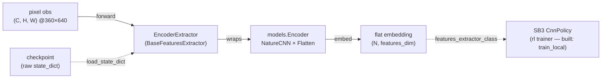
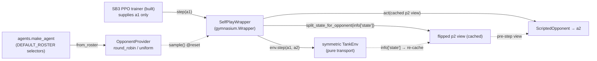
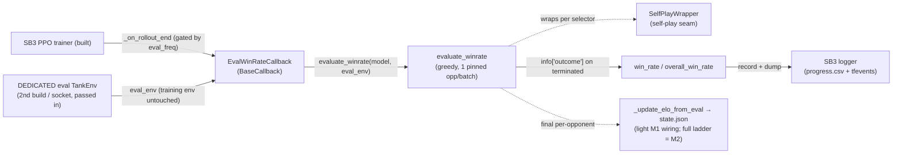

# rl

The **online RL** component — Stable-Baselines3 PPO with a `CnnPolicy` over the env's pixel
observations, plus the self-play machinery (opponent roster, ELO) layered as wrappers. **Three seams
ship today:** the policy↔encoder seam ([`EncoderExtractor`](../../src/pop_trainer/rl/extractor.py))
and the **self-play opponent seam** ([`selfplay.py`](../../src/pop_trainer/rl/selfplay.py) —
`OpponentProvider` + `SelfPlayWrapper` + `ScriptedOpponent`/`Opponent`), and now the **eval + ELO
seam** ([`evaluate.py`](../../src/pop_trainer/rl/evaluate.py) `evaluate_winrate` /
[`callbacks.py`](../../src/pop_trainer/rl/callbacks.py) `EvalWinRateCallback` /
[`elo.py`](../../src/pop_trainer/rl/elo.py) pure ELO math). **And now the integrator seam:**
[`train.py`](../../src/pop_trainer/rl/train.py) (`TrainConfig` + `train_local`) composes those
seams into one runnable SB3 PPO self-play run — vec-env stack, the `CnnPolicy` + `EncoderExtractor`
policy, periodic eval, checkpointing, and a resumable `state.json` sidecar (`train.py:1-27`,
`rl/__init__.py:22-26`). The `n_envs > 1` multi-env
fan-out (`SubprocVecEnv` of one Unity build per training port) is now **implemented + unit-tested** —
see [Multi-env (`n_envs > 1`)](#multi-env-n_envs--1). What remains for **later `rl` tasks** is the M2
work: the population / frozen-self opponent ladder (the `elo` math is the M2 primitive, not yet wired
into the M1 loop). The live Unity training smoke (incl. the multi-env 8-instance launch) is the
**operator's run** (the integrator itself ships); see the
[runbook](../runbook.md#5-run-rl-training-cli).

**Boundary:** `rl` imports [`core`](core.md) (`core.state.split_state_for_opponent` — the
perspective flip), [`env`](env.md) (the symmetric `TankEnv` the wrapper wraps),
[`models`](models.md) (the encoder factory), and [`agents`](agents.md) (`make_agent` + the canonical
selector registry) — plus torch / gymnasium / numpy / stable-baselines3 / stdlib. It imports
**nothing** from [`data`](data.md) or `pretraining`: the pretrained encoder is consumed as a loaded
`state_dict` artifact (not via a `models.from_pretrained`, `extractor.py:16-17`), and the self-play
seam re-uses the opponent-driving **primitives** (`split_state_for_opponent`, `make_agent`) directly
rather than the `data` module (`selfplay.py:26-28`). The empirical boundary check leaks `[]`. No
cycles.

## Key classes / entry points

### The encoder seam

- [`EncoderExtractor`](../../src/pop_trainer/rl/extractor.py) — a Stable-Baselines3
  [`BaseFeaturesExtractor`](../../src/pop_trainer/rl/extractor.py) (from
  `stable_baselines3.common.torch_layers`, `extractor.py:26`) that **wraps the shared
  [`models.Encoder`](models.md)** so SB3's `CnnPolicy` reads the SAME flat embedding the supervised
  pretraining produces (`extractor.py:34`). It is re-exported from the package alongside the
  self-play symbols, the eval seam, and the integrator — `rl/__init__.py`'s `__all__` is
  `DEFAULT_ROSTER`, `EncoderExtractor`, `EvalWinRateCallback`, `Opponent`, `OpponentProvider`,
  `ScriptedOpponent`, `SelfPlayWrapper`, `TrainConfig`, `evaluate_winrate`, `train_local`, `win_rate`
  (`rl/__init__.py:47-59`). The integrator additions over the prior slice are `DEFAULT_ROSTER`,
  `TrainConfig`, and `train_local` (`rl/__init__.py:45,48,55,57`). Note `elo` is NOT exported — it is
  reached as `from pop_trainer.rl.elo import ...`.
  - **Fixed architecture, no knobs.** The encoder is built `EncoderConfig(trunk="nature",
    pooling="flatten")` — a NatureCNN trunk + Flatten/FC head — at the canonical **360×640** frame
    (`extractor.py:61-63`). The extractor exposes NO architecture knobs; the trunk / pooling /
    resolution ablation lives in the [`models`](models.md) benchmark, NOT here (`extractor.py:5-8`).
    The constructor is `EncoderExtractor(observation_space, *, checkpoint=None, freeze=False)` —
    only those two keyword knobs (`extractor.py:51-57`).
  - **Derived, not hard-coded.** `in_channels` comes from the obs space `(C, H, W)`
    (`extractor.py:59,62`); `features_dim` is the encoder's flat embedding size probed at the obs
    `H × W` via `encoder.embedding_dim(input_hw=(H, W))` (`extractor.py:65`). It is NOT 84×84 — an
    84×84 frame would collapse the NatureCNN stem.
  - **Owns the pretrained-encoder load.** Given a `checkpoint`, it `torch.load`s a raw encoder
    `state_dict` and applies it via `self.encoder.load_state_dict` (`extractor.py:76-78`). There is
    NO `models.from_pretrained` — the extractor owns the load itself.
  - **The freeze contract.** `freeze=True` clears `requires_grad` on every encoder parameter
    (`extractor.py:80-82`). Freezing works through the **grad path** — SB3 builds its optimizer over
    ALL policy params, so a frozen param keeps a `None` grad under that optimizer and is never
    updated — NOT by excluding params from the optimizer. This is load-bearing: the old reference
    trainer got it wrong by excluding params (`extractor.py:11-14`).
  - **`forward` does not re-normalize.** SB3's preprocessing has already cast the uint8 frame to
    float and divided by 255, so observations arrive in `[0, 1]`; `forward` just returns
    `self.encoder(observations)` (`extractor.py:84-90`).

### The self-play opponent seam

The four symbols of [`selfplay.py`](../../src/pop_trainer/rl/selfplay.py) (all re-exported from the
package, `rl/__init__.py:33-38`). Self-play is a **WRAPPER over the trainer** (the ML-Agents
`ghost/` precedent), **never woven into the env or the PPO core** (`selfplay.py:7-8`).

- [`OpponentProvider`](../../src/pop_trainer/rl/selfplay.py) — a roster of opponents plus a
  **per-EPISODE** sampling strategy (`selfplay.py:116`). `sample()` is called once per episode at
  reset to pick that episode's opponent (`selfplay.py:167-174`).
  - **Two strategies.** `"round_robin"` cycles the roster in order with a modulo index
    (`selfplay.py:169-172`); `"uniform"` draws one uniformly from a **SEEDED**
    `np.random.default_rng` (`selfplay.py:146,174`) so a fixed `seed` reproduces the sequence of
    picks.
  - **Validated.** An unknown `strategy` raises `ValueError` listing the valid names
    (`selfplay.py:139-141`); an empty roster raises `ValueError` (`selfplay.py:143-144`). Valid
    strategies are `("round_robin", "uniform")` (`selfplay.py:54`).
  - **`from_roster` builds from `agents` selectors.** `from_roster(roster=DEFAULT_ROSTER, ...)`
    wraps each selector as `ScriptedOpponent(make_agent(sel, seed=seed))` (`selfplay.py:149-165`);
    `seed` threads into BOTH `make_agent` and the provider's sampling RNG. `DEFAULT_ROSTER` is the
    five canonical selectors — `noop`, `random`, `aggressive-coverage`, `wall-hugger`,
    `opponent-shadower` (`selfplay.py:46-52`) — the SAME selectors the collection runner resolves
    through the [`agents`](agents.md) registry.
- [`ScriptedOpponent`](../../src/pop_trainer/rl/selfplay.py) — wraps a scripted
  [`agents`](agents.md) `Agent` (`selfplay.py:74-87`). `obs_kind == "state"` — it consumes the
  52-float wire state (`selfplay.py:84`), and `act` delegates straight to the wrapped agent
  (`selfplay.py:89-91`). `set_map` / `reset` **getattr-PROBE** the wrapped agent and **no-op when
  the hook is absent** (`selfplay.py:93-113`) — mirroring `data.collect`'s `_maybe_set_map` /
  `_maybe_reset` but **re-implemented here**, not re-imported, to keep the `data` boundary.
- [`Opponent`](../../src/pop_trainer/rl/selfplay.py) — the runtime-checkable `Protocol` for the
  player2 side: `obs_kind` (which view the wrapper feeds) + `act` (returns the 5-float env action);
  `set_map` / `reset` are **OPTIONAL** on the protocol, never required (`selfplay.py:57-71`).
- [`SelfPlayWrapper`](../../src/pop_trainer/rl/selfplay.py) — a real `gymnasium.Wrapper` presenting
  the **symmetric pure-transport** `TankEnv` as a **1-action gym env** (`selfplay.py:177`). SB3
  supplies ONLY player1's action; the wrapper drives player2 behind the scenes. The action /
  observation spaces are player1's, inherited **unchanged** from the wrapped env (a
  `gymnasium.Wrapper` forwards both by default — `selfplay.py:180-182`).
  - **The mechanism.** At `reset` it samples ONE opponent for the episode, forwards
    `set_map(info["map"])` then `reset(seed)` to it (both no-ops unless the agent exposes the hook),
    and **CACHES** player2's flipped first-person view = `split_state_for_opponent(info["state"])` —
    the **PRE-step** view a simultaneous-move opponent sees (`selfplay.py:199-215`). At
    `step(action)` the opponent `act`s on that cached pre-step view, then `env.step(action, a2)`
    transports **BOTH** actions (a1 = caller, a2 = opponent), and the p2 view is **RE-cached** from
    the new `info["state"]` (`selfplay.py:217-229`). A new opponent is sampled **ONLY at reset,
    never mid-episode** (`selfplay.py:189-190`).
  - **It mirrors the collection driver.** This is exactly `data.collect.run_episode`'s driver loop
    (`a2 = player2.act(split_state_for_opponent(np.asarray(vec)))` → `env.step(a1, a2)`,
    [`collect.py:395-397`](../../src/pop_trainer/data/collect.py)) — but packaged as a `Wrapper`
    instead of a bespoke loop. The perspective flip (`core.state.split_state_for_opponent`, swapping
    the two 26-float halves, [`state.py:178-185`](../../src/pop_trainer/core/state.py)) lives in the
    wrapper, never reaching into env internals — so the flip stays visible and assertable.

### The eval + ELO seam

The M1 evaluation seam — three modules that score a trained policy by **win-rate** and log it during
training. The metric is win-rate (fraction of greedy episodes won), broken out **per opponent** so
the breakdown shows where the policy is strong/weak across the scripted family
(`evaluate.py:1-6`).

- [`evaluate_winrate(model, eval_env, opponents=DEFAULT_ROSTER, n_episodes=100, seed=None)`](../../src/pop_trainer/rl/evaluate.py)
  — the eval driver. For EACH selector in `opponents` it wraps the RAW `eval_env` in a fresh T3
  `SelfPlayWrapper(OpponentProvider.from_roster([selector], strategy="round_robin", seed=seed))` —
  a single-entry roster, so the whole batch is pinned to ONE fixed opponent — and plays `n_episodes`
  **GREEDY** (`model.predict(obs, deterministic=True)`) episodes to completion
  (`evaluate.py:112-126`). It returns a per-selector `dict[selector, win_rate]` whose insertion
  order matches the `opponents` argument (`evaluate.py:106,111,131-132`). Re-wrapping the same raw
  env across selectors is safe — `SelfPlayWrapper` holds no destructive state on the base env
  (`evaluate.py:92-94`).
  - **The win signal is `info["outcome"]`, NOT the reward sign.** The per-episode result is read
    from `info["outcome"]` on the `terminated` step ONLY, defaulting to `DRAW`
    (`evaluate.py:122,127-130`). A truncated-without-outcome episode (time-limit / lost connection)
    therefore stays a `"draw"` and can NEVER inflate the metric (`evaluate.py:88-90`). This is tied
    to the env source of truth: [`TankEnv.step`](../../src/pop_trainer/env/tank_env.py) sets
    `info["outcome"]="win"` iff `winner == S.PLAYER_1`, `"loss"` for a decided non-P1 winner, else
    `"draw"`, and ONLY on `terminated` (a truncation is not a decided game)
    (`tank_env.py:392-400`).
  - **Pure helpers (stdlib-only, unit-testable).** [`win_rate(outcomes)`](../../src/pop_trainer/rl/evaluate.py)
    is the pure counting helper — `wins / len(outcomes)`, draws/losses in the denominator only,
    `0.0` on empty input, unknown tokens tolerated (`evaluate.py:53-72`).
    [`overall_win_rate`](../../src/pop_trainer/rl/evaluate.py) is the unweighted mean of the
    per-opponent rates (the pooled rate when every opponent gets the same episode count)
    (`evaluate.py:149-161`) — it IS wired, used by the callback (`callbacks.py:114`).
    [`format_per_map_table`](../../src/pop_trainer/rl/evaluate.py) renders a one-line per-opponent
    breakdown (`<opp>: <rate> | ... | OVERALL: <overall> (N opponents x E episodes)`,
    `evaluate.py:164-183`) and **is now wired**: the [integrator](#the-train_local-integrator-seam)
    imports it (`train.py:576`) and prints it as the end-of-run summary line (`train.py:663`). All
    three helpers avoid torch/env (type-only imports, `evaluate.py:21-23,33-35`).
- [`EvalWinRateCallback(BaseCallback)`](../../src/pop_trainer/rl/callbacks.py) — the SB3 callback
  that runs the eval periodically during training and logs it.
  - **THE CRUX — eval against a DEDICATED eval env, NO buffer repair.** Eval runs against a SEPARATE
    `TankEnv` on its OWN Unity build / socket, **passed in at construction** as `eval_env`
    (`callbacks.py:59-60,64-78`) — it is NOT `self.model.get_env()` and NOT a re-wrap of the training
    vec stack (`callbacks.py:10-14`). Because the training env / socket is never driven by eval, the
    model's rollout state (`model._last_obs` / `model._last_episode_starts`) is left untouched and
    there is **NO buffer "repair"** to undo — eval and training are **fully isolated by
    construction** (`callbacks.py:13-14,48-50`). (The old env-reuse design wrote `_last_obs` /
    `_last_episode_starts = all-True` in a `finally` after eval; that repair is **deleted** — only a
    docstring mention of "no buffer repair" remains.)
  - **Rollout-boundary ONLY — never mid-rollout.** `_on_step` is a no-op returning `True`
    (`callbacks.py:82-84`); the eval fires in `_on_rollout_end`, gated by `eval_freq` AND a timestep
    delta against the last eval (`callbacks.py:86-92`). With the dedicated env this is now purely a
    **cadence** choice (the training buffer can no longer be poisoned by eval), not a correctness one,
    but the boundary cadence is kept so eval work is batched between rollouts (`callbacks.py:15-19`).
    `eval_freq <= 0` disables eval (`callbacks.py:53,88-89`).
  - **Evals via `evaluate_winrate` on the raw eval env.** It hands the raw `eval_env` (a bare
    `TankEnv`, not a `SelfPlayWrapper` / vec stack) straight to `evaluate_winrate`, which re-wraps it
    in its own per-opponent `SelfPlayWrapper` (`callbacks.py:104-110`). It logs
    `eval/win_rate/<selector>` per opponent plus an overall `eval/win_rate` into the model's existing
    SB3 logger, then `dump`s — so the row lands in BOTH `progress.csv` and TensorBoard `tfevents` at
    this timestep (`callbacks.py:112-117`).
  - **Rotation-desync handling — by omission, not a toggle.** It suppresses map rotation during eval
    NOT via a (nonexistent) `env.set_rotation_enabled` toggle but simply by NEVER passing
    `switch_arena` on any eval reset: `TankEnv` rotates ONLY when the CALLER passes
    `reset(options={"switch_arena": ...})` and `evaluate_winrate` issues plain `reset()`s — so the
    documented mid-eval arena-switch desync cannot occur (`callbacks.py:98-103`).
- [`elo.py`](../../src/pop_trainer/rl/elo.py) — pure ELO rating math, `import math` ONLY (no
  sb3/gym/torch/numpy — unit-testable on its own, `elo.py:1-8`). `elo_prob(elo1, elo2)` is the
  logistic expected-win probability (base 10, `/400`) (`elo.py:11-13`); `elo_change(elo_a, elo_b,
  K, a_win_rate)` returns the per-side ROUNDED deltas, which (being rounded per side) need NOT sum to
  zero (`elo.py:16-28`). It is **NOT exported from `rl/__init__.py`** — reach it as
  `from pop_trainer.rl.elo import elo_prob, elo_change`. **It is now wired into the integrator** as a
  light sidecar update: `train_local` seeds every roster selector at `BASE_ELO` (`train.py:72,452-454`)
  and nudges each opponent's rating from the realized per-opponent eval win-rate via
  [`_update_elo_from_eval`](../../src/pop_trainer/rl/train.py) (which calls `elo_change`,
  `train.py:468-489,662`), persisting the result in `state.json`. This is a deliberately light
  Phase-1 wiring so the persisted ELO structure is non-trivial; the **full ELO ladder over a
  frozen-self population is M2 work**, not yet built (`train.py:476-478`, `elo.py:2-5`).

### The `train_local` integrator seam

[`train.py`](../../src/pop_trainer/rl/train.py) is the **INTEGRATOR** — it composes the three seams
above into one runnable SB3 PPO self-play run and **re-implements nothing** (it WIRES the already-built
parts, `train.py:1-27`). [`TrainConfig`](../../src/pop_trainer/rl/train.py) is the frozen, validated
run spec (`train.py:78-203`); [`train_local(cfg)`](../../src/pop_trainer/rl/train.py) runs (or resumes)
one local run and returns `cfg.run_dir` (`train.py:556-683`). The operator-facing CLI is documented in
the [runbook](../runbook.md#5-run-rl-training-cli).

- **TWO env stacks, both built ONCE at startup.** `train_local` builds a TRAINING env on
  `cfg.game_port` (`monitor=True`) and a DEDICATED, ALWAYS-SINGLE eval env on
  `cfg.effective_eval_port` (`monitor=False`, `single=True`) — a SECOND Unity build / socket — at the
  top of the run, NOT per-eval (`train.py:873,875`). The two effective ports differ by construction:
  `effective_eval_port` is the `eval_port` override or **`game_port + n_envs`** — the first port AFTER
  the training range `[game_port, game_port + n_envs - 1]` (at `n_envs == 1` that is `game_port + 1`).
  `__post_init__` REJECTS an `eval_port` equal to `game_port` OR one inside the training range
  (`train.py:211-236`), so the eval build never collides with a training build.
- **The vec-env composition.** [`build_vec_env`](../../src/pop_trainer/rl/train.py) builds
  `[VecMonitor(]VecFrameStack({Dummy,Subproc}VecEnv([SelfPlayWrapper(TankEnv)]))[)]`
  (`train.py:524-603`): each per-env unit is a bare pure-transport `TankEnv` over its port's connection
  factory, wrapped in a `SelfPlayWrapper` driving player2 from an `OpponentProvider` built from
  `cfg.opponents` / `cfg.opponent_strategy`. At **`n_envs == 1`** it is a `DummyVecEnv` of ONE env on
  `port` (provider seeded `cfg.seed`); at **`n_envs > 1`** it is a `SubprocVecEnv` of `n_envs` envs,
  one per training port `game_port + i` (provider seeded `cfg.seed + i`, `start_method="spawn"`) — see
  [Multi-env (`n_envs > 1`)](#multi-env-n_envs--1). Then `VecFrameStack` at `n_stack = cfg.frame_stack`
  (`1` = passthrough, still wrapped so the stack is uniform — `train.py:598`), and when `monitor=True`
  it is wrapped OUTERMOST in `VecMonitor` so SB3 logs `rollout/ep_rew_mean` / `rollout/ep_len_mean` —
  **only the TRAINING stack is monitored**; the eval stack is built `monitor=False` (it uses
  `evaluate_winrate`'s own loop, not SB3 episode stats — `train.py:599-602`).
- **The policy.** PPO is built as `"CnnPolicy"` (`train.py:611-612`). Its `policy_kwargs` carries
  `features_extractor_class=EncoderExtractor` + `features_extractor_kwargs={checkpoint, freeze}` from
  `cfg.encoder_checkpoint` / `cfg.freeze_encoder` ([`_build_policy_kwargs`](../../src/pop_trainer/rl/train.py),
  `train.py:383-395`) — so the `EncoderExtractor` (which owns the pretrained-encoder load + the freeze
  path) is handed to the policy. The model is built **fresh** on a clean run, or **`PPO.load`-ed** on
  resume (`train.py:593-625`).

#### The live-launch seam / boundary (the crux)

`TankEnv` does NOT launch Unity — it takes an injected `connection_factory`. The LIVE launch lives in
[`data`](data.md), which `rl` must **NOT** import (boundary). So the live `connection_factory` is
**re-derived HERE from the shared, dependency-free [`core.launch`](core.md) primitives** — never
imported from `data` ([`_live_connection_factory_for_port`](../../src/pop_trainer/rl/train.py),
`train.py:257-288`; imports at `train.py:40-46`). The factory is **parameterized by `port`** so the
TRAINING env (`cfg.game_port`) and the DEDICATED eval env (`cfg.effective_eval_port`) each launch
their OWN build on their OWN socket (`train.py:266-269`). Each factory call: `build_launch_cmd` +
`subprocess.Popen` (windowed, never batchmode) + `connect` + wrap the socket in a `core.protocol.Connection`
(`train.py:273-286`). The live `Popen` is stashed on the produced `Connection` (`conn._launch_proc`,
`train.py:285`), and [`_attach_launch_proc`](../../src/pop_trainer/rl/train.py) wraps `env.close` so
closing the env **reaps the build** via [`_terminate`](../../src/pop_trainer/rl/train.py) (terminate →
wait → kill, idempotent — `train.py:209-224`). A unit-test **STUB** factory carries no `_launch_proc`,
so the reap-wrap is skipped and **no Unity launches** (`train.py:312-314`). The whole point of this
seam: `rl` imports **nothing** from `data` / `pretraining` (`train.py:25-27`).

- **Reconnect-safe reap (current-proc, not captured-original).** A mid-run socket drop makes the env
  RE-INVOKE the factory, producing a NEW `Connection` with a NEW `_launch_proc` for the relaunched
  build. So `close_and_reap` reads `getattr(env.conn, "_launch_proc", proc)` **at CLOSE time** —
  reaping the CURRENT connection's proc, falling back to the originally stashed `proc` only when the
  current conn carries none (`train.py:243-254`). The already-dead original is a no-op reap, and the
  relaunched build can never be orphaned.
- **DUAL REAP — both builds reaped on any exit.** `train_local` uses a **nested `try/finally`**:
  the eval env is closed in an inner `finally` (suppressed independently), and the training env in
  the outer `finally` (`train.py:584-681`). A failure to close one still closes the other, so BOTH
  live Unity builds are reaped even on exception / `KeyboardInterrupt` (`train.py:567-569,673-681`).

#### Checkpoint / resume / sidecar

- **Checkpoints.** SB3's `CheckpointCallback` writes `model_<steps>_steps.zip` on the
  `cfg.checkpoint_freq` cadence (`train.py:636-640`).
- **The sidecar rides the SAME cadence.** [`_make_sidecar_callback`](../../src/pop_trainer/rl/train.py)
  builds a callback that writes `run_dir/state.json` alongside each checkpoint zip, gated on the same
  `checkpoint_freq` (`train.py:492-525`). [`save_sidecar`](../../src/pop_trainer/rl/train.py) (PURE,
  strict JSON) captures the provider position, the per-selector ELO dict, `cfg.to_dict()`, and
  `num_timesteps` (`train.py:420-444`). The provider position is replayable **only for `round_robin`**
  (the `_index`); for `uniform` only `strategy` is recorded — non-replayable by design (the seeded RNG
  continues fresh — `train.py:435-444`).
- **Resume.** `--resume <prior run_dir>` picks the **MAX-step** zip
  ([`_latest_checkpoint`](../../src/pop_trainer/rl/train.py), parses the trailing integer from each
  `model_*.zip`, `train.py:531-550`), does `PPO.load(latest, env=vec_env)` (`train.py:601`), restores
  the provider position + ELO from the sidecar
  ([`_restore_provider_position`](../../src/pop_trainer/rl/train.py), `train.py:457-465,602-606`), and
  continues with `learn(reset_num_timesteps=False)` (`train.py:591,648`). Resuming a `run_dir` with
  no parseable checkpoint raises `FileNotFoundError` (`train.py:597-600`).

#### Multi-env (`n_envs > 1`)

The multi-env fan-out is now **IMPLEMENTED** (code path + unit tests ship; the LIVE 8-instance launch
is the operator's smoke, still pending). At `cfg.n_envs == 1` `build_vec_env` builds a `DummyVecEnv`
of one in-process env; at `cfg.n_envs > 1` it builds a **`SubprocVecEnv`** of `n_envs` Unity builds
with **`start_method="spawn"`** (REQUIRED — no fork/forkserver per CLAUDE.md; Windows-safe),
one build **per training port** `game_port + i` (`training_ports`, `train.py:487-489`), each in its
OWN process (`build_vec_env`, `train.py:575-597`).

- **Spawn-safe env factories.** Each env factory `i` is a CLOSURE capturing only `cfg` (a frozen,
  picklable dataclass) + the int `i`; it constructs the provider / base env / live connection INSIDE
  the subprocess, so nothing live crosses the spawn boundary (SB3 ships the `env_fns` via cloudpickle —
  `_training_env_factories`, `train.py:492-521`; `_make_self_play_env`, `train.py:459-484`).
- **Per-subproc opponent provider.** Each subproc builds its OWN `OpponentProvider` seeded
  `cfg.seed + i` (`train.py:481-483`), so each training build rotates its roster independently. The
  providers are **NOT reachable** from the main process (`SubprocVecEnv` exposes no `.envs`), so
  `_find_selfplay_wrapper` is used only at `n_envs == 1` (`train.py:879`).
- **Resume at `n_envs > 1` RESEEDS the rotation.** Because the per-subproc providers are unreachable,
  `train_local` passes `provider=None` at `n_envs > 1`; the sidecar records only `strategy` + `seed`
  and resume RESEEDS the rotation — **approximate phase, like `uniform`** (`save_sidecar` /
  `_restore_provider_position`, `train.py:663-664,696-697`; the `provider is None` branch,
  `train.py:879`). `round_robin` at `n_envs > 1` therefore degrades to per-subproc rotation with
  reseed-on-resume. **`n_envs == 1` keeps position-exact `round_robin` resume** (the in-process
  provider's `_index` is restored, `train.py:699-700`).
- **Eval is ALWAYS single.** The dedicated eval env is a single in-process env on
  `cfg.effective_eval_port` regardless of `cfg.n_envs` (`single=True` — `evaluate_winrate` needs the
  raw single `TankEnv` via `_find_selfplay_wrapper`, `train.py:875,621-637`).
- **Cadence holds at any `n_envs`.** The checkpoint + sidecar callbacks ride the SAME
  `max(checkpoint_freq // n_envs, 1)` per-call `save_freq` (`_checkpoint_save_freq`, `train.py:727-739`),
  so a `model_*.zip` + its `state.json` still land every `checkpoint_freq` NUM_TIMESTEPS in lockstep
  at any `n_envs`.
- **Pre-flight memory guard.** At high `n_envs` the PPO `RolloutBuffer` is the OOM surface; a startup
  guard sizes it (≈ `n_steps × n_envs × frame_bytes × frame_stack`) plus ~1 GB per live Unity instance
  (`n_envs + 1` instances) and ABORTS before launch if the total exceeds 60 % of available RAM unless
  `--allow-oversized` (`check_rl_memory_budget`, `train.py:301-344`). Operator details + the 7+1
  example: [runbook §5 → Multi-env training](../runbook.md#multi-env-training-n-envs--1).

#### The training-topology config

`cfg.game_config` defaults to [`train_config.json`](../../Assets/StreamingAssets/train_config.json)
(`DEFAULT_TRAIN_CONFIG`, `train.py:61`) — the single-arena AI-vs-AI pixel config the build launches
under. Load-bearing values (`train_config.json:1-22`): `timeScale: 5` (**MUST stay ≤ 5** — the
collection cap applies; ≥ 10 corrupts), `obs_pixels: true` at `640×360`, both `player1_ai` /
`player2_ai` `true`, `game_maxTime: 60`, `player_maxHealth: 3`, and a single `arena_path`
(`Arenas/custom1.json` — no rotation, unlike the collection rotation set).

**`train_local` composition** — the integrator wiring (TWO env stacks, both built once at startup):

```mermaid
graph TD
    cfg["TrainConfig"] -->|"build_vec_env(port=game_port, monitor=True)"| vec["TRAINING stack<br/>VecMonitor(VecFrameStack(DummyVecEnv([SelfPlayWrapper(TankEnv)])))"]
    cfg -->|"build_vec_env(port=effective_eval_port, monitor=False)"| evec["DEDICATED eval stack<br/>2nd Unity build / socket"]
    cfg -.->|_live_connection_factory_for_port| launch["core.launch<br/>build_launch_cmd + Popen + connect"]
    launch -->|Connection (+_launch_proc)| vec
    launch -->|Connection (+_launch_proc)| evec
    cfg -->|_build_policy_kwargs| pk["policy_kwargs<br/>EncoderExtractor + checkpoint/freeze"]
    pk --> ppo["PPO 'CnnPolicy'<br/>(fresh) or PPO.load (resume)"]
    vec --> ppo
    evec -->|raw TankEnv| cbs
    ppo -->|model.learn| cbs["CallbackList:<br/>EvalWinRateCallback (eval env) + CheckpointCallback + Sidecar"]
    cbs -->|checkpoint cadence| ckpt["model_&lt;steps&gt;_steps.zip + state.json (+ELO)"]
    ppo -->|final| summ["evaluate_winrate (eval env) → format_per_map_table (printed)"]
    vec -.->|"outer finally: close + reap"| reap["DUAL REAP<br/>both builds reaped"]
    evec -.->|"inner finally: close + reap"| reap
```

## Pulls from (upstream)

- [models](models.md) — `EncoderConfig` / `build_encoder` and the [`Encoder`](models.md) it wraps
  (its `embed` flat embedding + `Encoder.embedding_dim` for the features dimension), for the
  extractor seam (`extractor.py:29,61-65`).
- [core](core.md) — `core.state.split_state_for_opponent`, the frozen, involutive perspective flip
  the wrapper applies to give the opponent its first-person 52-float view (`selfplay.py:40`;
  `state.py:178-185`); plus, for the integrator, `core.launch` (`build_launch_cmd` / `connect` /
  `default_build_path`), `core.protocol.Connection`, and `core.config` (`EnvConfig` / `RewardConfig`)
  — the live `connection_factory` `train_local` re-derives from the shared launch primitives
  (`train.py:40-46,271-286`).
- [env](env.md) — the symmetric pure-transport `TankEnv` that `SelfPlayWrapper` wraps and drives via
  `env.reset` / `env.step(a1, a2)` (`selfplay.py:177,207,227`); the eval seam ALSO reads its
  `info["outcome"]` win/loss/draw tag as the win signal (`tank_env.py:392-400`;
  `evaluate.py:127-130`).
- [agents](agents.md) — `make_agent` + the canonical selector registry; `OpponentProvider.from_roster`
  builds each roster opponent through it (`DEFAULT_ROSTER` = the five canonical selectors)
  (`selfplay.py:39,46-52,164`).
- Plus torch / gymnasium / numpy / stable-baselines3 — the `BaseFeaturesExtractor` base class +
  `gymnasium.Wrapper` (`extractor.py:24-27`; `selfplay.py:36-37`), and the callback's `BaseCallback`
  base + the model's SB3 logger (`callbacks.py:31,112-117`). The pure
  `evaluate.py` / `elo.py` helpers stay import-light: `evaluate.py` keeps sb3/gym type-only
  (`evaluate.py:33-35`) and `elo.py` imports `math` only (`elo.py:8`).

## Pushes to (downstream)

The eval seam consumes the self-play seam internally (`evaluate_winrate` re-wraps the env in a
`SelfPlayWrapper`, `evaluate.py:109,114`); otherwise these seams are inputs the **now-built**
[`train_local`](#the-train_local-integrator-seam) integrator wires up:

- `EncoderExtractor` plugs into the SB3 `CnnPolicy` via
  `policy_kwargs={"features_extractor_class": EncoderExtractor, ...}` — exactly what `_build_policy_kwargs`
  emits (`train.py:383-395`) — so the policy / value heads read the standardized vision embedding.
- `SelfPlayWrapper` wraps the env the trainer learns over, presenting it as a 1-action gym so SB3
  trains player1 against the sampled scripted opponent; `build_vec_env` composes it into the vec stack
  (`train.py:369-375`).
- `EvalWinRateCallback` is added to the `model.learn(callback=...)` list so the trainer logs greedy
  per-opponent `eval/win_rate` at rollout boundaries — driven against the DEDICATED eval env
  (`eval_raw_env`, the second build's raw `TankEnv`), never the training env
  (`train.py:588,627-643`); `format_per_map_table` prints the final summary line (`train.py:663`).
- **Downstream of the seams now:** the operator-facing CLI
  ([runbook §5](../runbook.md#5-run-rl-training-cli)) drives `train_local` over a live windowed Unity
  build (two builds: training + dedicated eval).
- **Now built:** the `n_envs > 1` multi-env fan-out (`SubprocVecEnv` + per-env ports `game_port + i`,
  `start_method="spawn"`) is implemented + unit-tested (`build_vec_env`, `train.py:575-597`) — see
  [Multi-env (`n_envs > 1`)](#multi-env-n_envs--1); the LIVE 8-instance launch is the operator's smoke.
- **Still deferred (M2 work, not the train loop):** the full population / **frozen-self opponent**
  ELO ladder (only a light from-eval ELO sidecar update is wired in M1 — `train.py:703-724`; the
  ladder proper lands with frozen-self opponents in P2, `elo.py:2-5`). The integrator itself ships;
  the live Unity training smoke is the operator's run.

## Where it sits in the run

Three seams of the online-RL phase, all now composed by the **built**
[`train_local`](#the-train_local-integrator-seam) integrator:

- **Encoder seam** — where the env's pixel observation meets the SB3 policy/value heads: it lets the
  trainer reuse the SAME standardized vision backbone the supervised pretraining produces, loaded
  from a checkpoint and optionally frozen. It consumes the pixel frames [env](env.md) produces,
  through the [models](models.md) `Encoder`.
- **Self-play seam** — where the symmetric `TankEnv` is packaged as a 1-action gym: at train time
  `SelfPlayWrapper` samples a scripted opponent per episode (from the [agents](agents.md) roster via
  [`OpponentProvider`](../../src/pop_trainer/rl/selfplay.py)) and drives player2 from its flipped
  [core](core.md) state view, so SB3 only ever supplies player1's action. This is the same
  opponent-driving path the [data](data.md) collection runner uses, repackaged as a wrapper over the
  trainer.
- **Eval + ELO seam** — where a trained policy is scored: `EvalWinRateCallback` fires at rollout
  boundaries and calls `evaluate_winrate` against a **DEDICATED eval env** (a second Unity build /
  socket, so the training env is never touched and no buffer repair is needed), which RE-USES the
  self-play seam (one pinned opponent per batch) to play greedy episodes and read the win/loss/draw
  straight from the env's `info["outcome"]`, logging per-opponent + overall `eval/win_rate`. The
  `elo` math gets a light from-eval sidecar update in M1; the full ELO ladder is M2 work.
- **Integrator** — where the three seams become a runnable command:
  [`train_local`](#the-train_local-integrator-seam) builds TWO env stacks at startup (the
  `VecMonitor`-wrapped training env + a dedicated eval env on a second socket) + the `CnnPolicy` /
  `EncoderExtractor` policy, attaches the eval + checkpoint + sidecar callbacks, runs `model.learn`,
  and prints a final per-opponent line — re-deriving the live Unity launch from [core](core.md)
  `core.launch` (never [data](data.md)) and reaping BOTH builds via a nested `try/finally`
  (`train.py:556-683`). The operator drives it from the [runbook](../runbook.md#5-run-rl-training-cli).

**Encoder seam** — pixel obs → standardized embedding:



**Self-play seam** — `SelfPlayWrapper` drives player2 behind a 1-action gym face:



**Eval + ELO seam** — `EvalWinRateCallback` scores the policy by win-rate at rollout boundaries:



---
[← back to index](../README.md)
