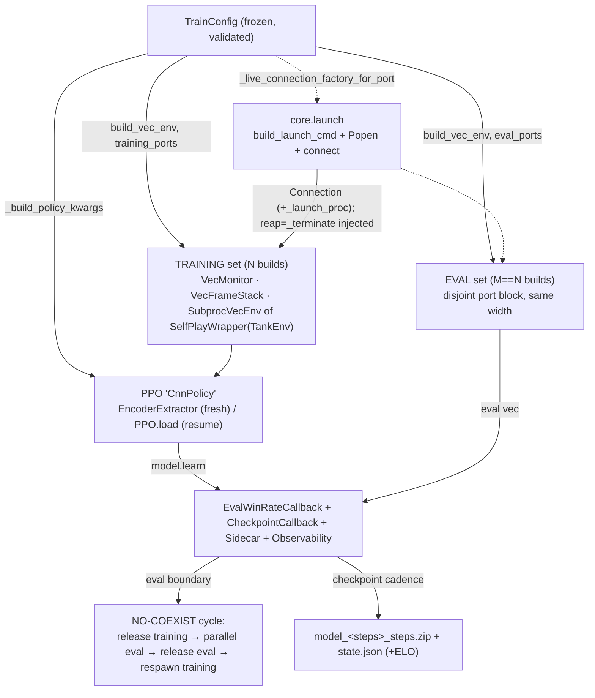
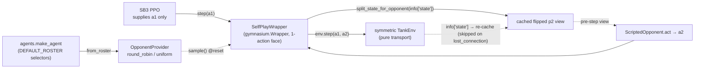

# rl

The **online RL** component: Stable-Baselines3 PPO over the env's pixel observations, plus the
self-play machinery layered as **wrappers over the trainer** (the ML-Agents `ghost/` precedent),
never woven into the PPO core. Five ideas hold the whole component together:

1. **The PPO integrator** — [`train.py`](../../src/pop_trainer/rl/train.py)'s `train_local` composes
   everything below into one runnable command and **re-implements nothing**.
2. **The `EncoderExtractor`** — the seam where the env's pixel frame meets the SB3 policy, wrapping
   the SAME vision [`Encoder`](models.md) the supervised pretraining produces.
3. **The OpponentProvider self-play seam** — `SelfPlayWrapper` presents the symmetric two-player
   `TankEnv` to SB3 as a normal 1-action gym, driving player2 behind the scenes.
4. **Eval + ELO** — a per-opponent **win-rate** eval that runs periodically during training, plus
   the pure ELO math (a light Phase-1 sidecar today; the full ladder is M2).
5. **The multi-env / eval lifecycle** — training and eval Unity builds are **time-multiplexed**: at
   any instant only ONE set is live, so they share the RAM budget.

The package re-exports the seam symbols (`EncoderExtractor`, the four self-play symbols,
`evaluate_winrate` / `win_rate` / `EvalWinRateCallback`, `TrainConfig` / `train_local`,
`DEFAULT_ROSTER`); `elo` is reached directly as `from pop_trainer.rl.elo import ...`, NOT exported
([`__init__.py:47-59`](../../src/pop_trainer/rl/__init__.py)).

**Boundary:** `rl` imports [`core`](core.md), [`env`](env.md), [`models`](models.md), and
[`agents`](agents.md) (+ torch / gymnasium / numpy / stable-baselines3 / psutil / stdlib). It imports
**nothing** from [`data`](data.md) or `pretraining`: the pretrained encoder is consumed as a loaded
`state_dict` (there is no `models.from_pretrained`), the opponent seam re-uses the `agents` registry
+ `core.state.split_state_for_opponent` directly, and the live Unity launch is re-derived from
`core.launch` — never the `data` launch path
([`extractor.py:21-22`](../../src/pop_trainer/rl/extractor.py),
[`selfplay.py:26-28`](../../src/pop_trainer/rl/selfplay.py),
[`train.py:32-36`](../../src/pop_trainer/rl/train.py)). No cycles.

## Architecture at a glance

How the integrator wires the seams into one PPO run:

The self-play seam SB3 sees on every training step:

## Key classes / entry points

### `EncoderExtractor` — the policy↔encoder seam
[`extractor.py`](../../src/pop_trainer/rl/extractor.py). An SB3
`BaseFeaturesExtractor` that wraps the shared [`models.Encoder`](models.md) so the `CnnPolicy` reads
the same flat embedding the supervised pretraining produces. The load-bearing facts:

- **Trunk is chosen by obs RESOLUTION**, with an explicit override. By default `gn-cnn` for a small
  frame (max spatial dim ≤ `SMALL_FRAME_MAX_DIM = 128`, e.g. 64×64), `cnn` otherwise (the canonical
  360×640) — flatten pooling either way. An explicit `trunk=` (`cnn` / `resnet` / `gn-cnn`, a key of
  [`models.TRUNKS`](models.md)) REPLACES the size rule — the trunk knob the CTO signed off; pooling /
  resolution stay fixed ([`_resolve_trunk`, `extractor.py:44-55`](../../src/pop_trainer/rl/extractor.py)).
- **It owns the pretrained-encoder load.** Given a `checkpoint` it `torch.load`s a raw `state_dict`
  and applies it — there is no `models.from_pretrained` ([`extractor.py:110-112`](../../src/pop_trainer/rl/extractor.py)).
- **The freeze contract.** `freeze=True` clears `requires_grad` on every encoder param; freezing
  works through the **grad path** (SB3 builds its optimizer over ALL policy params, so a frozen param
  keeps a `None` grad and never updates), NOT by excluding params from the optimizer — the old
  reference trainer got this wrong ([`extractor.py:114-116`](../../src/pop_trainer/rl/extractor.py)).
- **`forward` does not re-normalize** — SB3 already cast the uint8 frame to float `[0,1]`
  ([`extractor.py:118-124`](../../src/pop_trainer/rl/extractor.py)). `features_dim` is derived from
  the obs `H×W` via `encoder.embedding_dim` — no hardcoded spatial dims, NOT 84×84 (which collapses
  the `cnn` stem) ([`extractor.py:90-99`](../../src/pop_trainer/rl/extractor.py)).

Constructor: `EncoderExtractor(observation_space, *, checkpoint=None, freeze=False, trunk=None)`.

### The self-play opponent seam
[`selfplay.py`](../../src/pop_trainer/rl/selfplay.py) — four symbols, all WRAPPERS over the trainer:

- **[`SelfPlayWrapper`](../../src/pop_trainer/rl/selfplay.py)** — a real `gymnasium.Wrapper`
  presenting the symmetric `TankEnv` as a 1-action gym. SB3 supplies only player1's action; the
  wrapper samples one opponent per episode at reset, caches player2's **flipped** first-person view
  (`split_state_for_opponent(info["state"])` — the pre-step view a simultaneous-move opponent sees),
  and at `step(a1)` drives `env.step(a1, a2)` then re-caches the p2 view from the new `info["state"]`
  ([`selfplay.py:199-238`](../../src/pop_trainer/rl/selfplay.py)). The re-cache is **guarded on
  `"state" in info`**: on a lost-connection step (`info = {"lost_connection": True}`,
  [`tank_env.py:547`](../../src/pop_trainer/env/tank_env.py)) the prior view is kept and the env's
  reward-0 truncation passes through, so the vec env auto-resets and re-primes
  ([`selfplay.py:236-237`](../../src/pop_trainer/rl/selfplay.py)). This is exactly
  `data.collect.run_episode`'s driver loop ([`collect.py:396-397`](../../src/pop_trainer/data/collect.py)),
  repackaged as a Wrapper; the perspective flip
  ([`core.state.split_state_for_opponent`, `state.py:178-185`](../../src/pop_trainer/core/state.py))
  stays visible in the wrapper, never reaching into env internals.
- **[`OpponentProvider`](../../src/pop_trainer/rl/selfplay.py)** — a roster + a per-episode sampling
  strategy (`"round_robin"` cycles in order; `"uniform"` draws from a **seeded** RNG). An unknown
  strategy or empty roster raises `ValueError`. `from_roster(roster=DEFAULT_ROSTER, ...)` wraps each
  selector as `ScriptedOpponent(make_agent(sel, seed=seed))`
  ([`selfplay.py:116-174`](../../src/pop_trainer/rl/selfplay.py)).
- **[`ScriptedOpponent`](../../src/pop_trainer/rl/selfplay.py)** — wraps a scripted
  [`agents`](agents.md) `Agent`; `obs_kind == "state"` (the 52-float wire state). `set_map` / `reset`
  **getattr-probe** the agent and no-op when the hook is absent
  ([`selfplay.py:74-113`](../../src/pop_trainer/rl/selfplay.py)).
- **[`Opponent`](../../src/pop_trainer/rl/selfplay.py)** — the runtime-checkable `Protocol` for the
  player2 side (`obs_kind` + `act`; `set_map` / `reset` optional).

`DEFAULT_ROSTER` is the five canonical selectors — `noop`, `random`, `aggressive-coverage`,
`wall-hugger`, `opponent-shadower` ([`selfplay.py:46-52`](../../src/pop_trainer/rl/selfplay.py)).

### The eval + ELO seam
Scores a trained policy by **win-rate** (fraction of greedy episodes won), broken out per opponent:

- **[`evaluate_winrate`](../../src/pop_trainer/rl/evaluate.py)** — the eval driver, **parallel across
  M eval envs**. For each selector it re-pins every env's `SelfPlayWrapper` to a single-opponent
  provider (`vec.set_attr`, fanned per worker), then batches `predict(deterministic=True)` +
  `vec.step` until `n_episodes` outcomes are tallied. The win-rate **math is M-independent** —
  `M == 1` reproduces the sequential result, `M > 1` is only faster
  ([`evaluate.py:158-201`](../../src/pop_trainer/rl/evaluate.py)). The win signal is
  **`info["outcome"]` on the done step, never the reward sign**; a done-without-outcome (time-limit /
  lost connection) stays a `"draw"` and can never inflate the metric. The env is the source of truth:
  `TankEnv` sets `"win"`/`"loss"`/`"draw"` only on `terminated`
  ([`tank_env.py:583-591`](../../src/pop_trainer/env/tank_env.py),
  [`evaluate.py:144-155`](../../src/pop_trainer/rl/evaluate.py)).
- **Pure helpers (stdlib-only, unit-testable):** [`win_rate`](../../src/pop_trainer/rl/evaluate.py)
  (`wins / total`, `0.0` on empty), [`overall_win_rate`](../../src/pop_trainer/rl/evaluate.py) (mean
  of per-opponent rates), [`format_per_map_table`](../../src/pop_trainer/rl/evaluate.py) (the
  one-line summary the integrator prints) — all torch/env-free
  ([`evaluate.py:56-75,218-252`](../../src/pop_trainer/rl/evaluate.py)).
- **[`EvalWinRateCallback`](../../src/pop_trainer/rl/callbacks.py)** — the SB3 callback that runs the
  eval at **rollout boundaries** (gated by `eval_freq`; `_on_step` is a no-op) and logs
  `eval/win_rate/<selector>` + an overall `eval/win_rate` to the model's logger (→ both
  `progress.csv` and TensorBoard). Its crux is the **NO-COEXIST cycle** — see below
  ([`callbacks.py:104-161`](../../src/pop_trainer/rl/callbacks.py)).
- **[`elo.py`](../../src/pop_trainer/rl/elo.py)** — pure ELO math (`import math` only): `elo_prob`
  (logistic, base 10, /400) and `elo_change` (per-side rounded deltas that need not sum to zero).
  Wired into the integrator as a light from-eval sidecar update only; the full ELO ladder over a
  frozen-self population is **M2 work** ([`elo.py:11-28`](../../src/pop_trainer/rl/elo.py)).

### The `train_local` integrator
[`train.py`](../../src/pop_trainer/rl/train.py) composes the seams above into one runnable run.
[`TrainConfig`](../../src/pop_trainer/rl/train.py) is the frozen, validated run spec (topology,
encoder wiring, roster, eval/checkpoint cadence, resume, and PPO hyperparameters — every default
keeps SB3's own default exact); [`train_local(cfg)`](../../src/pop_trainer/rl/train.py) runs (or
resumes) and returns `cfg.run_dir` ([`train.py:150-318,1070-1335`](../../src/pop_trainer/rl/train.py)).
The full operator CLI lives in the [runbook §5](../runbook.md#5-run-rl-training) — the key
behaviours:

- **Two same-width env stacks, built once at startup.** A `VecMonitor`-wrapped training set on the
  training block `[game_port, game_port + n_envs - 1]` and a parallel eval set (`M == N`) on the
  **disjoint** eval block, default `game_port + n_envs` onward. `__post_init__` rejects an overlapping
  eval block. [`build_vec_env`](../../src/pop_trainer/rl/train.py) builds
  `VecMonitor(VecFrameStack({Dummy,Subproc}VecEnv([SelfPlayWrapper(TankEnv)])))` either way; only the
  training stack is monitored ([`train.py:619-631,691-784,1176-1180`](../../src/pop_trainer/rl/train.py)).
- **The policy.** `PPO("CnnPolicy", ...)` with `policy_kwargs` carrying
  `features_extractor_class=EncoderExtractor` + the `{checkpoint, freeze, trunk}` kwargs and an
  explicit `net_arch`; built fresh on a clean run or `PPO.load`-ed on resume. The PPO
  hyperparameters (`learning_rate` with an optional `linear` decay schedule, `n_steps`, `batch_size`,
  …) are all parameterized ([`_build_policy_kwargs`, `train.py:787-816`](../../src/pop_trainer/rl/train.py),
  [`train.py:1189-1224`](../../src/pop_trainer/rl/train.py)).
- **The live-launch seam (the crux).** `TankEnv` does NOT launch Unity; the live `connection_factory`
  is **re-derived here from `core.launch`** (never imported from `data`), parameterized per port, with
  the `Popen` stashed on the `Connection` so the env's injected `reap=_terminate` hook hard-kills its
  own build on `release` / the kill-old-first reconnect. Each launch points Unity's `-logFile` at a
  distinct per-attempt path so a respawn never truncates a prior (hung) log
  ([`_live_connection_factory_for_port`, `train.py:487-539`](../../src/pop_trainer/rl/train.py);
  [`_build_base_env`, `train.py:545-579`](../../src/pop_trainer/rl/train.py)).
- **Checkpoint / resume / sidecar.** SB3's `CheckpointCallback` writes `model_<steps>_steps.zip`; a
  sidecar callback rides the **same cadence** to write `run_dir/state.json` (provider position,
  per-selector ELO, `cfg.to_dict()`, `num_timesteps`). `--resume` loads the max-step zip + restores
  the sidecar. Position-exact `round_robin` resume holds only at `n_envs == 1`; at `n_envs > 1` (and
  for `uniform`) resume RESEEDS the rotation
  ([`save_sidecar`, `train.py:841-873`](../../src/pop_trainer/rl/train.py),
  [`_latest_checkpoint`, `train.py:1045-1064`](../../src/pop_trainer/rl/train.py),
  [`train.py:1189-1202`](../../src/pop_trainer/rl/train.py)).
- **Observability logging** — purely additive. `train_local` wires `core.logging_setup` for a
  per-process structured-JSONL trail (`training-system.log` + per-env / per-launch Unity logs under
  `run_dir/logs`); `--debug` (or `POP_LOG_LEVEL`) is the single INFO→DEBUG switch. It does NOT touch
  the wire, state layout, or control flow. Reading guide: [runbook → Observability
  logs](../runbook.md#observability-logs) ([`train.py:1123-1167,1559-1563`](../../src/pop_trainer/rl/train.py)).

> **NOTE — the `train_local` docstring is stale.** The docstring at
> [`train.py:1075-1077`](../../src/pop_trainer/rl/train.py) still calls the eval env "ALWAYS-SINGLE
> (`single=True`)"; the shipped code at
> [`train.py:1178-1180`](../../src/pop_trainer/rl/train.py) builds an `M == n_envs` parallel eval vec.
> This page documents the **code's** behaviour.

### The NO-COEXIST eval cycle + multi-env lifecycle
The training builds and the eval builds share the **same RAM budget** (`M_eval == N_train`), so they
are **time-multiplexed** — at any instant the run holds EITHER the training set OR the eval set, never
both. At each eval boundary [`EvalWinRateCallback._run_eval_cycle`](../../src/pop_trainer/rl/callbacks.py)
runs a load-bearing sequence ([`callbacks.py:125-161`](../../src/pop_trainer/rl/callbacks.py)):

1. **Tear down ALL training** instances (`training_vec.env_method("release")` — hard-kill each Unity
   child, frees its port; worker processes stay alive).
2. **Parallel eval** — lazy-launch the M eval instances and run `evaluate_winrate` across them.
3. **Tear down eval** (in a `finally`).
4. **Respawn training** (`training_vec.reset()` lazily re-launches) and re-sync the model's rollout
   sentinels to the fresh obs (`model._last_obs`, `_last_episode_starts[:] = True`).

At `n_envs > 1` the training vec is a `SubprocVecEnv` of one build per training port, with
`start_method="spawn"` (required — no fork/forkserver). Each subproc builds its OWN seeded
`OpponentProvider` inside the spawned process via picklable closures
([`build_vec_env`, `train.py:764-777`](../../src/pop_trainer/rl/train.py)). A pre-flight memory guard
sizes the PPO `RolloutBuffer` + ~1 GB per live Unity instance and charges **`n_envs`** instances (not
`n_envs + 1`, because the eval and training sets never coexist), aborting before launch if over 60 %
of available RAM unless `--allow-oversized`
([`check_rl_memory_budget`, `train.py:401-449`](../../src/pop_trainer/rl/train.py)). Both env sets are
reaped via a nested `try/finally` on any exit ([`train.py:1319-1333`](../../src/pop_trainer/rl/train.py)).
This survives — but does NOT fix — the intermittent multi-env C# reset-region stall; it recovers from
it via [`TankEnv`'s lazy-launch / `release` / kill-old-first
reconnect](env.md#instance-lifecycle-lazy-launch--release--kill-old-first-reconnect). Operator detail:
[runbook → Multi-env training](../runbook.md#multi-env-training---n-envs--1).

The training-topology config (`cfg.game_config`) defaults to
[`train_config.json`](../../unity/Assets/StreamingAssets/train_config.json) — a single-arena
AI-vs-AI pixel config: `timeScale: 5` (**must stay ≤ 5**), `obs_pixels: true` at 640×360 (the keys the
env `frame_shape` is derived + validated from —
[`core.obs`](core.md#the-observation-resolution-contract-coreobs)), both players AI, one
`arena_path` (no rotation). Read the file for the exact values
([`DEFAULT_TRAIN_CONFIG`, `train.py:99`](../../src/pop_trainer/rl/train.py)).

## Pulls from (upstream)

- **[models](models.md)** — `build_encoder` / `EncoderConfig` / the `TRUNKS` registry + the
  [`Encoder`](models.md) the extractor wraps (its `embedding_dim` gives `features_dim`)
  ([`extractor.py:34,95-99`](../../src/pop_trainer/rl/extractor.py)).
- **[core](core.md)** — `core.state.split_state_for_opponent` (the perspective flip the wrapper
  applies, [`state.py:178-185`](../../src/pop_trainer/core/state.py)); plus `core.launch` /
  `core.protocol.Connection` / `core.config` / `core.obs` / `core.logging_setup` for the integrator's
  re-derived live launch ([`train.py:51-72`](../../src/pop_trainer/rl/train.py)).
- **[env](env.md)** — the symmetric pure-transport `TankEnv` the wrapper wraps and drives via
  `env.step(a1, a2)`; the integrator constructs it with the injected `reap=_terminate` hook; the eval
  seam reads its `info["outcome"]` win signal
  ([`selfplay.py:177`](../../src/pop_trainer/rl/selfplay.py),
  [`tank_env.py:583-591`](../../src/pop_trainer/env/tank_env.py)).
- **[agents](agents.md)** — `make_agent` + the canonical selector registry;
  `OpponentProvider.from_roster` builds each roster opponent through it
  ([`selfplay.py:39,164`](../../src/pop_trainer/rl/selfplay.py)).
- **torch / gymnasium / numpy / stable-baselines3 / psutil** — the `BaseFeaturesExtractor` base,
  `gymnasium.Wrapper`, the SB3 PPO / vec-env / callback machinery, and the memory guard's `psutil`.
  The pure `evaluate.py` / `elo.py` helpers stay import-light (sb3/gym type-only; `elo` is `math`
  only).

## Pushes to (downstream)

`rl` is the **tail** of the build graph — it is wired by its own integrator and driven by the
operator; nothing in `src/pop_trainer` imports it.

- The seams feed [`train_local`](#the-train_local-integrator): `EncoderExtractor` → the `CnnPolicy`
  `policy_kwargs`; `SelfPlayWrapper` → the vec stack; `EvalWinRateCallback` → the
  `model.learn(callback=...)` list; `format_per_map_table` → the final summary line.
- The operator-facing CLI ([runbook §5](../runbook.md#5-run-rl-training)) drives `train_local`
  over live windowed Unity builds (the N training + M==N eval builds, time-multiplexed).
- **Deferred (M2, not the train loop):** the full population / frozen-self ELO ladder — only a light
  from-eval ELO sidecar update is wired in M1 ([`elo.py:2-5`](../../src/pop_trainer/rl/elo.py)).

## Where it sits in the run

The online-RL phase, last in the pipeline. The supervised pretraining produces a vision
[`Encoder`](models.md); `rl` loads that encoder into the `EncoderExtractor`, wraps the
[env](env.md)'s pixel `TankEnv` in the self-play seam to drive a scripted [agents](agents.md)
opponent (the same opponent-driving path [data](data.md) collection uses), and runs SB3 PPO —
periodically scoring the policy by per-opponent win-rate via the time-multiplexed eval cycle and
nudging a sidecar ELO. The operator drives the whole thing from the
[runbook](../runbook.md#5-run-rl-training).

---
[← back to index](../README.md)
