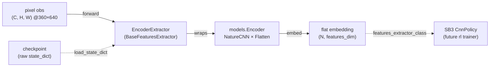

# rl

The **online RL** component — Stable-Baselines3 PPO with a `CnnPolicy` over the env's pixel
observations, plus the self-play machinery (opponent roster, ELO) layered as wrappers. **This
Phase-1 slice ships only the policy↔encoder seam** ([`EncoderExtractor`](../../src/pop_trainer/rl/extractor.py)).
The PPO train loop, callbacks, opponent provider, and ELO land in **later `rl` tasks** — the
package docstring says so (`rl/__init__.py:12`).

**Boundary:** this slice imports [`models`](models.md) (the encoder factory) plus torch /
gymnasium / stable-baselines3 / stdlib. It imports **nothing** from [`data`](data.md) or
`pretraining` — the pretrained encoder is consumed as a loaded `state_dict` artifact, not via a
`models.from_pretrained` (`extractor.py:16-17`). No cycles. (The package docstring forward-declares
a wider allowed set — `core` / `env` / `models` / `agents` — for the future trainer; the seam
shipped here imports only `models`.)

## Key classes / entry points

- [`EncoderExtractor`](../../src/pop_trainer/rl/extractor.py) — a Stable-Baselines3
  [`BaseFeaturesExtractor`](../../src/pop_trainer/rl/extractor.py) (from
  `stable_baselines3.common.torch_layers`, `extractor.py:26`) that **wraps the shared
  [`models.Encoder`](models.md)** so SB3's `CnnPolicy` reads the SAME flat embedding the supervised
  pretraining produces (`extractor.py:34`). It is the one public symbol of `rl` today
  (`rl/__init__.py:19-21`).
  - **Fixed architecture, no knobs.** The encoder is built `EncoderConfig(trunk="nature",
    pooling="flatten")` — a NatureCNN trunk + Flatten/FC head — at the canonical **360×640** frame
    (`extractor.py:61-63`). The extractor exposes NO architecture knobs; the trunk / pooling /
    resolution ablation lives in the [`models`](models.md) benchmark, NOT here (`extractor.py:5-8`).
    The constructor is `EncoderExtractor(observation_space, *, checkpoint=None, freeze=False)` —
    only those two keyword knobs (`extractor.py:51-57`).
  - **Derived, not hard-coded.** `in_channels` comes from the obs space `(C, H, W)`
    (`extractor.py:59,62`); `features_dim` is the encoder's flat embedding size probed at the obs
    `H × W` via `encoder.embedding_dim(input_hw=(H, W))` (`extractor.py:65`). It is NOT 84×84 — an
    84×84 frame would collapse the NatureCNN stem.
  - **Owns the pretrained-encoder load.** Given a `checkpoint`, it `torch.load`s a raw encoder
    `state_dict` and applies it via `self.encoder.load_state_dict` (`extractor.py:76-78`). There is
    NO `models.from_pretrained` — the extractor owns the load itself.
  - **The freeze contract.** `freeze=True` clears `requires_grad` on every encoder parameter
    (`extractor.py:80-82`). Freezing works through the **grad path** — SB3 builds its optimizer over
    ALL policy params, so a frozen param keeps a `None` grad under that optimizer and is never
    updated — NOT by excluding params from the optimizer. This is load-bearing: the old reference
    trainer got it wrong by excluding params (`extractor.py:11-14`).
  - **`forward` does not re-normalize.** SB3's preprocessing has already cast the uint8 frame to
    float and divided by 255, so observations arrive in `[0, 1]`; `forward` just returns
    `self.encoder(observations)` (`extractor.py:84-90`).

## Pulls from (upstream)

- [models](models.md) — `EncoderConfig` / `build_encoder` and the [`Encoder`](models.md) it wraps
  (its `embed` flat embedding + `Encoder.embedding_dim` for the features dimension)
  (`extractor.py:29,61-65`).
- Plus torch / gymnasium / stable-baselines3 (the `BaseFeaturesExtractor` base class)
  (`extractor.py:24-27`).

## Pushes to (downstream)

Nothing internal **yet** — the consumer is not built:

- (Future `rl` trainer reads this as the SB3 `CnnPolicy`
  `policy_kwargs={"features_extractor_class": EncoderExtractor}`, so the policy / value heads read
  the standardized vision embedding. The PPO loop, callbacks, opponent provider, and ELO are not
  built yet — `rl/__init__.py:12`.)

## Where it sits in the run

The seam where the env's pixel observation meets the SB3 policy/value heads. Today it is the only
built piece of the online-RL phase: it lets the (not-yet-built) PPO trainer reuse the SAME
standardized vision backbone the supervised pretraining produces, loaded from a checkpoint and
optionally frozen. It consumes the pixel frames [env](env.md) produces, through the
[models](models.md) `Encoder`, once the trainer exists.

---
[← back to index](../README.md)
