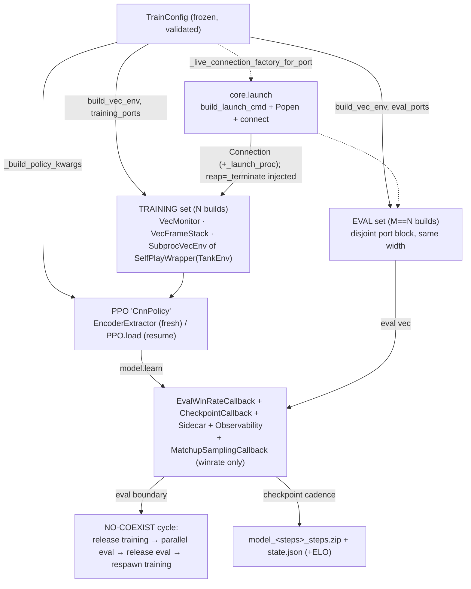
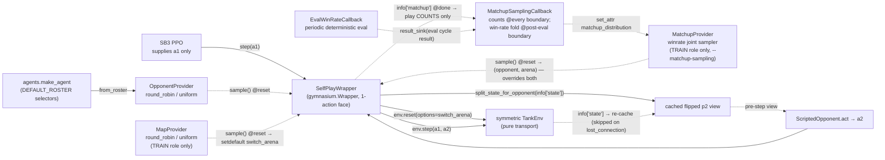

# rl

The **online RL** component: Stable-Baselines3 PPO over the env's pixel observations, plus the
self-play machinery layered as **wrappers over the trainer** (the ML-Agents `ghost/` precedent),
never woven into the PPO core. Five ideas hold the whole component together:

1. **The PPO integrator** — [`train.py`](../../src/pop_trainer/rl/train.py)'s `train_local` composes
   everything below into one runnable command and **re-implements nothing**.
2. **The `EncoderExtractor`** — the seam where the env's pixel frame meets the SB3 policy, wrapping
   the SAME vision [`Encoder`](models.md) the supervised pretraining produces.
3. **The OpponentProvider self-play seam** — `SelfPlayWrapper` presents the symmetric two-player
   `TankEnv` to SB3 as a normal 1-action gym, driving player2 behind the scenes; an optional
   `MapProvider` adds per-episode arena rotation on the **training** role only, and an optional
   `MatchupProvider` (`--matchup-sampling winrate`) replaces both per-episode choices with ONE joint
   (opponent × map) draw weighted by EVAL win-rate deficits — a cheap curriculum that trains hardest
   where the periodic deterministic eval says the agent is weakest.
4. **Eval + ELO** — a per-opponent (and, under map rotation, per-map) **win-rate** eval that runs
   periodically during training, plus the pure ELO math (a light Phase-1 sidecar today; the full
   ladder is M2).
5. **The multi-env / eval lifecycle** — training and eval Unity builds are **time-multiplexed**: at
   any instant only ONE set is live, so they share the RAM budget.

The package re-exports the seam symbols (`EncoderExtractor`, the four re-exported self-play symbols —
`Opponent` / `ScriptedOpponent` / `OpponentProvider` / `SelfPlayWrapper`,
`evaluate_winrate` / `win_rate` / `EvalWinRateCallback`, `TrainConfig` / `train_local`,
`DEFAULT_ROSTER`). The newer `MapProvider` and `MatchupProvider` are the **fifth and sixth**
self-play symbols in `selfplay.__all__` but are NOT in the package re-export — reach them (like `elo`
and the `matchup` pure math) via the submodule:
`from pop_trainer.rl.selfplay import MapProvider, MatchupProvider`, `from pop_trainer.rl.elo import ...`
([`__init__.py:35-59`](../../src/pop_trainer/rl/__init__.py),
[`selfplay.py:45-52`](../../src/pop_trainer/rl/selfplay.py)).

**Boundary:** `rl` imports [`core`](core.md), [`env`](env.md), [`models`](models.md), and
[`agents`](agents.md) (+ torch / gymnasium / numpy / stable-baselines3 / psutil / stdlib). It imports
**nothing** from [`data`](data.md) or `pretraining`: the pretrained encoder is consumed as a loaded
`state_dict` (there is no `models.from_pretrained`), the opponent seam re-uses the `agents` registry
+ `core.state.split_state_for_opponent` directly, and the live Unity launch is re-derived from
`core.launch` — never the `data` launch path
([`extractor.py:21-22`](../../src/pop_trainer/rl/extractor.py),
[`selfplay.py:26-29`](../../src/pop_trainer/rl/selfplay.py),
[`train.py:33-37`](../../src/pop_trainer/rl/train.py)). The new
[`matchup.py`](../../src/pop_trainer/rl/matchup.py) is a **stdlib-only** pure-math sibling (`math`
only; imported by `selfplay` / `callbacks` / the tests —
[`matchup.py:36-37`](../../src/pop_trainer/rl/matchup.py)). No cycles.

## Architecture at a glance

How the integrator wires the seams into one PPO run:

The self-play seam SB3 sees on every training step:

## Key classes / entry points

### `EncoderExtractor` — the policy↔encoder seam
[`extractor.py`](../../src/pop_trainer/rl/extractor.py). An SB3
`BaseFeaturesExtractor` that wraps the shared [`models.Encoder`](models.md) so the `CnnPolicy` reads
the same flat embedding the supervised pretraining produces. The load-bearing facts:

- **Trunk is chosen by obs RESOLUTION**, with an explicit override. By default `gn-cnn` for a small
  frame (max spatial dim ≤ `SMALL_FRAME_MAX_DIM = 128`, e.g. 64×64), `cnn` otherwise (the canonical
  360×640) — flatten pooling either way. An explicit `trunk=` (`cnn` / `resnet` / `gn-cnn`, a key of
  [`models.TRUNKS`](models.md)) REPLACES the size rule — the trunk knob the CTO signed off; pooling /
  resolution stay fixed ([`_resolve_trunk`, `extractor.py:44-55`](../../src/pop_trainer/rl/extractor.py)).
- **It owns the pretrained-encoder load.** Given a `checkpoint` it `torch.load`s a raw `state_dict`
  and applies it — there is no `models.from_pretrained` ([`extractor.py:110-112`](../../src/pop_trainer/rl/extractor.py)).
- **The freeze contract.** `freeze=True` clears `requires_grad` on every encoder param; freezing
  works through the **grad path** (SB3 builds its optimizer over ALL policy params, so a frozen param
  keeps a `None` grad and never updates), NOT by excluding params from the optimizer — the old
  reference trainer got this wrong ([`extractor.py:114-116`](../../src/pop_trainer/rl/extractor.py)).
- **`forward` does not re-normalize** — SB3 already cast the uint8 frame to float `[0,1]`
  ([`extractor.py:118-124`](../../src/pop_trainer/rl/extractor.py)). `features_dim` is derived from
  the obs `H×W` via `encoder.embedding_dim` — no hardcoded spatial dims, NOT 84×84 (which collapses
  the `cnn` stem) ([`extractor.py:90-99`](../../src/pop_trainer/rl/extractor.py)).

Constructor: `EncoderExtractor(observation_space, *, checkpoint=None, freeze=False, trunk=None)`.

### The self-play opponent seam
[`selfplay.py`](../../src/pop_trainer/rl/selfplay.py) — **six** symbols, all WRAPPERS over the
trainer:

- **[`SelfPlayWrapper`](../../src/pop_trainer/rl/selfplay.py)** — a real `gymnasium.Wrapper`
  presenting the symmetric `TankEnv` as a 1-action gym. SB3 supplies only player1's action; the
  wrapper samples one opponent per episode at reset, caches player2's **flipped** first-person view
  (`split_state_for_opponent(info["state"])` — the pre-step view a simultaneous-move opponent sees),
  and at `step(a1)` drives `env.step(a1, a2)` then re-caches the p2 view from the new `info["state"]`
  ([`selfplay.py:419-500`](../../src/pop_trainer/rl/selfplay.py)). The re-cache is **guarded on
  `"state" in info`**: on a lost-connection step (`info = {"lost_connection": True}`,
  [`tank_env.py:547`](../../src/pop_trainer/env/tank_env.py)) the prior view is kept and the env's
  reward-0 truncation passes through, so the vec env auto-resets and re-primes
  ([`selfplay.py:482-489`](../../src/pop_trainer/rl/selfplay.py)). This is exactly
  `data.collect.run_episode`'s driver loop ([`collect.py:396-397`](../../src/pop_trainer/data/collect.py)),
  repackaged as a Wrapper; the perspective flip
  ([`core.state.split_state_for_opponent`, `state.py:178-185`](../../src/pop_trainer/core/state.py))
  stays visible in the wrapper, never reaching into env internals. **Map injection (optional):** the
  constructor takes `maps: MapProvider | None = None`; when set, `reset` copies the caller's options
  and `setdefault("switch_arena", maps.sample())` — a caller-supplied `switch_arena` **wins** and the
  caller's options dict is never mutated. When `maps is None` (the default) the options pass through
  **byte-identical** to before — no `switch_arena` is ever sent (the backward-compatible / eval path)
  ([`selfplay.py:450-455`](../../src/pop_trainer/rl/selfplay.py)). **Matchup injection (optional):**
  the constructor also takes `matchups: MatchupProvider | None = None`; when set it is the SINGLE
  source of the episode's (opponent, arena) pair — one joint draw at reset **overrides both** the
  opponent sample and the map sample; a `None` boot-arena cell injects nothing (handshake
  byte-identical), a real target merges via the same caller-wins `setdefault`
  ([`selfplay.py:438-457`](../../src/pop_trainer/rl/selfplay.py)). On the episode-ending step the
  wrapper tags `info["matchup"] = {"opponent", "map", "outcome"}` — the plain-data sample the
  aggregation callback COUNTS (the tag feeds the per-cell play counts only, never the win-rate
  table); a done WITHOUT an outcome token maps to 0.5 (a draw, never a win)
  ([`selfplay.py:490-499`](../../src/pop_trainer/rl/selfplay.py)). The `matchup_distribution`
  property is the broadcast target: assigning it lands INSIDE the held provider (the provider object
  and its seeded RNG are never replaced); with `matchups=None` (the default) nothing changes — no
  joint draw, no tag, no new info keys ([`selfplay.py:401-417`](../../src/pop_trainer/rl/selfplay.py)).
- **[`OpponentProvider`](../../src/pop_trainer/rl/selfplay.py)** — a roster + a per-episode sampling
  strategy (`"round_robin"` cycles in order; `"uniform"` draws from a **seeded** RNG). An unknown
  strategy or empty roster raises `ValueError`. `from_roster(roster=DEFAULT_ROSTER, ...)` wraps each
  selector as `ScriptedOpponent(make_agent(sel, seed=seed))`
  ([`selfplay.py:126-184`](../../src/pop_trainer/rl/selfplay.py)).
- **[`MapProvider`](../../src/pop_trainer/rl/selfplay.py)** — the **map sibling** of
  `OpponentProvider`: a non-empty list of arena targets (`Arenas/<name>.json`) + the SAME two
  strategies (`"round_robin"` cycles in order; `"uniform"` is a **seeded** draw), validated the same
  way (unknown strategy / empty list → `ValueError`). `sample()` returns ONE arena target per
  episode (called at reset by the wrapper). `from_curated(values, ...)` resolves a `--maps` flag value
  via [`core.maps.resolve_map_rotation`](core.md) — the single source of how a rotation request maps
  to arena targets ([`selfplay.py:187-257`](../../src/pop_trainer/rl/selfplay.py)).
- **[`MatchupProvider`](../../src/pop_trainer/rl/selfplay.py)** — the **third sibling**: a JOINT
  per-episode sampler over cells = (opponent selector × arena target). Built from explicit
  `(selector, opponent)` pairs (a `ScriptedOpponent` does not carry its selector name) via
  `from_roster(roster, maps, seed=...)`; the cell order is the canonical opponent-major enumeration
  from `matchup_cells`, shared with the aggregation callback so a broadcast distribution indexes the
  same cell everywhere. `sample()` is one seeded categorical draw over the current plain-data
  `distribution` (initialized uniform — every cell starts at the 0.5 win-rate prior), returning
  `(selector, opponent, arena_or_None)`; `maps=None` is the single-arena mode (every cell carries
  the `None` boot arena; NO `switch_arena` is ever sent). Plain-data picklable, spawn-safe like its
  siblings ([`selfplay.py:260-346`](../../src/pop_trainer/rl/selfplay.py)).
- **[`ScriptedOpponent`](../../src/pop_trainer/rl/selfplay.py)** — wraps a scripted
  [`agents`](agents.md) `Agent`; `obs_kind == "state"` (the 52-float wire state). `set_map` / `reset`
  **getattr-probe** the agent and no-op when the hook is absent
  ([`selfplay.py:84-123`](../../src/pop_trainer/rl/selfplay.py)).
- **[`Opponent`](../../src/pop_trainer/rl/selfplay.py)** — the runtime-checkable `Protocol` for the
  player2 side (`obs_kind` + `act`; `set_map` / `reset` optional).

`DEFAULT_ROSTER` is the five canonical selectors — `noop`, `random`, `aggressive-coverage`,
`wall-hugger`, `opponent-shadower` ([`selfplay.py:56-62`](../../src/pop_trainer/rl/selfplay.py)).

The winrate sampler's arithmetic lives in the **stdlib-only**
[`matchup.py`](../../src/pop_trainer/rl/matchup.py) (unit-testable with no torch / sb3 / env
imports): `matchup_cells` (the ONE canonical opponent-major cell enumeration every consumer derives
from), `outcome_to_float` (`"win"` → 1.0, `"loss"` → 0.0, `"draw"` / missing / unknown → 0.5 —
mirroring eval's never-a-win convention; it scores the training terminal tag, which feeds play
counts only), `ema_update` (`(1-α)·wr + α·measurement`; unseen cells start at the 0.5
`INITIAL_WIN_RATE` prior), the **eval-signal feed** — `eval_cell_rates` (normalizes an
`evaluate_winrate` result of EITHER return shape onto the sampler cells: rotation per-cell counts
yield `wins/episodes` with zero-episode cells OMITTED so an unmeasured cell cannot move the fold;
single-arena per-opponent rates land on the `(selector, None)` boot-arena cells) and
`fold_eval_rates` (one eval cycle's per-cell rates EMA-folded into the win-rate table; returns a NEW
list, unmeasured cells keep their value exactly, unknown cells are ignored) — `deficit_distribution`
(`P(cell) = floor·uniform + (1-floor)·normalize(1-wr)`; min prob ≥ `floor/n`, an all-won deficit
falls back to uniform instead of NaN), and the observability helpers `distribution_entropy` /
`worst_cells` ([`matchup.py:71-210`](../../src/pop_trainer/rl/matchup.py)).

### The eval + ELO seam
Scores a trained policy by **win-rate** (fraction of greedy episodes won), broken out per opponent —
and, when a map rotation is active, per map as well:

- **[`evaluate_winrate`](../../src/pop_trainer/rl/evaluate.py)** — the eval driver, **parallel across
  M eval envs**. Each (opponent[, map]) phase re-pins every env's `SelfPlayWrapper` to a
  single-selector provider (`vec.set_attr`, fanned per worker), then batches
  `predict(deterministic=True)` + `vec.step` until the phase's episodes are tallied. The win-rate
  **math is M-independent** — `M == 1` reproduces the sequential result, `M > 1` is only faster
  ([`_eval_phase_vec`, `evaluate.py:170-229`](../../src/pop_trainer/rl/evaluate.py);
  [`evaluate_winrate`, `evaluate.py:232-307`](../../src/pop_trainer/rl/evaluate.py)). The win signal
  is **`info["outcome"]` on the done step, never the reward sign**; a done-without-outcome
  (time-limit / lost connection) stays a `"draw"` and can never inflate the metric. The env is the
  source of truth: `TankEnv` sets `"win"`/`"loss"`/`"draw"` only on `terminated`
  ([`tank_env.py:583-591`](../../src/pop_trainer/env/tank_env.py),
  [`evaluate.py:221-229`](../../src/pop_trainer/rl/evaluate.py)).
- **Map coverage (`maps=` given — normally the training rotation).** Each opponent's `n_episodes`
  budget is spread **deterministically** across the rotation maps by
  [`episode_spread`](../../src/pop_trainer/rl/evaluate.py) (floor/ceil quotas summing to exactly N —
  100 episodes / 10 maps = 10 per (opponent, map) cell; the total eval cost is unchanged by the
  rotation, [`evaluate.py:102-123`](../../src/pop_trainer/rl/evaluate.py)), and every cell runs as
  its own pinned phase: `_eval_phase_vec` ALSO pins a single-map `MapProvider` per env
  (`set_attr("maps", ...)`), so each reset in the phase injects
  `reset(options={"switch_arena": arena})` — the same live-validated reset-time channel training
  rotation uses ([`evaluate.py:185-212`](../../src/pop_trainer/rl/evaluate.py)). The return is then
  per-cell `{(selector, arena): (wins, episodes)}` counts; with `maps=None` it stays the plain
  `{selector: win_rate}` dict and **no `switch_arena` is ever sent** — byte-identical to the
  single-arena eval ([`evaluate.py:288-307`](../../src/pop_trainer/rl/evaluate.py)).
- **Pure helpers (stdlib-only, unit-testable):** [`win_rate`](../../src/pop_trainer/rl/evaluate.py)
  (`wins / total`, `0.0` on empty, [`evaluate.py:80-99`](../../src/pop_trainer/rl/evaluate.py));
  [`pool_by_opponent`](../../src/pop_trainer/rl/evaluate.py) /
  [`pool_by_map`](../../src/pop_trainer/rl/evaluate.py) /
  [`pooled_win_rate`](../../src/pop_trainer/rl/evaluate.py) — all three POOL wins/episodes from the
  SAME per-cell counts (never a mean of means), so per-opponent, per-map, and overall **reconcile by
  construction** even under an uneven floor/ceil spread
  ([`evaluate.py:310-357`](../../src/pop_trainer/rl/evaluate.py));
  [`overall_win_rate`](../../src/pop_trainer/rl/evaluate.py) (mean of per-opponent rates,
  [`evaluate.py:374-386`](../../src/pop_trainer/rl/evaluate.py));
  [`map_short_name`](../../src/pop_trainer/rl/evaluate.py) (arena target → TensorBoard tag stem,
  [`evaluate.py:126-133`](../../src/pop_trainer/rl/evaluate.py)); and the two final-summary
  formatters: [`format_per_opponent_line`](../../src/pop_trainer/rl/evaluate.py) (the per-opponent +
  OVERALL line — **RENAMED** from `format_per_map_table`, which was always per-opponent) and the
  genuinely per-map [`format_per_map_line`](../../src/pop_trainer/rl/evaluate.py) (no OVERALL cell —
  an unweighted mean over maps would not pool correctly under an uneven spread)
  ([`evaluate.py:389-425`](../../src/pop_trainer/rl/evaluate.py)).
- **[`EvalWinRateCallback`](../../src/pop_trainer/rl/callbacks.py)** — the SB3 callback that runs the
  eval at **rollout boundaries** (gated by `eval_freq`; `_on_step` is a no-op) and logs
  `eval/win_rate/<selector>` + an overall `eval/win_rate` to the model's logger (→ both
  `progress.csv` and TensorBoard); with `maps` it additionally logs one per-map marginal
  `eval/win_rate/map/<short-name>` per rotation arena — all scalars pooled from the same per-cell
  counts, never one scalar per (opponent × map) cell. An optional `result_sink` callable receives
  each completed cycle's structured `evaluate_winrate` result — the matchup curriculum's ONLY
  win-rate feed (`train_local` wires `MatchupSamplingCallback.submit_eval_result` here); `None`
  (the default) leaves the logging path identical
  ([`callbacks.py:129-134,173-178`](../../src/pop_trainer/rl/callbacks.py)). Its crux is the
  **NO-COEXIST cycle** — see below
  ([`callbacks.py:94-244`](../../src/pop_trainer/rl/callbacks.py)).
- **[`elo.py`](../../src/pop_trainer/rl/elo.py)** — pure ELO math (`import math` only): `elo_prob`
  (logistic, base 10, /400) and `elo_change` (per-side rounded deltas that need not sum to zero).
  Wired into the integrator as a light from-eval sidecar update only — under map rotation it
  consumes the **pooled per-opponent marginals**
  ([`train.py:1581-1589`](../../src/pop_trainer/rl/train.py)); the full ELO ladder over a
  frozen-self population is **M2 work** ([`elo.py:11-28`](../../src/pop_trainer/rl/elo.py)).

### The `train_local` integrator
[`train.py`](../../src/pop_trainer/rl/train.py) composes the seams above into one runnable run.
[`TrainConfig`](../../src/pop_trainer/rl/train.py) is the frozen, validated run spec (topology,
encoder wiring, roster, eval/checkpoint cadence, resume, and PPO hyperparameters — every default
keeps SB3's own default exact); [`train_local(cfg)`](../../src/pop_trainer/rl/train.py) runs (or
resumes) and returns `cfg.run_dir` ([`train.py:165-444,1284-1637`](../../src/pop_trainer/rl/train.py)).
The full operator CLI lives in the [runbook §5](../runbook.md#5-run-rl-training) — the key
behaviours:

- **Two same-width env stacks, built once at startup.** A `VecMonitor`-wrapped training set on the
  training block `[game_port, game_port + n_envs - 1]` and a parallel eval set (`M == N`) on the
  **disjoint** eval block, default `game_port + n_envs` onward. `__post_init__` rejects an overlapping
  eval block. [`build_vec_env`](../../src/pop_trainer/rl/train.py) builds
  `VecMonitor(VecFrameStack({Dummy,Subproc}VecEnv([SelfPlayWrapper(TankEnv)])))` either way; only the
  training stack is monitored ([`train.py:727-740,799-893,1401-1405`](../../src/pop_trainer/rl/train.py)).
- **The policy.** `PPO("CnnPolicy", ...)` with `policy_kwargs` carrying
  `features_extractor_class=EncoderExtractor` + the `{checkpoint, freeze, trunk}` kwargs and an
  explicit `net_arch`; built fresh on a clean run or `PPO.load`-ed on resume. The PPO
  hyperparameters (`learning_rate` with an optional `linear` decay schedule, `n_steps`, `batch_size`,
  …) are all parameterized ([`_build_policy_kwargs`, `train.py:895-910`](../../src/pop_trainer/rl/train.py),
  [`train.py:1425-1464`](../../src/pop_trainer/rl/train.py)).
- **The live-launch seam (the crux).** `TankEnv` does NOT launch Unity; the live `connection_factory`
  is **re-derived here from `core.launch`** (never imported from `data`), parameterized per port, with
  the `Popen` stashed on the `Connection` so the env's injected `reap=_terminate` hook hard-kills its
  own build on `release` / the kill-old-first reconnect. Each launch points Unity's `-logFile` at a
  distinct per-attempt path so a respawn never truncates a prior (hung) log
  ([`_live_connection_factory_for_port`, `train.py:562-618`](../../src/pop_trainer/rl/train.py);
  [`_build_base_env`, `train.py:620-655`](../../src/pop_trainer/rl/train.py)).
- **Checkpoint / resume / sidecar.** SB3's `CheckpointCallback` writes `model_<steps>_steps.zip`; a
  sidecar callback rides the **same cadence** to write `run_dir/state.json` (opponent-provider
  position, per-selector ELO, `cfg.to_dict()`, `num_timesteps`). The **map rotation rides the same
  contract in a SEPARATE `map_provider` block** (the opponent `provider` block is unchanged): with
  `cfg.maps is None` (single-arena) it records `{"maps": null}` (nothing to resume); at `n_envs == 1`
  it records the `round_robin` index for a position-exact resume; at `n_envs > 1` (or `uniform`) the
  block records strategy + seed so resume RESEEDS — per-subproc providers are seeded
  `cfg.seed + offset`, mirroring opponents. `--resume` loads the max-step zip + restores both blocks
  ([`save_sidecar` / `_map_provider_state`, `train.py:949-1018`](../../src/pop_trainer/rl/train.py),
  [`_restore_map_provider_position`, `train.py:1067-1079`](../../src/pop_trainer/rl/train.py),
  [`_latest_checkpoint`, `train.py:1259-1282`](../../src/pop_trainer/rl/train.py),
  [`train.py:1425-1442,1609-1620`](../../src/pop_trainer/rl/train.py)). The **matchup curriculum
  rides a third `matchup` block**: with the feature off it records `{"sampling": "off"}` (mirroring
  the map block's `{"maps": null}`); with it on the callback's `state()` (cells + the eval-fed
  win-rate table + training play counts, marked `signal: "eval"`) is persisted verbatim and
  `--resume` restores it **by cell key** — roster/rotation-tolerant (surviving cells continue, new
  cells start at the 0.5 prior) and position-exact at ANY `n_envs`, because the table lives in the
  main process. An OLDER sidecar without the `signal` field (its table was fed from training
  outcomes) restores fine: its values decay out over the first few eval folds (EMA-blended, not
  overwritten)
  ([`_matchup_state_block`, `train.py:1021-1039`](../../src/pop_trainer/rl/train.py);
  [`_restore_matchup_state`, `train.py:1082-1098`](../../src/pop_trainer/rl/train.py);
  [`callbacks.py:336-371`](../../src/pop_trainer/rl/callbacks.py)).
- **Map rotation — the FREE-RUNNING provider is TRAINING-only; eval covers the rotation via PINNED
  phases (load-bearing invariant).** A free-running `MapProvider` is attached ONLY when
  `cfg.maps is not None` AND `role == ROLE_TRAIN`; the eval vec is built `role=ROLE_EVAL`, so its
  wrappers are constructed `maps=None` and no construction-time provider ever rotates an eval env
  ([`_make_self_play_env`'s role gate, `train.py:706-716`](../../src/pop_trainer/rl/train.py)). The
  eval map schedule is owned entirely by `evaluate_winrate` instead: ONE arena pinned per
  (opponent, map) phase (a single-map provider set via `vec.set_attr`), injected as
  `reset(options={"switch_arena": ...})` — the build handles `switch_arena` only while `!ingame`,
  and a reset-option switch lands exactly there, so the **deliberate, pinned, phase-scoped**
  switching at reset is safe
  ([`_eval_phase_vec`, `evaluate.py:185-212`](../../src/pop_trainer/rl/evaluate.py);
  [`callbacks.py:208-217`](../../src/pop_trainer/rl/callbacks.py)). The historical bug (commit
  `c84a28e`) was different in kind: eval envs then carried a FREE-RUNNING rotation that switched to
  an arbitrary arena at every vec auto-reset — unaccounted by the eval math and racing an in-flight
  episode — and that uncontrolled path stays forbidden. Without `--maps`, eval sends **no**
  `switch_arena` at all (plain `reset()`s, byte-identical to the single-arena eval); with it, the
  integrator hands the TRAINING rotation to the eval callback so eval covers the same arenas
  training plays ([`train.py:1496-1512`](../../src/pop_trainer/rl/train.py)). The default config is
  still single-arena; rotation is opt-in via `--maps`.
- **Matchup sampling (`--matchup-sampling winrate`) — an EVAL-fed win-rate curriculum,
  TRAINING-only, default `off`.** With `off` (the default) the feature is fully inert: no
  `MatchupProvider`, no callback, no new info keys — the independent opponent/map samplers behave
  exactly as above ([`MATCHUP_SAMPLING_CHOICES`, `train.py:135-138`](../../src/pop_trainer/rl/train.py)).
  With `winrate` each TRAINING wrapper gets a `MatchupProvider` over `cfg.opponents × (cfg.maps or
  the boot arena)`, seeded per-subproc like its siblings — the eval wrappers NEVER get one (the same
  role gate as the map provider, [`train.py:717-723`](../../src/pop_trainer/rl/train.py)) — and ONE
  main-process [`MatchupSamplingCallback`](../../src/pop_trainer/rl/callbacks.py) closes the loop
  with **two strictly separated data flows**
  ([`callbacks.py:247-463`](../../src/pop_trainer/rl/callbacks.py); wiring at
  [`train.py:1473-1484,1490-1527`](../../src/pop_trainer/rl/train.py)):
  - **`win_rates` — what EVAL measured.** The per-cell win-rate table is fed ONLY from the periodic
    deterministic eval: after each eval cycle `EvalWinRateCallback` hands the structured
    `evaluate_winrate` result to `MatchupSamplingCallback.submit_eval_result` (the `result_sink`
    wired in `train_local`). At that SAME rollout boundary the callback normalizes it onto the
    sampler cells (`eval_cell_rates`), EMA-folds it into the table (`fold_eval_rates`,
    `--matchup-ema-alpha`, default `0.4` — sized for per-eval-cycle folds of ~10-episode cell
    estimates; a per-episode-scale alpha like the old 0.05 would leave the curriculum near its
    prior for ~20 eval cycles), recomputes `P(cell) = eps·uniform + (1−eps)·normalize(1−wr)`
    (`--matchup-floor` eps, default `0.25`), BROADCASTS the plain-data distribution to every worker
    via `set_attr("matchup_distribution", ...)` — the same delegation path eval uses to re-pin
    opponents — and logs ONE `matchup_update` summary. The same-boundary guarantee is the
    `CallbackList` ORDER: `EvalWinRateCallback` runs FIRST, the matchup callback LAST
    ([`train.py:1490-1527`](../../src/pop_trainer/rl/train.py);
    [`callbacks.py:373-383,417-441`](../../src/pop_trainer/rl/callbacks.py)). The distribution is
    UNIFORM until the first eval cycle (every cell starts at the 0.5 prior) and FROZEN between
    eval cycles — no fold, no broadcast, no log at a non-eval boundary; `_on_training_start`
    broadcasts once up-front (the resume seam,
    [`callbacks.py:390-397`](../../src/pop_trainer/rl/callbacks.py)).
  - **`counts` — what TRAINING played.** `_on_step` only ACCUMULATES the terminal `info["matchup"]`
    tags (the distribution never changes mid-rollout) and `_on_rollout_end` folds them into the
    per-cell play counts at EVERY boundary — pure observability of what the sampler actually
    sampled. Training terminal outcomes NEVER move `win_rates`
    ([`callbacks.py:399-415,426-428`](../../src/pop_trainer/rl/callbacks.py)). Rationale: the
    training-side EMA measured the STOCHASTIC rollout policy, which at high entropy inverts against
    the deterministic eval (training reported a noop win-rate near 0.9 while eval said ~0.1),
    steering the curriculum away from the policy's real weaknesses; eval measures the deterministic
    policy the run is judged on.

  Because the signal is eval, the mode REQUIRES eval enabled: config validation rejects
  `matchup_sampling="winrate"` with `eval_freq <= 0`
  ([`train.py:340-345`](../../src/pop_trainer/rl/train.py)). Observability is ONE compact
  `matchup_update` summary per POST-EVAL boundary (the worst-k lowest-win-rate cells + distribution
  entropy + eval folds / cells measured + play counts) plus two TB scalars,
  `matchup/distribution_entropy` and `matchup/episodes` — never one scalar per cell
  ([`callbacks.py:440-463`](../../src/pop_trainer/rl/callbacks.py)). **The coupling is ONE-WAY:
  eval steers training, the sampler never touches eval** — the eval wrappers have no
  `MatchupProvider`, and the eval schedule is owned by the eval seam itself (pinned per-map phases
  under `--maps`, the boot arena without it). Verified live (the gated run: 8 rollout boundaries
  spanning 2 eval cycles): the fold + broadcast fired at exactly the 2 post-eval boundaries and the
  table was byte-identical across the 6 non-eval boundaries; the distribution was uniform before
  the first fold; counts accumulated at every boundary; the EMA arithmetic was exact
  (0.5 → 0.3 → 0.18 at alpha 0.4 against an all-zero eval); exit 0, with zero `recv_timeout`s
  across 72 eval resets.
- **Observability logging** — purely additive. `train_local` wires `core.logging_setup` for a
  per-process structured-JSONL trail (`training-system.log` + per-env / per-launch Unity logs under
  `run_dir/logs`); `--debug` (or `POP_LOG_LEVEL`) is the single INFO→DEBUG switch. It does NOT touch
  the wire, state layout, or control flow. Reading guide: [runbook → Observability
  logs](../runbook.md#observability-logs) ([`train.py:700,1341-1369`](../../src/pop_trainer/rl/train.py)).

> **NOTE — the `train_local` docstring is stale.** The docstring at
> [`train.py:1289-1291`](../../src/pop_trainer/rl/train.py) still calls the eval env "ALWAYS-SINGLE
> (`single=True`)"; the shipped code at
> [`train.py:1401-1405`](../../src/pop_trainer/rl/train.py) builds an `M == n_envs` parallel eval vec.
> This page documents the **code's** behaviour.

### The NO-COEXIST eval cycle + multi-env lifecycle
The training builds and the eval builds share the **same RAM budget** (`M_eval == N_train`), so they
are **time-multiplexed** — at any instant the run holds EITHER the training set OR the eval set, never
both. At each eval boundary [`EvalWinRateCallback._run_eval_cycle`](../../src/pop_trainer/rl/callbacks.py)
runs a load-bearing sequence ([`callbacks.py:200-244`](../../src/pop_trainer/rl/callbacks.py)):

1. **Tear down ALL training** instances (`training_vec.env_method("release")` — hard-kill each Unity
   child, frees its port; worker processes stay alive).
2. **Parallel eval** — lazy-launch the M eval instances and run `evaluate_winrate` across them.
3. **Tear down eval** (in a `finally`).
4. **Respawn training** (`training_vec.reset()` lazily re-launches) and re-sync the model's rollout
   sentinels to the fresh obs (`model._last_obs`, `_last_episode_starts[:] = True`).

At `n_envs > 1` the training vec is a `SubprocVecEnv` of one build per training port, with
`start_method="spawn"` (required — no fork/forkserver). Each subproc builds its OWN seeded
`OpponentProvider` inside the spawned process via picklable closures
([`_env_factories_for_ports` / `build_vec_env`, `train.py:742-777,871-885`](../../src/pop_trainer/rl/train.py)). A pre-flight memory guard
sizes the PPO `RolloutBuffer` + ~1 GB per live Unity instance and charges **`n_envs`** instances (not
`n_envs + 1`, because the eval and training sets never coexist), aborting before launch if over 60 %
of available RAM unless `--allow-oversized`
([`check_rl_memory_budget`, `train.py:476-528`](../../src/pop_trainer/rl/train.py)). Both env sets are
reaped via a nested `try/finally` on any exit ([`train.py:1621-1635`](../../src/pop_trainer/rl/train.py)).
This survives — but does NOT fix — the intermittent multi-env C# reset-region stall; it recovers from
it via [`TankEnv`'s lazy-launch / `release` / kill-old-first
reconnect](env.md#instance-lifecycle-lazy-launch--release--kill-old-first-reconnect). Operator detail:
[runbook → Multi-env training](../runbook.md#multi-env-training---n-envs--1).

The training-topology config (`cfg.game_config`) defaults to
[`train_config.json`](../../unity/Assets/StreamingAssets/train_config.json) — a single-arena
AI-vs-AI pixel config: `timeScale: 5` (**must stay ≤ 5**), `obs_pixels: true` at 640×360 (the keys the
env `frame_shape` is derived + validated from —
[`core.obs`](core.md#the-observation-resolution-contract-coreobs)), both players AI, one
`arena_path` (no rotation). Read the file for the exact values
([`DEFAULT_TRAIN_CONFIG`, `train.py:108`](../../src/pop_trainer/rl/train.py)).

## Pulls from (upstream)

- **[models](models.md)** — `build_encoder` / `EncoderConfig` / the `TRUNKS` registry + the
  [`Encoder`](models.md) the extractor wraps (its `embedding_dim` gives `features_dim`)
  ([`extractor.py:34,95-99`](../../src/pop_trainer/rl/extractor.py)).
- **[core](core.md)** — `core.state.split_state_for_opponent` (the perspective flip the wrapper
  applies, [`state.py:178-185`](../../src/pop_trainer/core/state.py)) and
  `core.maps.resolve_map_rotation` (the single source resolving a `--maps` flag value to arena targets
  — used by `MapProvider.from_curated` and the CLI, [`selfplay.py:41`](../../src/pop_trainer/rl/selfplay.py),
  [`train.py:64,1909`](../../src/pop_trainer/rl/train.py)); plus `core.launch` /
  `core.protocol.Connection` / `core.config` / `core.obs` / `core.logging_setup` for the integrator's
  re-derived live launch ([`train.py:52-70`](../../src/pop_trainer/rl/train.py)).
- **[env](env.md)** — the symmetric pure-transport `TankEnv` the wrapper wraps and drives via
  `env.step(a1, a2)`; the integrator constructs it with the injected `reap=_terminate` hook; the eval
  seam reads its `info["outcome"]` win signal
  ([`selfplay.py:481`](../../src/pop_trainer/rl/selfplay.py),
  [`tank_env.py:583-591`](../../src/pop_trainer/env/tank_env.py)).
- **[agents](agents.md)** — `make_agent` + the canonical selector registry;
  `OpponentProvider.from_roster` builds each roster opponent through it
  ([`selfplay.py:40,174`](../../src/pop_trainer/rl/selfplay.py)).
- **torch / gymnasium / numpy / stable-baselines3 / psutil** — the `BaseFeaturesExtractor` base,
  `gymnasium.Wrapper`, the SB3 PPO / vec-env / callback machinery, and the memory guard's `psutil`.
  The pure `evaluate.py` / `elo.py` helpers stay import-light (sb3/gym type-only; `elo` is `math`
  only).

## Pushes to (downstream)

`rl` is the **tail** of the build graph — it is wired by its own integrator and driven by the
operator; nothing in `src/pop_trainer` imports it.

- The seams feed [`train_local`](#the-train_local-integrator): `EncoderExtractor` → the `CnnPolicy`
  `policy_kwargs`; `SelfPlayWrapper` → the vec stack; `EvalWinRateCallback` (+ the
  `MatchupSamplingCallback` when `--matchup-sampling winrate`) → the `model.learn(callback=...)`
  list; `format_per_opponent_line` (+ `format_per_map_line` under map rotation) → the final summary
  lines.
- The operator-facing CLI ([runbook §5](../runbook.md#5-run-rl-training)) drives `train_local`
  over live windowed Unity builds (the N training + M==N eval builds, time-multiplexed).
- **Deferred (M2, not the train loop):** the full population / frozen-self ELO ladder — only a light
  from-eval ELO sidecar update is wired in M1 ([`elo.py:2-5`](../../src/pop_trainer/rl/elo.py)).

## Where it sits in the run

The online-RL phase, last in the pipeline. The supervised pretraining produces a vision
[`Encoder`](models.md); `rl` loads that encoder into the `EncoderExtractor`, wraps the
[env](env.md)'s pixel `TankEnv` in the self-play seam to drive a scripted [agents](agents.md)
opponent (the same opponent-driving path [data](data.md) collection uses), and runs SB3 PPO —
periodically scoring the policy by per-opponent win-rate via the time-multiplexed eval cycle and
nudging a sidecar ELO. The operator drives the whole thing from the
[runbook](../runbook.md#5-run-rl-training).

---
[← back to index](../README.md)
