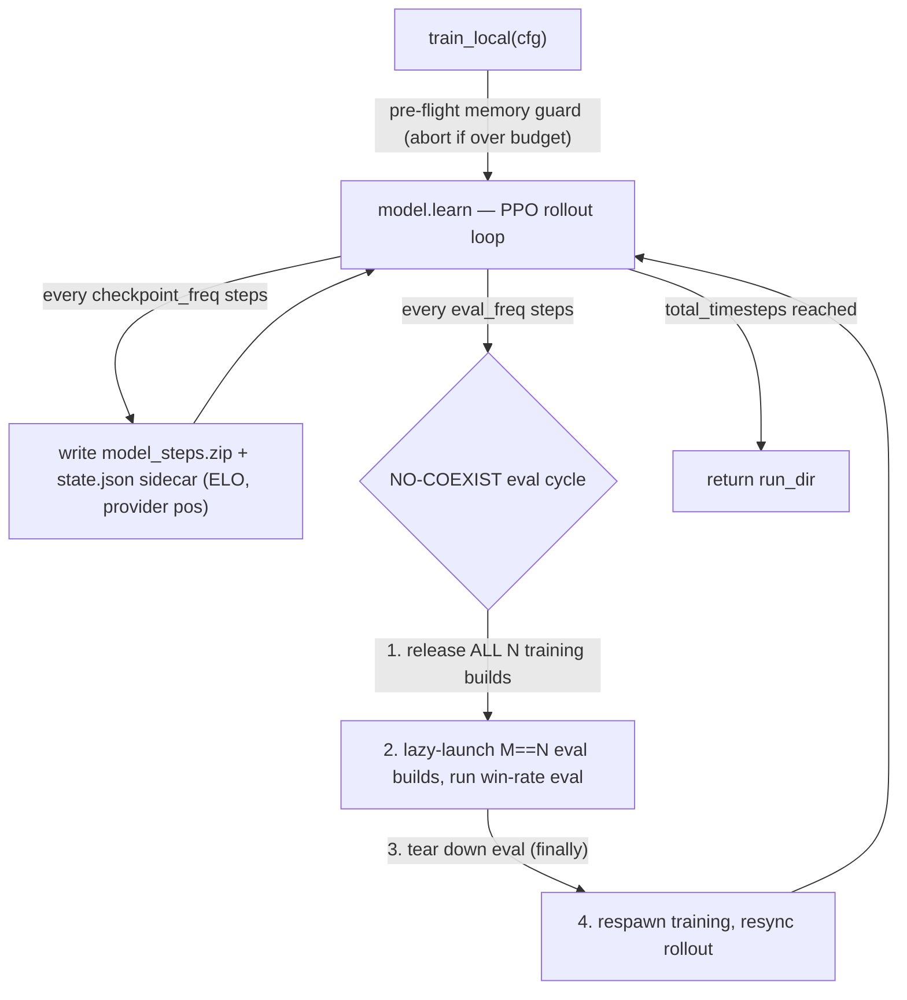
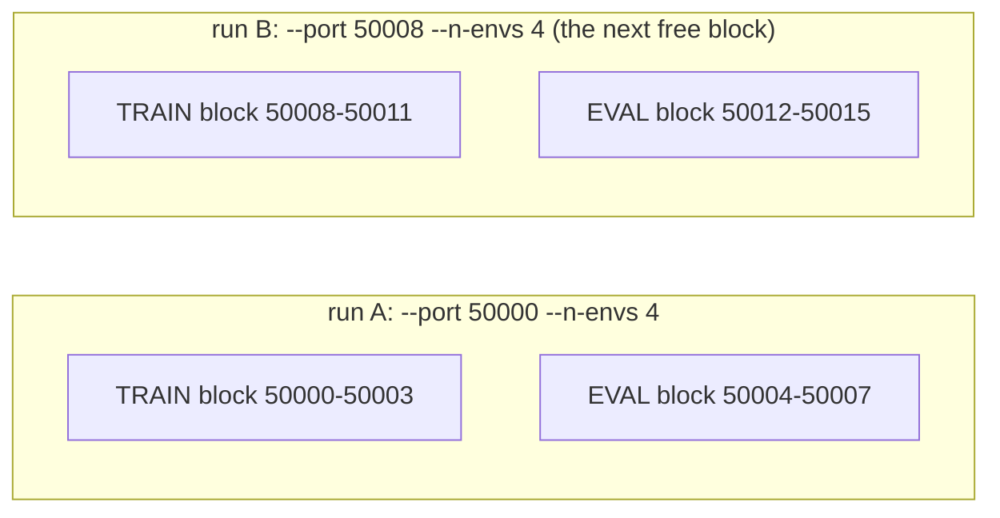

# Runbook — operate the trainer end to end

The HOW-TO-RUN page: every command an operator runs, the load-bearing flags, and the gotchas
that bite. It says **how to run**; the [component pages](README.md) say how it WORKS — this page
links out instead of re-explaining internals. Every command is grounded in the actual entry point
+ config (read, not inferred); the infra-manager accuracy-check runs them to verify.

Commands run from the **repo root**. Windows and macOS are both supported (the build + launcher are
OS-aware). Replace the example repo-root paths with yours. The Python env is **`uv`** — never the
system Python.

## Quick start

Three commands take you from clone to two agents playing (assumes Unity 6.5 installed):

```bash
uv sync                                                    # 1. Python env (Python 3.12, pinned)
"C:\Program Files\Unity\Hub\Editor\6000.5.0f1\Editor\Unity.exe" \
  -batchmode -quit -accept-apiupdate -logFile - \
  -projectPath "C:\src\TankTwinStickShooter\unity" \
  -executeMethod BuildScript.BuildWindows                 # 2. build the simulator (once)
uv run python -m pop_trainer.play                         # 3. watch two bots play one episode
```

From there: [collect a dataset](#4-collect-a-dataset) · [train a policy](#5-run-rl-training) ·
[inspect a checkpoint](#7-inspect-a-checkpoint).

### Operator gotchas (the load-bearing ones)

| Gotcha | Rule | Where |
|--------|------|-------|
| **timeScale** | MUST stay **≤ 5**. `≤ 5` is bit-identical to 1×; **`≥ 10` corrupts frames** under load. Never raise the configs' `timeScale` to 10+. | [§5 topology](#the-training-topology) |
| **Port gap (multi-run)** | A run uses **`2N` ports** at `--n-envs N` (train block + disjoint eval block). Leave a **`≥ 2N`** gap between concurrent runs. | [§5 ports](#ports--running-runs-side-by-side) |
| **Memory** | Both collect + train pre-flight a RAM guard and **abort (exit 2)** over 60% of available RAM. `--n-steps` is the lever for train; `--workers`/`--shard-size` for collect. | [collect](#memory-safety-the-pre-flight-guard) · [train](#multi-env-training---n-envs--1) |
| **Smoke runs aren't resumable** | A `--total-timesteps` below `--checkpoint-freq` (default 10000) writes **no `model_*.zip`**, so it **cannot be `--resume`d**. Keep `total-timesteps ≥ checkpoint-freq`. | [§5 resume](#resume) |
| **obs_pixels required** | The env reads a length-prefixed pixel frame every step, so every config must have `obs_pixels: true`. Play/collect/train default configs all enable it. | [core obs](components/core.md#the-observation-resolution-contract-coreobs) |
| **Observability logs** | Per-process JSONL trail under `run_dir/logs` (override `--log-dir`); `--debug` cranks to DEBUG. First stop when diagnosing the multi-env hang. | [§5 logs](#observability-logs) |

---

## 1. Python environment

```bash
uv sync                                          # create/update the venv from pyproject + uv.lock
uv run python --version                          # -> Python 3.12.x
uv run python -c "import pop_trainer; print('ok')"
```

Tests — pure-logic + contracts (Unity-needing tests are opt-in `integration` / `e2e`):

```bash
uv run pytest -m "not integration and not e2e"   # the default green suite
uv run pytest -m e2e                             # Tier-1 live e2e (needs a build; auto-skips without one)
```

`test_e2e_collection.py` drives a small real collection against a live build; it **auto-skips** when
no build is present at `collect_runner.DEFAULT_EXE`, so a buildless run stays green.

## 2. Build the Unity game

The trainer / play app needs a standalone build of the simulator for the host OS.
[`BuildScript`](../unity/Assets/Editor/BuildScript.cs) has one method per platform, each invoked via
the Unity 6.5 editor in batchmode. Both build the enabled scenes, **exit non-zero on failure** (so
the batchmode caller detects it), and ship `StreamingAssets` (the configs + `Arenas/*.json`) into the
player ([`BuildScript.cs:34-62`](../unity/Assets/Editor/BuildScript.cs)).

| Host | Method | Output (git-ignored) |
|------|--------|----------------------|
| Windows | [`BuildScript.BuildWindows`](../unity/Assets/Editor/BuildScript.cs) | `unity/build/TankTwinStickShooter.exe` |
| macOS | [`BuildScript.BuildOSX`](../unity/Assets/Editor/BuildScript.cs) | `unity/build/TankTwinStickShooter.app` bundle |

**Windows:**

```bash
"C:\Program Files\Unity\Hub\Editor\6000.5.0f1\Editor\Unity.exe" \
  -batchmode -quit -accept-apiupdate -logFile - \
  -projectPath "C:\src\TankTwinStickShooter\unity" \
  -executeMethod BuildScript.BuildWindows
```

**macOS** (the editor binary lives inside the editor `.app`):

```bash
/Applications/Unity/Hub/Editor/6000.5.0f1/Unity.app/Contents/MacOS/Unity \
  -batchmode -quit -accept-apiupdate -logFile - \
  -projectPath "/Users/<you>/path/to/TankTwinStickShooter/unity" \
  -executeMethod BuildScript.BuildOSX
```

On macOS the launchable binary lives *inside* the bundle (`Contents/MacOS/`); you never type its name
— the OS-aware resolver
([`core.launch.default_build_path`](../src/pop_trainer/core/launch.py)) globs the bundle and hands the
inner binary to the launcher.

> The built game is a **Python-clocked simulator** with no standalone human mode — see
> [game architecture](game-architecture.md).

## 3. Play an episode

With the build in place, run one episode of any two players:

```bash
uv run python -m pop_trainer.play                          # default: aggressive-coverage vs opponent-shadower
uv run python -m pop_trainer.play --help                   # full flag surface
```

This launches the build **windowed** with `demo_config.json` (obs_pixels on at 640×360), connects
over TCP, runs one episode, prints a trace, and tears down. **No `--exe` needed on any OS** — the
default is the platform build from §2 ([`play.DEFAULT_EXE`](../src/pop_trainer/play.py)); pass `--exe`
only to point elsewhere.

**Three player forms** on each of `--player1` / `--player2` — any matchup is valid (rl-vs-human,
rl-vs-rulebased, rl-vs-rl, …):

| Form | Meaning |
|------|---------|
| `human` | keyboard play ([see below](#human-vs-human-play-two-players-one-keyboard)) |
| a selector | one of `aggressive-coverage`, `wall-hugger`, `opponent-shadower`, `random`, `noop` ([agents](components/agents.md)) |
| `rl:<checkpoint.zip>` | a trained SB3 PPO model (a bare `*.zip` path also works) — loaded predict-only; `torch`/`sb3` imported **lazily**, only for an `rl:` player |

```bash
uv run python -m pop_trainer.play --player1 rl:runs/train/model.zip --player2 opponent-shadower
```

Useful flags (defaults shown, [`_parse_args`](../src/pop_trainer/play.py)): `--exe` (OS-resolved),
`--config unity/Assets/StreamingAssets/demo_config.json`, `--port 50000`,
`--player1`/`--player2` (forms above), `--max-steps 600`, `--seed 0`. Play exits **`2`** if the build
exe, config, or an `rl:` checkpoint is missing ([`play.py:486-508`](../src/pop_trainer/play.py)).

### Human-vs-human play (two players, one keyboard)

Human play needs the optional `human` extra (installs `pynput`, the global keyboard hook):

```bash
uv sync --extra human
uv run python -m pop_trainer.play --player1 human --player2 human
```

One human + one bot is also valid (`--player1 human --player2 opponent-shadower`, or vs a trained
agent). Controls:

- **P1** — move WASD, aim TFGH, fire LEFT SHIFT.
- **P2** — move IJKL, aim numpad 8/4/5/6, fire ENTER. (Numpad aim works with Num Lock ON or OFF.)

When any player is `human`, play auto-selects `human_config.json` (real-time `timeScale: 1`) instead
of `demo_config.json` — unless you pass `--config`. An `rl:` player does **not** change the cadence
([`play.py:481-484`](../src/pop_trainer/play.py)).

> **LOCAL-DEV ONLY.** `pynput` installs a GLOBAL keyboard hook that needs a real desktop session.
> Human play is **not** part of the headless GCP / cluster path. **Do not add `--extra human` to a
> cluster / headless install.**

## 4. Collect a dataset

The **multi-worker** collection runner
([`python -m pop_trainer.data.collect_runner`](../src/pop_trainer/data/collect_runner.py)) builds one
[`CollectionSpec`](../src/pop_trainer/data/collect.py) per worker and drives them spawn-based; each
worker launches its **own** Unity build + socket and writes `.npz` shards to a `worker_<id>/` subdir
of `--out-dir`. See [data](components/data.md) for how the pipeline works.

```bash
# single map (no rotation)
uv run python -m pop_trainer.data.collect_runner --out-dir runs/collect-demo
# rotate over the curated 10-map set (core.maps.CURATED_ROTATION) — pass --maps with NO value
uv run python -m pop_trainer.data.collect_runner --out-dir runs/collect-rot --maps
uv run python -m pop_trainer.data.collect_runner --help    # full flag surface
```

Flags (defaults shown, [`_parse_args`](../src/pop_trainer/data/collect_runner.py)):

| Flag | Default | Meaning |
|------|---------|---------|
| `--out-dir` | *(required)* | root output dir; worker `w` writes to `worker_<w>/` under it |
| `--maps` / `--map-rotation` | *(absent)* | **no value** → the curated 10-map rotation; **a directory** → its sorted `*.json` arena targets; **a list** → that order; **absent** → single `--map` |
| `--map` | `custom1` | single-map config + the **boot** arena when `--maps` is absent |
| `--config` | *(absent → `--map` default)* | override the **boot** config (obs resolution + initial arena); the env `frame_shape` derives from its `obs_pixels_*` (a 64×64 config → a `(64, 64, 3)` env). Absent → `MAP_CONFIGS[--map]` (`demo_config.json`, 640×360). **Composes with `--maps`**: `switch_arena` arena rotation is unchanged. See [64×64 collect](#collecting-a-6464-square-dataset) |
| `--pairing P1:P2` | `DEFAULT_PAIRINGS` mix | a `(player1:player2)` selector pairing; **repeatable**. Omitted → the default coverage-family mix |
| `--episodes` | `1` | episodes **per worker** |
| `--max-steps` | `800` | per-episode step cap (see [episode budget](#episode-budget--obs_pixels)) |
| `--workers` | `2` | parallel workers, one build each (**clamped to `[1, MAX_WORKERS=8]`**, `collect_runner.py:154,531`) |
| `--exe` | `unity/build/TankTwinStickShooter.exe` | path to the Unity build |
| `--base-port` | `50000` | base TCP port; worker `w` connects on `base_port + w` |
| `--seed` | `0` | base seed; worker `w` uses `base + w*10000` |
| `--shard-size` | *(auto)* | in-RAM **buffer** bound (samples/worker before a flush), **not** a file-size knob. Auto → the OOM-safe byte budget. See [memory safety](#memory-safety-the-pre-flight-guard) |
| `--description TEXT` | *(none)* | seed ONE free-form description into the manifest at collection time. See [descriptions](#descriptions-annotating-a-dataset) |
| `--description-author` | `human` | author for `--description` (free string, e.g. `claude`) — content provenance (who wrote the note), not git/PR attribution |
| `--allow-oversized` | *(off)* | skip the pre-flight memory **abort** (estimate still printed) |

Selectors for `--pairing` (and `--map`'s default boot): `aggressive-coverage`, `wall-hugger`,
`opponent-shadower`, `random`.

### Collecting a 64×64 square dataset

`--config` overrides the boot config the build launches on; the env `frame_shape` is **derived from
its `obs_pixels_*`** (the same `core.obs.frame_shape_from_config` source of truth play/train use), so
pointing it at a 64×64-native config yields a `(64, 64, 3)` env and writes 64×64 frames. Absent, the
runner falls back to the `--map` default (`config = args.config if args.config is not None else
MAP_CONFIGS[args.map]`, [`collect_runner.py:804`](../src/pop_trainer/data/collect_runner.py)), i.e.
`demo_config.json` at 640×360. It **composes with `--maps`** — the override changes only the boot
resolution/arena; `switch_arena` arena rotation is unchanged.

```bash
# 64x64-native square corpus, arena-rotated over the curated set
uv run python -m pop_trainer.data.collect_runner \
  --config unity/Assets/StreamingAssets/train_config_64.json \
  --out-dir datasets/collect-64 --maps
```

This feeds the gn-cnn @ 64×64 pretrain cell — see
[pretraining → resolution 64](components/pretraining.md#resolution-64-and-0-native-the-shape-follows-the-dataset).

### Memory safety (the pre-flight guard)

`--shard-size` is the **in-RAM buffer** bound, not a file-size knob: each buffered sample holds an
**uncompressed** `(H, W, 3)` uint8 frame, so the buffer — not the tiny on-disk shard (flat frames
compress ~140×) — is the OOM surface. A smaller bound just yields **more, smaller** shards with
**byte-identical** disk contents.

`main` runs a **pre-flight guard before any build launches**: it reads available RAM, computes the
peak-buffer estimate, **always prints it**, and **aborts with exit `2`** when the estimate exceeds
**60%** of available RAM — unless `--allow-oversized`
([`check_memory_budget`, `collect.py:136-170`](../src/pop_trainer/data/collect.py); call site
[`collect_runner.py:819-841`](../src/pop_trainer/data/collect_runner.py)). The peak is:

```
peak buffer ~= frame_bytes × shard_size × workers × 2   (the SPIKE_FACTOR=2 compress transient)
```

([`estimate_peak_buffer_bytes`, `collect.py:125-133`](../src/pop_trainer/data/collect.py)). The
auto `--shard-size` divides a ~384 MB per-worker byte budget by the frame size
([`default_shard_size`, `collect.py:110-122`](../src/pop_trainer/data/collect.py)) — for the
640×360×3 (~0.69 MB) frame that is **~582 frames/shard**, far under the old count-based default that
OOMed a multi-worker box.

**If the guard aborts:** more `--workers` × bigger `--shard-size` raises the peak **linearly** — drop
either (or pass `--allow-oversized` only if the box has headroom the conservative guard does not
model).

### Episode budget + obs_pixels

- **obs_pixels is mandatory.** Collection must receive pixel frames, so the build **boots** on the
  obs_pixels-enabled `--map` config (`custom1` → `demo_config.json`, 640×360, the same config play
  launches) and rotates the arena via `switch_arena` at runtime. `main` exits `2` if the build exe or
  boot config is missing. See [data → rotation/map-tagging](components/data.md#the-rotation-scheduler--tag-from-echo).
- **`--max-steps` defaults to `800`** because the coverage family fully sweeps a map only by ~800
  decisions on the live engine — keep it long enough to cover the map
  ([agents note](components/agents.md#operational-note--coverage-is-step-budget-dependent-on-the-real-engine)).

### What you get back (progress + summary)

- **Live progress** — on a TTY, one aggregate tqdm bar ticks **per completed episode** across all
  workers (ETA + a running `samples=…` count). It **auto-silences** off a TTY
  (`disable=not sys.stderr.isatty()`), so a redirected/piped run emits zero progress bytes
  ([`_Progress`, `collect.py:652-682`](../src/pop_trainer/data/collect.py);
  [`collect_parallel`, `collect.py:685-723`](../src/pop_trainer/data/collect.py)).
- **End-of-run summary** — counts only, no filename dumps: an aggregate line, one terse per-worker
  line, and a per-map sample-count table aligned to the `maps.json` sidecar (including zero-sample
  arenas). Counts come from a **pure** counter
  ([`summarize_collection`, `collect_runner.py:598-633`](../src/pop_trainer/data/collect_runner.py))
  that reads back **only** each shard's tiny `map_ids` member — the big `frames` array is never
  decompressed ([`_read_worker_map_ids`, `collect_runner.py:636-651`](../src/pop_trainer/data/collect_runner.py)).
- **`maps.json` sidecar** — `{"schema_version": 1, "maps": ["Arenas/...json", ...]}`, written per
  worker-dir AND at the run root, so each on-disk `int32` `map_id` is reversible to the arena Unity
  actually loaded (the echo-tagged id; see [data](components/data.md#the-rotation-scheduler--tag-from-echo)).
- **`manifest.json` fingerprint** — written once at the run root (next to the root `maps.json`). See
  [the manifest below](#the-manifestjson-fingerprint).

### The `manifest.json` fingerprint

Each run also writes a single **`manifest.json`** at the run root recording, under
`schema_version: 2`: the collection params (`seed`, the full `command`, `workers`, `episodes`,
`max_steps`, the `maps` list, the `pairings`, and the `total_shards` / `total_samples` /
`per_map_samples` counts — reused from the same summary as the printout), provenance (`git_commit`,
`git_dirty`, and a `build` `{path, mtime_utc, size_bytes}` fingerprint), the `machine` (hostname,
platform, CPU, RAM, python), and the `descriptions` list (see
[descriptions below](#descriptions-annotating-a-dataset)). It is written **atomically** (tmp →
`Path.replace`) ([`collect_runner.py:874-936`](../src/pop_trainer/data/collect_runner.py)).

> **Not a reproduce-this recipe — it is the dataset's IDENTITY.** Datasets are **NOT
> byte-reproducible** run-to-run (Unity physics + GPU rendering vary across machines), so the
> manifest exists to **identify** a dataset and make cross-machine discrepancies explicable (which
> commit, which build, which machine) — not to regenerate a corpus byte-for-byte. See
> [data → the run-root manifest](components/data.md#the-run-root-manifestjson-dataset-fingerprint).

### Descriptions (annotating a dataset)

The manifest carries a `descriptions` list of free-form human/agent annotations so you can record
WHAT a dataset is. Each entry is exactly `{"author", "text", "added_utc"}` (`added_utc` ISO-8601
UTC); `author` is **content provenance** (who wrote the note — `human`, `claude`, …), NOT git/PR
attribution. A pre-existing v1 manifest with no `descriptions` key is tolerated (treated as empty),
so older datasets stay annotatable. Two ways to add one:

**At collection time** — seed one description as the manifest is written (the seed entry's
`added_utc` shares the manifest's `created_utc`):

```bash
uv run python -m pop_trainer.data.collect_runner --out-dir runs/collect-demo \
  --description "first center-block sweep" --description-author claude
```

**Post-hoc** — append (or list) descriptions on an already-collected run with
[`python -m pop_trainer.data.describe`](../src/pop_trainer/data/describe.py):

```bash
# append one annotation (rewrites manifest.json atomically; --author defaults to 'human')
uv run python -m pop_trainer.data.describe runs/collect-demo --text "looks clean" --author claude
# list the existing descriptions instead of adding one
uv run python -m pop_trainer.data.describe runs/collect-demo --list
```

`describe` takes the run **directory** holding `manifest.json`. It returns **0** on success and **2**
on a missing `manifest.json` or a missing `--text` (when not using `--list`)
([`describe.py:92-125`](../src/pop_trainer/data/describe.py)). See
[data → descriptions](components/data.md#descriptions-human--agent-annotations).

## 5. Run RL training

Train a PPO policy against the scripted self-play roster over the live Unity **pixel** env. The
integrator is [`python -m pop_trainer.rl.train`](../src/pop_trainer/rl/train.py); it composes the RL
seams (encoder extractor, self-play wrapper, eval callback) into one SB3 PPO run with checkpointing
and a resumable sidecar — see [rl → the integrator](components/rl.md#the-train_local-integrator).
Like play/collect it **launches a live windowed build** and reads a pixel frame each step.

```bash
# minimal: trains against the full 5-selector DEFAULT_ROSTER (noop/random/coverage/wall-hugger/shadower)
uv run python -m pop_trainer.rl.train --total-timesteps 10000 --run-dir runs/train-smoke
# single-opponent roster
uv run python -m pop_trainer.rl.train --total-timesteps 10000 --run-dir runs/train-noop --opponents noop
uv run python -m pop_trainer.rl.train --help               # full flag surface
```

`--opponents` is comma-separated (`noop,random` trains against two); an unknown selector exits **`2`**
with the valid list **before** Unity launches. Omitting it trains against the full roster.

### The train → eval → checkpoint lifecycle

Training and eval builds **share one RAM budget** (`M_eval == N_train`), so they are
**time-multiplexed** — only one set is live at any instant. At each eval boundary the run tears down
training, runs a parallel win-rate eval, then respawns training:



Win-rate is logged as `eval/win_rate/<selector>` + an overall `eval/win_rate` to `progress.csv` +
TensorBoard — plus, when `--maps` is active, one per-map `eval/win_rate/map/<short-name>` scalar per
rotation arena (see [Map rotation](#map-rotation)). Internals (the NO-COEXIST cycle, ELO sidecar,
win-signal source of truth) live in
[rl → the eval cycle](components/rl.md#the-no-coexist-eval-cycle--multi-env-lifecycle).

### Flag reference

Flags (defaults shown, [`_parse_args`, `train.py:1645-1861`](../src/pop_trainer/rl/train.py)). Every
PPO/encoder default keeps SB3's own default exact, so a run with no new flags reproduces today's run
bit-for-bit ([`TrainConfig`, `train.py:276-299`](../src/pop_trainer/rl/train.py)).

**Run control**

| Flag | Default | Meaning |
|------|---------|---------|
| `--total-timesteps` | *(required)* | total env-steps to train |
| `--run-dir` | *(required)* | output dir for checkpoints / sidecar / TensorBoard |
| `--config` | `train_config.json` | game/training config forwarded to the launch (`DEFAULT_TRAIN_CONFIG`, `train.py:108`) |
| `--resume` | *(absent)* | a prior `run_dir` to resume — loads the latest `model_*.zip` + `state.json` ([see Resume](#resume)) |
| `--seed` | `0` | master seed — threaded into SB3, the env, and the opponent provider |
| `--opponents` | *(full roster)* | comma-separated roster selectors, validated against [`AGENT_SELECTORS`](../src/pop_trainer/agents/registry.py); unknown → exit 2 before launch |
| `--opponent-strategy` | `round_robin` | `round_robin` (resumable) or `uniform` (seed-only resume) |
| `--maps` | *(absent)* | per-episode arena rotation for **TRAINING** (via `switch_arena`), and **eval covers the same rotation** (episodes spread across the maps, per-map win-rates in TensorBoard — see [Map rotation](#map-rotation)). **Absent** → single arena from `--config` (today's default). **No value** → the curated 10-map rotation (`core.maps.CURATED_ROTATION`). **A directory** → its sorted `*.json` configs' arena targets. **A list of arena targets** → that order, verbatim. Resolved via `resolve_map_rotation` (`train.py:1878`) |
| `--map-strategy` | `round_robin` | map rotation: `round_robin` (resumable at `--n-envs 1`) or `uniform` (seed-only resume) |
| `--matchup-sampling` | `off` | matchup choice per **TRAINING** episode: `off` → the independent opponent/map samplers above (feature fully inert, behavior unchanged); `winrate` → ONE joint (opponent × map) draw weighted toward low-win-rate cells (**eval unaffected**) — see [Matchup sampling](#matchup-sampling) (`MATCHUP_SAMPLING_CHOICES`, `train.py:137`) |
| `--matchup-floor` | `0.25` | the winrate sampler's exploration floor `eps` in `[0, 1]`: every cell keeps probability ≥ `eps / n_cells` |
| `--matchup-ema-alpha` | `0.05` | per-cell win-rate EMA weight of the newest episode, in `(0, 1]` |
| `--eval-freq` | `10000` | env-steps between win-rate evals (`0` = off) |
| `--eval-episodes` | `10` | greedy episodes per opponent per eval; with `--maps`, spread **deterministically** across the rotation maps (`episode_spread` floor/ceil quotas summing to exactly N — e.g. 100 episodes / 10 maps = 10 per (opponent, map) cell; total eval cost unchanged) |
| `--checkpoint-freq` | `10000` | env-steps between checkpoints (the sidecar rides this cadence) |

**Topology / ports** (see [ports](#ports--running-runs-side-by-side))

| Flag | Default | Meaning |
|------|---------|---------|
| `--n-envs` | `1` | parallel **training** envs. `1` → in-process `DummyVecEnv`; `N>1` → `SubprocVecEnv` of `N` builds, each on port `game_port + i` (`start_method="spawn"`). Eval is built at the SAME width `M==N`. See [multi-env](#multi-env-training---n-envs--1) |
| `--port` | `50000` | base TCP port. Training block = `[port, port + n_envs - 1]` (`training_ports`, `train.py:710-712`) |
| `--eval-port` | *(`port + n_envs`)* | base for the **eval block** `[eval_port, eval_port + n_envs - 1]`. Default = first port AFTER the training block (`effective_eval_port`, `train.py:361-371`). When set it must differ from `--port` AND not overlap the training block, else `ValueError` (`train.py:333-350`) |
| `--frame-stack` | `1` | `VecFrameStack` depth (`1` = passthrough) |
| `--allow-oversized` | *(off)* | skip the pre-flight rollout-buffer memory **abort** (estimate still printed; [see memory](#multi-env-training---n-envs--1)) |

**Encoder** (the trunk/freeze internals: [rl → EncoderExtractor](components/rl.md#encoderextractor--the-policyencoder-seam))

| Flag | Default | Meaning |
|------|---------|---------|
| `--trunk` | `auto` | `auto` keeps the size-based selection (`gn-cnn` ≤128px frame, else `cnn`); `cnn`/`resnet`/`gn-cnn` force that trunk (`TRUNK_CHOICES`, `train.py:133`) |
| `--encoder-checkpoint` | `None` | optional pretrained-encoder `state_dict` for the features extractor |
| `--freeze-encoder` | *(off)* | freeze the encoder weights during RL |
| `--net-arch` | `[64, 64]` | policy/value MLP head; or a per-head spec `'pi=64,64:vf=64,64'` (`_parse_net_arch`, `train.py:1624-1643`) |

**PPO hyperparameters** (all SB3-faithful defaults)

| Flag | Default | | Flag | Default |
|------|---------|-|------|---------|
| `--n-steps` | `2048` | | `--gamma` | `0.99` |
| `--batch-size` | `64` | | `--gae-lambda` | `0.95` |
| `--learning-rate` | `3e-4` | | `--clip-range` | `0.2` |
| `--lr-schedule` | `constant` | | `--ent-coef` | `0.0` |
| `--n-epochs` | `10` | | `--vf-coef` | `0.5` |
| | | | `--max-grad-norm` | `0.5` |

`--lr-schedule` is `constant` (fixed `--learning-rate`) or `linear` (decay to 0 via SB3's
`progress_remaining`, `_resolve_learning_rate`, `train.py:896-907`). `--n-steps` is **the memory
lever** at `--n-envs > 1` (the rollout buffer scales `n_steps × n_envs`).

```bash
# tuned: linear LR decay, deeper rollout, explicit resnet trunk
uv run python -m pop_trainer.rl.train --total-timesteps 200000 --run-dir runs/train-tuned \
  --learning-rate 1e-4 --lr-schedule linear --n-steps 1024 --ent-coef 0.01 --trunk resnet
```

**Observability**

| Flag | Default | Meaning |
|------|---------|---------|
| `--log-dir` | *(`run_dir/logs`)* | dir for the per-process observability logs ([see logs](#observability-logs)) |
| `--debug` | *(INFO)* | the SINGLE switch: crank ALL logs to DEBUG (≡ `POP_LOG_LEVEL=DEBUG`) |

**Not on the CLI** (use `TrainConfig` dataclass defaults — override in code): `frame_shape` (DERIVED
from the launched config's `obs_pixels_*` via
[`core.obs.frame_shape_from_config`](components/core.md#the-observation-resolution-contract-coreobs),
then `validate_frame_shape`d, `train.py:1312-1319,1888`) and `build_path` (→ the OS-aware
[`default_build_path`](../src/pop_trainer/core/launch.py)).

### Ports — running runs side by side

At `--n-envs N` a run owns **`2N` ports**: a training block `[P, P+N-1]` and a **disjoint** eval
block `[P+N, P+2N-1]` (the default; `--eval-port` overrides the eval base). The two sets never run
concurrently (time-multiplexed), but disjoint blocks stop a relaunched-but-not-yet-reaped instance
from clashing on bind.



So to run two trainings side by side, leave a **`≥ 2N`** gap:

```bash
# run A: train 50000, eval 50001 (default --eval-port = port + 1 at --n-envs 1)
uv run python -m pop_trainer.rl.train --total-timesteps 10000 --run-dir runs/train-a --port 50000
# run B: train 50002, eval 50003
uv run python -m pop_trainer.rl.train --total-timesteps 10000 --run-dir runs/train-b --port 50002 --eval-port 50003
```

### Multi-env training (`--n-envs > 1`)

`--n-envs N` fans out to a `SubprocVecEnv` of `N` builds (`start_method="spawn"`, Windows-safe), each
on its own training port `game_port + i`. The eval set is built at the **same width** (`M == N`) on
the auto-assigned disjoint block; **you do not pass `--eval-port` for the common case**. Concrete
example — 4 train + 4 (time-multiplexed) eval, with a shorter rollout to stay in budget:

```bash
uv run python -m pop_trainer.rl.train \
  --total-timesteps 200000 --run-dir runs/train-4x \
  --n-envs 4 --n-steps 512 --port 50000
```

With `--port 50000 --n-envs 4`: training = `[50000, 50003]`, eval = `[50004, 50007]`
(auto `game_port + n_envs`; `eval_ports`, `train.py:715-722`). In general at `--port P --n-envs N`:
training = `[P, P+N-1]`, eval = `[P+N, P+2N-1]`.

> **Memory — the rollout buffer is the OOM surface.** The SB3 PPO `RolloutBuffer` stores
> `(n_steps, n_envs, *obs_shape)` uint8 frames, so its obs cost is approximately
> **`n_steps × n_envs × frame_bytes × frame_stack`** (`estimate_rl_memory_bytes`,
> `train.py:445-456`). **Lowering `--n-steps` is the primary lever** (halve it → roughly halve the
> buffer at fixed `--n-envs`; this is why the 4-env example uses `--n-steps 512`).
>
> A **pre-flight guard** runs at startup (`check_rl_memory_budget`, `train.py:459-507`; called at
> `train.py:1356`): it adds **~1 GB per live Unity instance** for **`n_envs`** instances (NOT
> `n_envs + 1` — the eval and training SETS never coexist, so peak concurrent = `n_envs`), **always
> prints the estimate**, and **aborts with exit `2` BEFORE any build launches** when the total
> exceeds **60% of available RAM** (`MEMORY_MARGIN = 0.6`) — unless `--allow-oversized`. If it aborts:
> lower `--n-steps` or `--n-envs`.

At `--n-envs > 1` the opponent rotation is **per-subproc** (each build has its own seeded provider),
so `--resume` **RESEEDS** the rotation (approximate phase, like `uniform`) rather than restoring a
position-exact `round_robin`; at `--n-envs 1` resume stays position-exact. See
[rl → multi-env](components/rl.md#the-no-coexist-eval-cycle--multi-env-lifecycle).

> **Stall recovery — the run survives a lost connection; it does not prevent the stall.** Multi-env
> training intermittently hits a ~30 s instance stall (an underlying C# reset-region issue, **not yet
> fixed**). On a socket drop, `TankEnv` does a **kill-old-first reconnect** (reap the old instance to
> free its port, then relaunch), so the run **recovers and continues** — the dropped step is a
> reward-0 truncation and the next episode starts fresh. The relaunch points Unity's `-logFile` at
> the next `unity-<role>-<port>-<attempt>.log`, so the stalled instance's C# log survives. A
> `worker_death` / `step_lost_connection` record mid-run is the recovery path, not a crash. The same
> pre-existing C#-side midgame-restart race also surfaces on a small fraction (~0.5–1 %) of **eval**
> resets as a `recv_timeout`; the affected eval episode is scored as a **draw** (never a win) — it
> predates, and is not caused by, eval map rotation. See
> [env → instance lifecycle](components/env.md#instance-lifecycle-lazy-launch--release--kill-old-first-reconnect).

### Map rotation

By default training runs on the **single arena** in `--config` (`train_config.json`'s
`arena_path`) — no rotation. `--maps` opts into per-episode arena rotation: each TRAINING episode
samples one arena (`--map-strategy round_robin` cycles in order, `uniform` is a seeded draw) and the
`SelfPlayWrapper` sends it to Unity via `switch_arena` at reset. The flag resolves like collection's
(`core.maps.resolve_map_rotation`): **no value** → the curated 10-arena set
(`core.maps.CURATED_ROTATION`); **a directory** → its sorted `*.json` arena targets; **a list** →
verbatim.

```bash
# rotate every TRAINING episode over the curated 10-arena set (uniform draw)
uv run python -m pop_trainer.rl.train --total-timesteps 200000 --run-dir runs/train-rot \
  --maps --map-strategy uniform
# rotate over an explicit ordered list (round_robin, the default strategy)
uv run python -m pop_trainer.rl.train --total-timesteps 200000 --run-dir runs/train-rot2 \
  --maps Arenas/empty.json Arenas/chokepoint.json Arenas/scattered.json
```

> **EVAL COVERS THE ROTATION — `--maps` rotates eval too, pinned rather than free-running.** The
> free-running map provider attaches to the **training role only** (the eval vec is built
> `role=ROLE_EVAL`, `maps=None`); instead `evaluate_winrate` spreads each opponent's
> `--eval-episodes` budget deterministically across the rotation maps and plays every
> (opponent, map) cell as its own **pinned** phase, requesting `switch_arena` at reset through the
> same live-validated channel training rotation uses. TensorBoard gains one
> `eval/win_rate/map/<short-name>` scalar per rotation arena alongside the per-opponent + overall
> tags, and the final summary prints a per-opponent line AND a per-map line. Per-map, per-opponent,
> and overall are all pooled from the SAME per-cell win/episode counts, so they reconcile by
> construction; ELO consumes the pooled per-opponent marginals. **Without `--maps`, eval is
> byte-identical to before** — the fixed boot arena, no `switch_arena` ever sent. Internals:
> [rl → per-map eval](components/rl.md#the-eval--elo-seam) and
> [rl → map rotation invariant](components/rl.md#the-train_local-integrator).
>
> **Resume:** the rotation is persisted in a separate `map_provider` sidecar block. `round_robin`
> resume is **position-exact only at `--n-envs 1`**; at `--n-envs > 1` (per-subproc providers) or
> `uniform`, resume **RESEEDS** the rotation — exactly like the opponent rotation.

### Matchup sampling

By default (`--matchup-sampling off`) the opponent and the map are sampled **independently** per
episode (the sections above) and the feature is fully inert — behavior unchanged. `--matchup-sampling
winrate` replaces both choices with **one joint draw** over cells = (opponent × map): each TRAINING
episode's cell is drawn from `P(cell) = eps·uniform + (1−eps)·normalize(1 − win_rate)`, so the agent
gets more training signal on the (opponent, map) combinations it is currently **weakest** at, while
the `--matchup-floor` eps keeps every combination in the mix. The win-rate signal comes from TRAINING
terminals (win = 1, loss = 0, draw/truncation = 0.5 — never a win), folded as an EMA
(`--matchup-ema-alpha`) at rollout boundaries only; unseen cells start at the 0.5 prior (initial
distribution exactly uniform). It also works **without `--maps`**: cells are then (opponent × boot
arena) and no `switch_arena` is ever sent (flags at `train.py:1801-1821`).

```bash
# win-rate curriculum over 3 opponents x the curated 10 arenas
uv run python -m pop_trainer.rl.train --total-timesteps 200000 --run-dir runs/train-matchup \
  --opponents aggressive-coverage,wall-hugger,opponent-shadower --maps \
  --matchup-sampling winrate
```

Watch `matchup/distribution_entropy` + `matchup/episodes` in TensorBoard, and the one-line
`matchup_update` summary (worst-k lowest-win-rate cells + entropy) in `training-system.log`.

> **EVAL IS UNAFFECTED** — the joint sampler attaches to the **training role only**, and eval
> episodes never feed the matchup EMA (it folds TRAINING terminals only). The eval benchmark keeps
> its own deterministic schedule — `round_robin` opponent pinning on the fixed boot arena, or the
> pinned per-map phases under [map rotation](#map-rotation) — comparable eval-to-eval. Internals:
> [rl → matchup sampling](components/rl.md#the-train_local-integrator).
>
> **Resume:** the curriculum is persisted in a third `matchup` sidecar block (cells + win-rate EMA +
> counts; with the feature off the block is just `{"sampling": "off"}`). `--resume` restores it **by
> cell key**, so a changed roster/rotation keeps the surviving cells and starts new ones at the 0.5
> prior — and it is position-exact at ANY `--n-envs` (the EMA lives in the main process, not
> per-subproc).

### The training topology

The build launches under
[`train_config.json`](../unity/Assets/StreamingAssets/train_config.json): a **single-arena AI-vs-AI**
pixel config — `obs_pixels: true` at `obs_pixels_width: 640` / `obs_pixels_height: 360` (the keys the
env's `frame_shape` is derived from), both players AI, `game_maxTime: 60`, `player_maxHealth: 1`, one
`arena_path` (`Arenas/custom1.json`, no rotation) ([`train_config.json:1-22`](../unity/Assets/StreamingAssets/train_config.json)).

> **`timeScale` MUST stay ≤ 5 (hard operational rule).** `train_config.json` ships `timeScale: 5`
> ([`train_config.json:5`](../unity/Assets/StreamingAssets/train_config.json)). `timeScale ≤ 5` is
> bit-identical to 1×; **`timeScale ≥ 10` corrupts** frames under load. NEVER raise it to 10+.

### Resume

`--resume <prior run_dir>` continues a previous run: it picks the **highest-step** `model_*.zip`
([`_latest_checkpoint`, `train.py:1239-1262`](../src/pop_trainer/rl/train.py)), does `PPO.load`
(`train.py:1413`), restores the opponent position + the map-rotation block + ELO from that dir's
`state.json` sidecar (`train.py:1414-1422`) — and, when `--matchup-sampling winrate` is on, the
`matchup` curriculum block (`train.py:1461-1462`; see [Matchup sampling](#matchup-sampling)) — and
continues with `reset_num_timesteps=False`. Resuming a dir with no parseable `model_*.zip` raises
`FileNotFoundError` (`train.py:1409-1412`).

> **CRITICAL — sub-cadence smoke runs are NOT resumable.** `--checkpoint-freq` (default **10000**
> env-steps; `TrainConfig.checkpoint_freq`, `train.py:271`) controls when a `model_*.zip` is written.
> A run whose `--total-timesteps` is **below** the checkpoint cadence writes **no intermediate
> `model_*.zip`** — only the final `state.json` — and therefore **cannot be `--resume`d** (resume
> needs a checkpoint zip and raises `FileNotFoundError`). For a resumable checkpoint, keep
> `--total-timesteps >=` the `--checkpoint-freq` you pass (default: `>= 10000`); treat anything below
> the cadence as **smoke-only**. Lower `--checkpoint-freq` to force an earlier checkpoint on a short
> run.

### Observability logs

Every run writes a per-process **structured-JSONL** log trail into the log dir (default
`run_dir/logs`, override `--log-dir`) — the operator's guide to diagnosing the multi-env hang. It is
**purely observational**: it does not touch the TCP wire, the 52-float state, message ordering, or
control flow (Python off by default on any unwired path; C# gated on the build's `verbose` flag — see
[game architecture](game-architecture.md#observability-logging-verbose-gated-zero-wire-impact)).

**Per-process file routing** — each writer gets its OWN file so concurrent writers never contend:

| File | Who writes it |
|------|---------------|
| `training-system.log` | the main process (`role=system`, `layer=train`) |
| `env-<role>-<port>.log` | one per env connection (`role` = `train`/`eval`). SHARED by the env + protocol layers for that socket; **appends across respawns** (not suffixed per launch) |
| `unity-<role>-<port>-<attempt>.log` | one per Unity **LAUNCH** (the build's `-logFile`), paired by `(role, port)`. The **`<attempt>` suffix** (`-0`, `-1`, …) is load-bearing: Unity truncates its `-logFile` on every launch, so a distinct file per launch means a respawn **never wipes the prior (hung) instance's C# log** (`_attempt_unity_log_path`, `train.py:531-543`) |

A **1-train + 1-eval run** (default `--n-envs 1`, ports 50000/50001) that never relaunches produces
**5 files**:

```
training-system.log
env-train-50000.log    unity-train-50000-0.log
env-eval-50001.log     unity-eval-50001-0.log
```

A reconnect on the train socket adds `unity-train-50000-1.log` (the prior `-0` is left intact).
General formula: **1 `env-*.log` per connection + 1 `unity-*-<attempt>.log` per launch + 1 system
file**. (At `--n-envs N`: `N` train + `N` eval connections, since eval is the same width.)

**Reading them:**

- **INFO vs DEBUG.** Default is INFO (handshake / reset / episode milestones + `run_config` /
  memory-estimate / `rollout_*` / `checkpoint_save` / `worker_death` markers). `--debug` (or
  `POP_LOG_LEVEL=DEBUG`) adds per-step send/recv/step.
- **Cross-stack merge key.** Each Python line is one strict-JSON object with `ts_wall` /
  `ts_mono` / `level` / `layer` / `role` / `port` / `event` + detail fields. C# lines are
  `[tag] wall=<ISO-8601 UtcNow> k=v …`. **`ts_wall` (Python) and `wall=` (C#) are the same
  wall-clock** — line up a Python `step` against the C# `readpixels` lines for that port to find
  where a hang happened.
- **Eval isolation.** Each logger sets `propagate=False`, so eval records land ONLY in
  `env-eval-<port>.log` and never leak into `training-system.log` — the system log is training +
  system markers only, no eval noise.

## 6. Validate coverage (no Unity required)

The [`measure_coverage`](../src/pop_trainer/agents/coverage_metrics.py) harness runs a deterministic
kinematic rollout of an agent on a `WallLayout` and reports coverage-fraction + occupancy-entropy —
the in-tree check that the coverage family beats `RandomAgent`. No live build:

```bash
uv run python -c "
from pop_trainer.core.protocol import WallLayout, WallDims
from pop_trainer.agents import CoverageAgent, RandomAgent, measure_coverage
layout = WallLayout(map_id='open', tile_id=0, dims=WallDims(min_x=-6, max_x=5, min_y=-6, max_y=5), columns={})
cov = measure_coverage(CoverageAgent.aggressive(seed=0), layout)
rnd = measure_coverage(RandomAgent(seed=0), layout)
print(f'coverage  cov={cov.coverage_fraction:.2f} entropy={cov.occupancy_entropy:.2f}')
print(f'random    cov={rnd.coverage_fraction:.2f} entropy={rnd.occupancy_entropy:.2f}')
"
```

On this 12×12 open map the coverage agent reaches `cov≈0.85` vs the baseline `cov≈0.33`. (The
kinematic harness is optimistic vs the live engine — see the
[agents note](components/agents.md#operational-note--coverage-is-step-budget-dependent-on-the-real-engine).)

## 7. Inspect a checkpoint

After a [training run](#5-run-rl-training) writes a `model_*.zip`, inspect it with
[`utils.model_info`](components/utils.md) — no Unity, no env, no GPU:

```bash
uv run python -m pop_trainer.utils.model_info runs/train-smoke/model_10000_steps.zip
```

It loads the checkpoint on CPU (schedules skipped on load) and prints the observation + action
spaces, the full `model.policy` repr, the **active encoder trunk** class name (`CnnTrunk` /
`ResNetTrunk` / `GroupNormCNN`), and **id-deduped** per-section parameter counts (total / trainable /
frozen) — the dedupe matters because SB3 shares the one features-extractor across the policy's pi/vf
references, so a naive sum would triple-count the encoder. See [utils](components/utils.md).

---
[← back to index](README.md)
